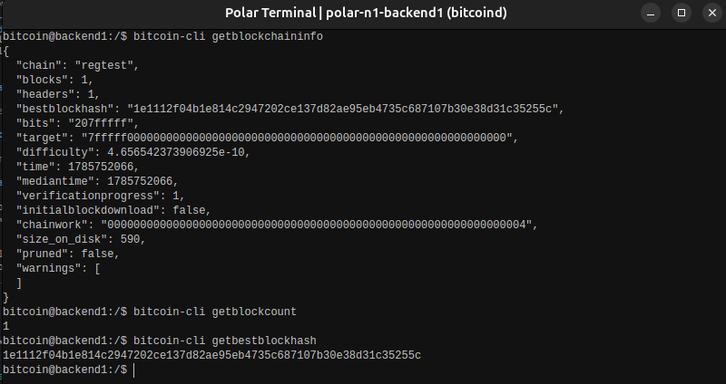
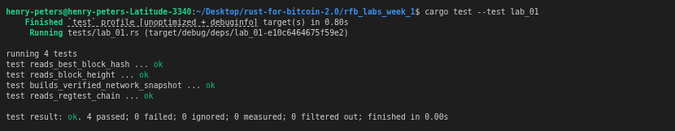

# Lab 01 — Regtest network inspection

## Commands used

<!-- List every bitcoin-cli command and cargo test command you ran -->
- cargo test --test lab_01
- bitcoin-cli getblockchaininfo
- bitcoin-cli getblockcount
- bitcoin-cli getbestblockhash

## Terminal output

<!-- Paste the relevant terminal output here -->
```bash
bitcoin@backend1:/$ bitcoin-cli getblockchaininfo
{
  "chain": "regtest",
  "blocks": 1,
  "headers": 1,
  "bestblockhash": "1e1112f04b1e814c2947202ce137d82ae95eb4735c687107b30e38d31c35255c",
  "bits": "207fffff",
  "target": "7fffff0000000000000000000000000000000000000000000000000000000000",
  "difficulty": 4.656542373906925e-10,
  "time": 1785752066,
  "mediantime": 1785752066,
  "verificationprogress": 1,
  "initialblockdownload": false,
  "chainwork": "0000000000000000000000000000000000000000000000000000000000000004",
  "size_on_disk": 590,
  "pruned": false,
  "warnings": [
  ]
}
bitcoin@backend1:/$ bitcoin-cli getblockcount
1
bitcoin@backend1:/$ bitcoin-cli getbestblockhash
1e1112f04b1e814c2947202ce137d82ae95eb4735c687107b30e38d31c35255c
```

## Evidence references
<!-- Describe or link to screenshots, logs, or other supporting evidence -->

<!-- My tests -->


## Explanation

<!-- Explain what Polar is, what Docker is, what Bitcoin Core is, and what regtest mode is -->
**POLAR:**
Polar is a desktop app that lets you spin up local Bitcoin and Lightning Network nodes with one click rather than doing it manually. It uses Docker under the hood so you don't have to configure anything manually. Polar is used for development and testing.

**Docker:**
Docker is a tool that runs software inside isolated containers. Polar uses it to run eachh Bitcoin Core node in its own container, so they don't interfere with your system or each other.

**Bitcoin Core:**
It is the reference implementation of Bitcoin. It's a full node that validates blocks and transactions, maintains the UTXO set, and exposes a JSON-RPC interface that bitcoin-cl talks to. It's what actually running inside the Polar container.

**Regtest mode:**
Regtest is an acronym short for "regression test" mode. A private local blockchain where you control everything. You can mine blocks instantly on demand, there's no real money involved, and no internet connection is needed. It's the standard environment for developing and testing Bitcoi applications because you get deterministic, repeatable behaviour.


