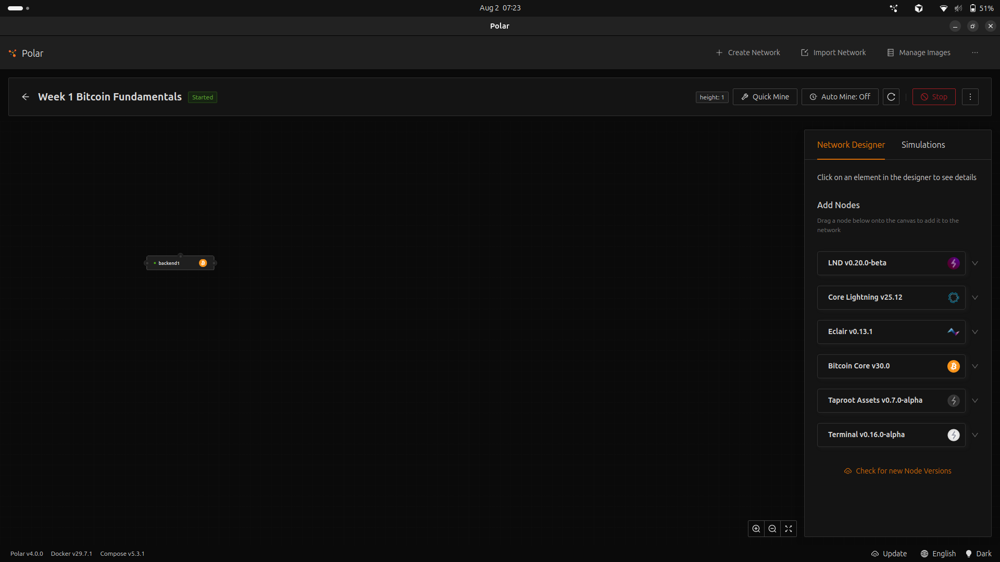
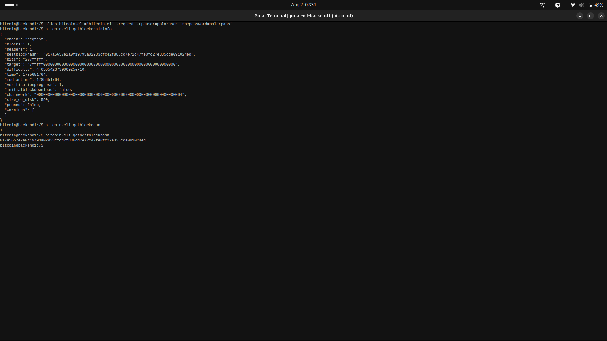

# Lab 01 — Regtest network inspection

<!-- Replace every TODO line. The grader scores a section 0 while a TODO remains in it. Rewrite the Explanation in your own words: an instructor marks it for your understanding, not mine. -->

## Commands used

Polar setup, performed in the Polar GUI:

1. Create a network named `Week 1 Bitcoin Fundamentals`.
2. Add one Bitcoin Core node, zero Lightning nodes.
3. Start the network and wait for the node to report **Started**.

Bitcoin Core RPCs, run in the node's terminal (right-click the node → Launch Terminal):

```bash
bitcoin-cli getblockchaininfo
bitcoin-cli getblockcount
bitcoin-cli getbestblockhash
```

Rust implementation and tests:

```bash
cd rfb_labs_week_1
cargo test --test lab_01
```

The Rust functions `get_chain`, `get_block_height`, and `get_best_block_hash` issue
exactly those three RPCs, and `inspect_network` composes them into one
`NetworkSnapshot` after refusing any chain other than `regtest`.

## Terminal output

```
$ bitcoin-cli getblockchaininfo
{
  "chain": "regtest",
  "blocks": 1,
  "headers": 1,
  "bestblockhash": "017a5657e2a0f19793a02933cfc42f886cd7e72c47fe0fc27e335cde091024ed",
  "bits": "207fffff",
  "target": "7fffff0000000000000000000000000000000000000000000000000000000000",
  "difficulty": 4.656542373906925e-10,
  "time": 1785651764,
  "mediantime": 1785651764,
  "verificationprogress": 1,
  "initialblockdownload": false,
  "chainwork": "0000000000000000000000000000000000000000000000000000000000000004",
  "size_on_disk": 590,
  "pruned": false,
  "warnings": [
  ]
}

$ bitcoin-cli getblockcount
1

$ bitcoin-cli getbestblockhash
017a5657e2a0f19793a02933cfc42f886cd7e72c47fe0fc27e335cde091024ed
```

The three results agree with each other: `chain` reads `regtest`, the height is 1,
and the `bestblockhash` field inside `getblockchaininfo` matches the standalone
`getbestblockhash` result. Height 1 is the freshly created network, one block past
the regtest genesis block.

```
$ cargo test --test lab_01
running 4 tests
test reads_block_height ... ok
test reads_best_block_hash ... ok
test reads_regtest_chain ... ok
test builds_verified_network_snapshot ... ok

test result: ok. 4 passed; 0 failed; 0 ignored; 0 measured; 0 filtered out; finished in 0.00s
```

## Evidence references



The screenshot shows the Polar window with the network `Week 1 Bitcoin Fundamentals`
marked **Started**, the single Bitcoin Core node `backend1` on the designer canvas,
and the height indicator reading 1, matching the `getblockcount` output above. No
Lightning nodes are present, since Lab 01 only requires a Bitcoin Core backend.



The second screenshot is the node's own terminal, opened from Polar with right-click
→ Launch Terminal. The `bitcoin@backend1` prompt confirms the three RPCs ran inside
the container rather than against a separate local node, and the values there match
the Terminal output section above.

## Explanation

These four pieces sit in a stack, each solving a different problem.

**Bitcoin Core** is the actual Bitcoin node software. It validates blocks and
transactions against consensus rules, keeps the UTXO set, holds a mempool, and
serves the RPC interface every later lab talks to. It is the only component here
that knows what Bitcoin *is*.

**regtest** is a network mode inside Bitcoin Core, alongside mainnet and testnet.
It uses a private genesis block, a trivial proof-of-work target, and coins with no
value, and it lets me mine blocks on demand with `generatetoaddress` instead of
waiting for real miners. That on-demand mining is what makes these labs possible:
Lab 03 needs 101 blocks in seconds. Its addresses carry the `bcrt1` prefix so a
regtest address can never be confused with a mainnet one.

**Docker** packages the node and runs it in an isolated container with its own
filesystem, network interface, and data directory. That isolation is what lets
Lab 10 run two independent nodes on one laptop that can be disconnected from each
other on purpose.

**Polar** is a desktop GUI that orchestrates the Docker containers. It generates
each node's configuration, wires the containers into a network, exposes RPC ports,
and gives me start/stop control and a terminal per node. Without it I would be
writing `docker run` commands and config files by hand.

The dependency runs one way: Polar drives Docker, Docker runs Bitcoin Core, and
Bitcoin Core is configured to operate in regtest mode.

`inspect_network` refuses to build a snapshot when `chain` is not `regtest`. That
guard matters because every later lab mines blocks and spends coins freely, which
is safe on a throwaway chain and destructive anywhere else. Verifying the chain
first is the cheap check that makes the rest of the work safe.
