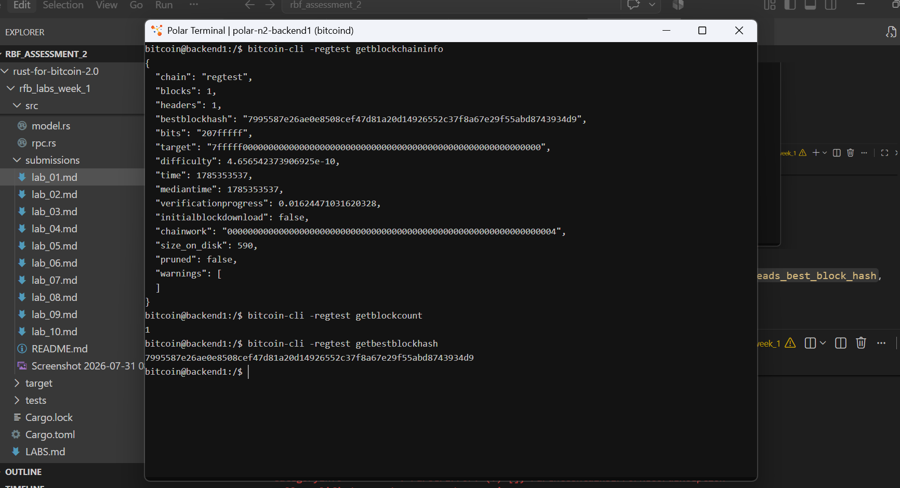

# Lab 01 — Regtest network inspection

## Commands used

* **Rust command** *
```

cargo test --test lab_01
cargo fmt
cargo fmt --check


```

* **Bitcoin Core RPCs.** *
```
getblockchaininfo
getblockcount
getbestblockhash
```

## Terminal output

* **chain (getblockchaininfo)** * 
```
{
  "chain": "regtest",
  "blocks": 1,
  "headers": 1,
  "bestblockhash": "7995587e26ae0e8508cef47d81a20d14926552c37f8a67e29f55abd8743934d9",
  "bits": "207fffff",
  "target": "7fffff0000000000000000000000000000000000000000000000000000000000",
  "difficulty": 4.656542373906925e-10,
  "time": 1785353537,
  "mediantime": 1785353537,
  "verificationprogress": 0.01634334090574795,
  "initialblockdownload": false,
  "chainwork": "0000000000000000000000000000000000000000000000000000000000000004",
  "size_on_disk": 590,
  "pruned": false,
  "warnings": [
  ]
}

```

* **block height(getblockcount)** *
```
1
```
* **best-block hash** *
```
7995587e26ae0e8508cef47d81a20d14926552c37f8a67e29f55abd8743934d9
```


## Evidence references



* **Cargo Test Suite:** All 4 tests in `tests/lab_01.rs` (`builds_verified_network_snapshot`, `reads_best_block_hash`, `reads_block_height`, `reads_regtest_chain`) passed successfully.
* **Code Formatting:** Standard formatting verified via `cargo fmt --check`.


## Explanation

* **Polar:** Software that provides a visual interface to easily spin up, connect, and manage Bitcoin Core nodes and Lightning Network nodes running inside Docker containers. It also provides an interactive terminal to execute `bitcoin-cli` RPC commands against running nodes.
* **Docker:** A containerization engine used to run isolated micro-environments (containers). Polar utilizes Docker under the hood to deploy lightweight, consistent Bitcoin Core and Lightning node software without dependency conflicts.
* **Bitcoin Core:** The reference open-source implementation of the Bitcoin protocol. It functions as a full node, maintaining the complete ledger, validating incoming blocks and transactions against consensus rules, managing the UTXO set, and exposing JSON-RPC interfaces (`bitcoin-cli`) for programmatic interaction.
* **Regtest (Regression Test Mode):** A local, isolated Bitcoin testing environment. Operating on a private network with near-zero mining difficulty, it allows developers to instantly generate blocks on demand (`generatetoaddress`) without requiring real Proof-of-Work computation or experiencing external network latency.

