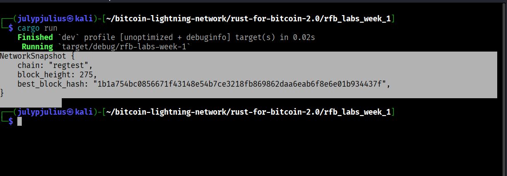
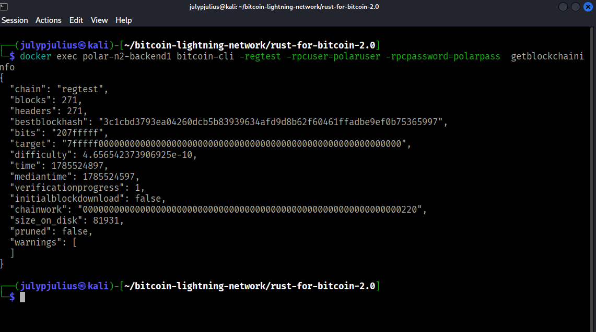

# Lab 01 — Regtest network inspection

## Commands used
I created the entry point main.rs which when I run cargo run it basically spins up  'inspect_network
which contain three Bitcoin core JSON-RPC calls via 'bitcoin-cli'

Since I'm also using docker I used the docker exec command and passing in the blockchain info for the network.
The command format was like this: `docker exec polar-n2-backend1 bitcoin-cli -regtest -rpcuser=polaruser -rpcpassword=polarpass  getblockchaininfo`  


## Terminal output
This was the output from it 
└─$ cargo run             
    Finished `dev` profile [unoptimized + debuginfo] target(s) in 0.08s
     Running `target/debug/rfb-labs-week-1`
NetworkSnapshot {
    chain: "regtest",
    block_height: 298,
    best_block_hash: "707bfdbaef13463ab0a22e19b03418370378e6ddac59ebbcf13a38711f83f277",
}
        
    The command output for the docker command is 
   ```bash 
    $ docker exec polar-n2-backend1 bitcoin-cli -regtest -rpcuser=polaruser -rpcpassword=polarpass  getblockchaininfo  
```
**Output**
```
{
  "chain": "regtest",
  "blocks": 303,
  "headers": 303,
  "bestblockhash": "75e481e4356e7ecdc19b20a8ad9c3d57385a9e78260eed88090950c3edc63756",
  "bits": "207fffff",
  "target": "7fffff0000000000000000000000000000000000000000000000000000000000",
  "difficulty": 4.656542373906925e-10,
  "time": 1785526817,
  "mediantime": 1785526517,
  "verificationprogress": 1,
  "initialblockdownload": false,
  "chainwork": "0000000000000000000000000000000000000000000000000000000000000260",
  "size_on_disk": 91499,
  "pruned": false,
  "warnings": [
  ]
}
```
TODO: Record chain, block height, and best-block hash.

## Evidence references



TODO: Link screenshots or describe the attached evidence.

## Explanation


#### Polar -->  is a desktop that manages local Bitcoin and Lightning test networks using Docker containers

#### Regtest(Regression test mode) --> Is a special bitcoin core network mode built for local development: Blocks can be mined instantly (the chain is exposed locally) since there is no peer to peer network to sync with and no proof of work difficulty required.

#### Bicoin Core exposes JSON-RPC so that other nodes can querry and control the node. This institutes everything from the reading the blockchain state for example  
('getblockchaininfo', 'getblockcount' etc)

#### Docker container isolates each node's process, filesystem and network namespace from the host machine
