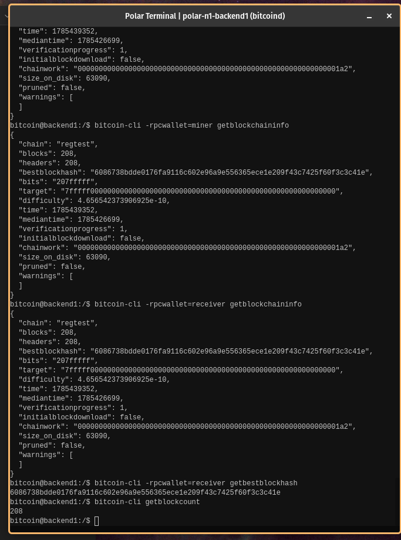

# Lab 01 — Regtest network inspection

## Commands used
I used the `call` method of the Rpc `client`. The Bitcoin Core RPCs ran are:
`getbestblockhash`, `getblockchaininfo`, `getblockcount`

## Terminal output
```bash 

bitcoin@backend1:/$ bitcoin-cli -rpcwallet=miner getblockchaininfo
{
  "chain": "regtest",
  "blocks": 208,
  "headers": 208,
  "bestblockhash": "6086738bdde0176fa9116c602e96a9e556365ece1e209f43c7425f60f3c3c41e",
  "bits": "207fffff",
  "target": "7fffff0000000000000000000000000000000000000000000000000000000000",
  "difficulty": 4.656542373906925e-10,
  "time": 1785439352,
  "mediantime": 1785426699,
  "verificationprogress": 1,
  "initialblockdownload": false,
  "chainwork": "00000000000000000000000000000000000000000000000000000000000001a2",
  "size_on_disk": 63090,
  "pruned": false,
  "warnings": [
  ]
}

bitcoin@backend1:/$ bitcoin-cli getblockcount
207

bitcoin@backend1:/$ bitcoin-cli -rpcwallet=receiver getbestblockhash 
6086738bdde0176fa9116c602e96a9e556365ece1e209f43c7425f60f3c3c41e
```

## Evidence references


## Explanation
- Polar creates the network and opens terminals for you to run `bitcoin-cli` commands.
- Docker runs isolated node containers
- Bitcoin Core validates, stores and exposes RPCs
- Regtest provides instant blocks, fake coins, real consensus rules and zero financial risk
