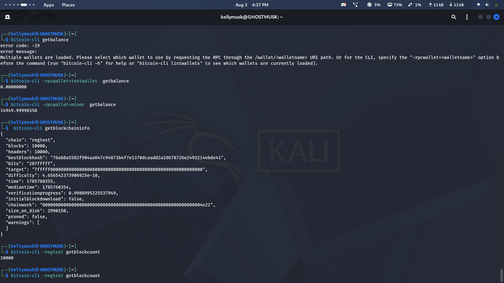

# Lab 01 — Regtest network inspection

## Commands used

cargo test --test lab_01 -- --nocapture
bitcoin-cli -regtest getblockchaininfo
bitcoin-cli -regtest getblockcount
bitcoin-cli -regtest getbestblockhash

## Terminal output

                                                                   
┌──(kellymusk㉿GHOSTMUSK)-[~/rust-for-bitcoin-2.0/rfb_labs_week_1]
└─$ cargo test --test lab_01 -- --nocapture
    Finished `test` profile [unoptimized + debuginfo] target(s) in 0.10s
     Running tests/lab_01.rs (target/debug/deps/lab_01-2e2545a9c58b9545)

running 4 tests
test builds_verified_network_snapshot ... ok
test reads_block_height ... ok
test reads_regtest_chain ... ok
test reads_best_block_hash ... ok

test result: ok. 4 passed; 0 failed; 0 ignored; 0 measured; 0 filtered out; finished in 0.00s

┌┌──(kellymusk㉿GHOSTMUSK)-[~]
└─$  bitcoin-cli getblockchaininfo  
{
  "chain": "regtest",
  "blocks": 10000,
  "headers": 10000,
  "bestblockhash": "76ab8a5582f904aa647c94873b4f7e1370dcaadd2a2d678726e2493214ebde41",
  "bits": "207fffff",
  "target": "7fffff0000000000000000000000000000000000000000000000000000000000",
  "difficulty": 4.656542373906925e-10,
  "time": 1785760355,
  "mediantime": 1785760354,
  "verificationprogress": 0.9988995225537949,
  "initialblockdownload": false,
  "chainwork": "0000000000000000000000000000000000000000000000000000000000004e22",
  "size_on_disk": 2990150,
  "pruned": false,
  "warnings": [
  ]
}
   
┌──(kellymusk㉿GHOSTMUSK)-[~]
└─$ bitcoin-cli -regtest getblockcount
10000
   
 ┌──(kellymusk㉿GHOSTMUSK)-[~]
└─$ bitcoin-cli -regtest getbestblockhash
0f9188f13cb7b2c71f2a335e3a4fc328bf5beb436012afca590b1a11466e2206

## Evidence references

TODO: Link screenshots or describe the attached evidence.

## Explanation

Polar runs the Bitcoin nodes for the lab inside isolated containers. Docker is the underlying container engine that makes those isolated Bitcoin Core instances possible. Bitcoin Core is the software that actually runs the node and answers RPC commands like getblockchaininfo. regtest is the special local test network mode used for labs; it uses fake money and allows instant mining so we can safely experiment without touching real Bitcoin.
