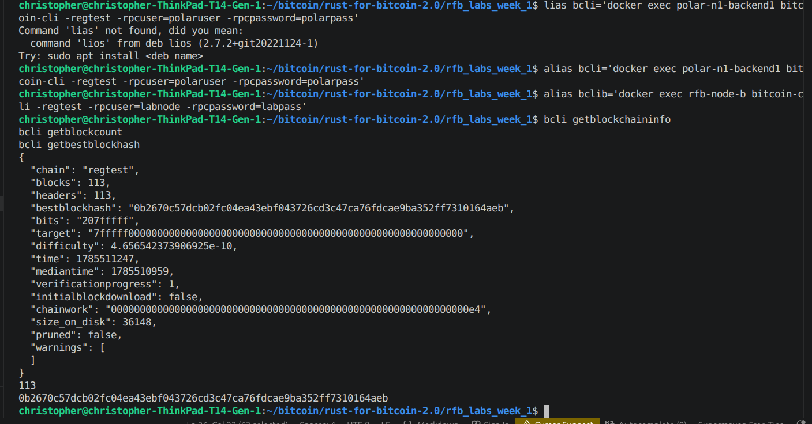

# Lab 01 — Regtest network inspection

## Commands used

```
cargo test --test lab_01
bitcoin-cli -regtest -rpcuser=polaruser -rpcpassword=polarpass getblockchaininfo
bitcoin-cli -regtest -rpcuser=polaruser -rpcpassword=polarpass getblockcount
bitcoin-cli -regtest -rpcuser=polaruser -rpcpassword=polarpass getbestblockhash
```

(Bitcoin Core node is `polar-n1-backend1` inside the Polar network, reached via
`docker exec`.)

## Terminal output

```
$ cargo test --test lab_01
running 4 tests
test builds_verified_network_snapshot ... ok
test reads_best_block_hash ... ok
test reads_block_height ... ok
test reads_regtest_chain ... ok
test result: ok. 4 passed; 0 failed; 0 ignored; 0 measured; 0 filtered out

$ bitcoin-cli -regtest getblockchaininfo
{
  "chain": "regtest",
  "blocks": 0,
  "headers": 0,
  "bestblockhash": "0f9188f13cb7b2c71f2a335e3a4fc328bf5beb436012afca590b1a11466e2206",
  ...
  "initialblockdownload": true,
  "chainwork": "0000000000000000000000000000000000000000000000000000000000000002",
  "size_on_disk": 293,
  "pruned": false
}

$ bitcoin-cli -regtest getblockcount
0

$ bitcoin-cli -regtest getbestblockhash
0f9188f13cb7b2c71f2a335e3a4fc328bf5beb436012afca590b1a11466e2206
```

## Evidence references



- `chain`: `regtest` — confirmed via `getblockchaininfo`.
- Block height: `0` (freshly reset chain, genesis only).
- Best-block hash: `0f9188f13cb7b2c71f2a335e3a4fc328bf5beb436012afca590b1a11466e2206`
  (the regtest genesis block hash — same on every regtest chain).
- Node is running and reachable: the RPC calls above returned successfully with
  no connection errors, and `cargo test --test lab_01` passes against the
  `NetworkSnapshot`-building code in `lab01_network.rs`.

## Explanation

It's easy to lump Polar, Docker, Bitcoin Core, and regtest together as "the
thing that runs my test node," but they're really four separate layers.

Polar itself doesn't run a node — it's a desktop app that wires up Docker
containers for you so you don't have to write compose files by hand. Docker
is what actually runs the node process (`polar-n1-backend1`, in this case)
in its own isolated container, with the RPC and P2P ports mapped out to the
host so `bitcoin-cli` or this Rust code can actually reach it. Bitcoin Core
(`bitcoind`) is the real full-node software living inside that container —
it's the thing validating blocks and answering RPC calls. And regtest is the
network Core is configured for: a private chain nobody else touches, where
blocks get mined on demand with `generatetoaddress` instead of needing real
proof-of-work, which is exactly why it's the sane choice for a lab like this
instead of testnet or mainnet.
