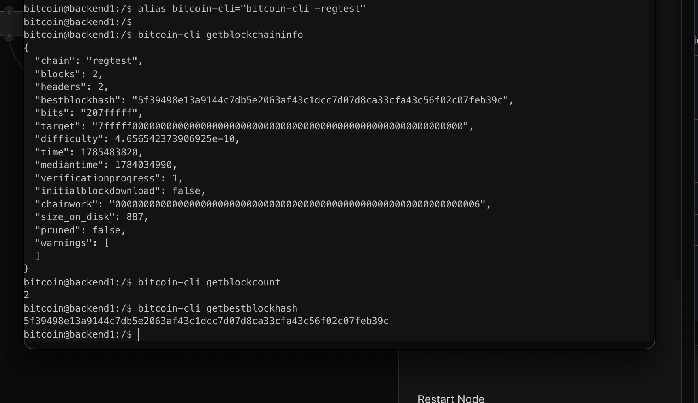

# Lab 01 — Regtest network inspection

## Commands used

TODO: List the Rust command and Bitcoin Core RPCs you ran.

```bash
cargo test --test lab_01

bitcoin-cli getblockchaininfo
bitcoin-cli getblockcount
bitcoin-cli getbestblockhash
```

## Terminal output

TODO: Record chain, block height, and best-block hash.

```text
Chain: regtest
Block height: 2
Best block hash:
5f39498e13a9144c7db5e2063af43c1dcc7d07d8ca33cfa43c56f02c07feb39c
```

## Evidence references

- Screenshot: 
- The screenshot shows the successful execution of:
  - `bitcoin-cli getblockchaininfo`
  - `bitcoin-cli getblockcount`
  - `bitcoin-cli getbestblockhash`

## Explanation

Polar provides a local Bitcoin regtest environment using Docker containers. Making it easy to run and manage Bitcoin Core nodes for development and testing.

Docker isolates the Bitcoin Core node inside a container, providing a reproducible environment without affecting the host machine.

Bitcoin Core is the reference implementation of the Bitcoin protocol. It validates blocks and transactions, maintains the blockchain, and exposes RPC methods that applications can use to interact with the node.

Regtest is a private Bitcoin network designed for development. Blocks can be mined on demand, coins have no real value, and developers can safely experiment without interacting with the public Bitcoin network.
