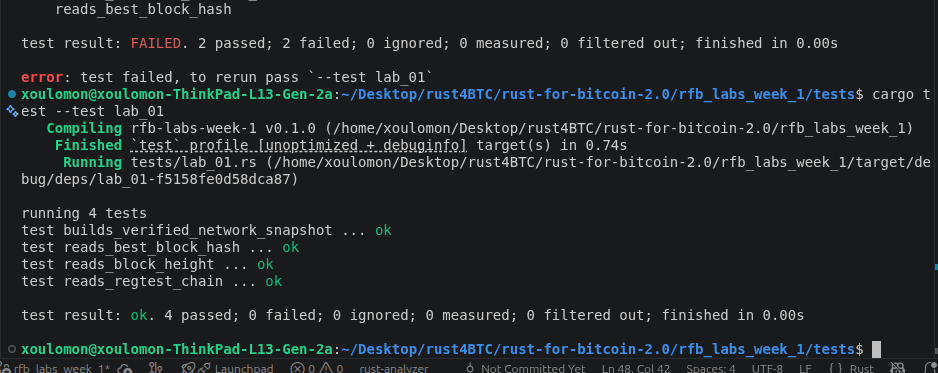
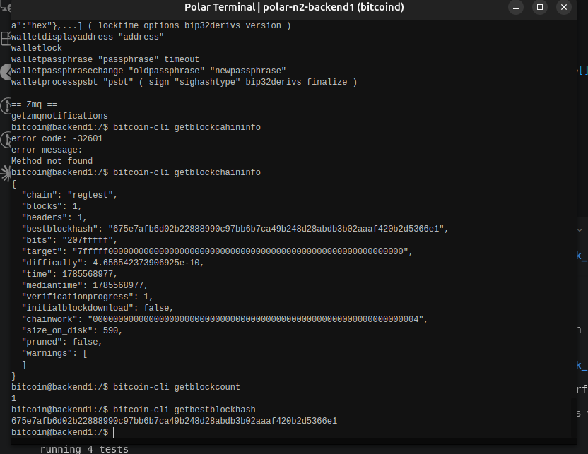

# Lab 01 — Regtest network inspection

## Commands used

<!-- TODO: List the Rust command and Bitcoin Core RPCs you ran. -->


```bash
cargo test --test lab_01 # test Lab01 implementation

bitcoin-cli -regtest getblockchaininfo  # Get chain name
bitcoin-cli -regtest getblockcount      # Get block height
bitcoin-cli -regtest getbestblockhash   # Get best block hash
```

## Terminal output

<!-- TODO: Record chain, block height, and best-block hash. -->
```bash
bitcoin@backend1:/$ bitcoin-cli getblockcahininfo
error code: -32601
error message:
Method not found
bitcoin@backend1:/$ bitcoin-cli getblockchaininfo
{
  "chain": "regtest",
  "blocks": 1,
  "headers": 1,
  "bestblockhash": "675e7afb6d02b22888990c97bb6b7ca49b248d28abdb3b02aaaf420b2d5366e1",
  "bits": "207fffff",
  "target": "7fffff0000000000000000000000000000000000000000000000000000000000",
  "difficulty": 4.656542373906925e-10,
  "time": 1785568977,
  "mediantime": 1785568977,
  "verificationprogress": 1,
  "initialblockdownload": false,
  "chainwork": "0000000000000000000000000000000000000000000000000000000000000004",
  "size_on_disk": 590,
  "pruned": false,
  "warnings": [
  ]
}
bitcoin@backend1:/$ bitcoin-cli getblockcount    
1
bitcoin@backend1:/$ bitcoin-cli getbestblockhash
675e7afb6d02b22888990c97bb6b7ca49b248d28abdb3b02aaaf420b2d5366e1
```


## Evidence references

<!-- TODO: Link screenshots or describe the attached evidence. -->


The first screen shot show all test for lab01 passes 


The second sscreenshot shows the me caling the bitcoin rpc methods on Polar terminal and it's corresponding response.


## Explanation

<!-- TODO: Explain Polar, Docker, Bitcoin Core, and regtest in your own words. -->

Bitcoin Core — The main Bitcoin node software. Validates transactions/blocks, maintains the chain, has wallet functions.

Regtest — A private Bitcoin network mode where you control everything. Mine blocks instantly, no real money, fully isolated. Used for testing.

Docker — Packages software + dependencies into portable containers, so you can run apps (like Bitcoin/Lightning nodes) without installing them directly on your machine.

Polar — A GUI app that uses Docker to spin up a local Bitcoin regtest network with multiple Lightning nodes pre-connected, so you can test Lightning apps visually without setup hassle.

How they connect: Docker runs the containers → Bitcoin Core (regtest) is the chain inside them → Polar is the UI that wires it all together.

