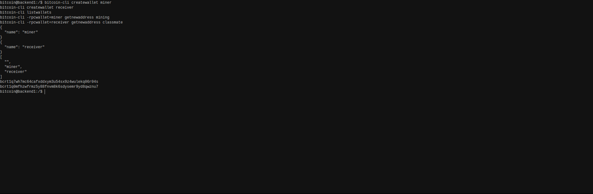
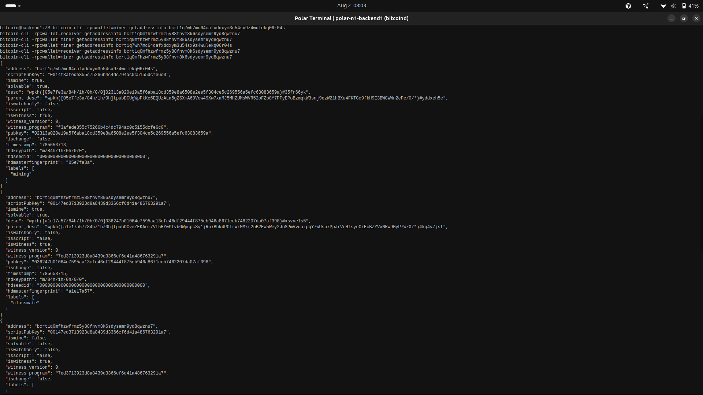

# Lab 02 — Wallets and addresses

<!-- Replace every TODO line. The grader scores a section 0 while a TODO remains in it. Rewrite the Explanation in your own words. -->

## Commands used

```bash
bitcoin-cli createwallet miner
bitcoin-cli createwallet receiver
bitcoin-cli listwallets

bitcoin-cli -rpcwallet=miner getnewaddress mining
bitcoin-cli -rpcwallet=receiver getnewaddress classmate

bitcoin-cli -rpcwallet=miner getaddressinfo <mining-address>
bitcoin-cli -rpcwallet=receiver getaddressinfo <classmate-address>
```

Ownership cross-check, deliberately asking the *wrong* wallet:

```bash
bitcoin-cli -rpcwallet=miner getaddressinfo <classmate-address>
```

Tests:

```bash
cargo test --test lab_02
```

`create_wallet` and `list_wallets` are node-wide calls. `get_new_address` and
`address_belongs_to_wallet` pass `Some(wallet_name)`, which becomes `-rpcwallet=…`.

## Terminal output

Wallet creation and the two addresses:

```
$ bitcoin-cli createwallet miner
{
  "name": "miner"
}

$ bitcoin-cli createwallet receiver
{
  "name": "receiver"
}

$ bitcoin-cli listwallets
[
  "",
  "miner",
  "receiver"
]

$ bitcoin-cli -rpcwallet=miner getnewaddress mining
bcrt1q7wh7mc64cafxddxym3u54sx9z4wulekq06r04s

$ bitcoin-cli -rpcwallet=receiver getnewaddress classmate
bcrt1q0mfhzwfrmz5y88fnvm8k6sdysemr9yd8qwznu7
```

Both addresses carry the `bcrt1` prefix. The empty string in `listwallets` is the
unnamed wallet Polar loads with the node, so three wallets are loaded at once and
every wallet-scoped call below has to say which one it means.

Each address queried against its own wallet — both report `ismine: true`:

```
$ bitcoin-cli -rpcwallet=miner getaddressinfo bcrt1q7wh7mc64cafxddxym3u54sx9z4wulekq06r04s
{
  "address": "bcrt1q7wh7mc64cafxddxym3u54sx9z4wulekq06r04s",
  "scriptPubKey": "0014f3afede355c75266b4c4dc794ac0c5155dcfe6c0",
  "ismine": true,
  "solvable": true,
  "iswatchonly": false,
  "isscript": false,
  "iswitness": true,
  "witness_version": 0,
  "witness_program": "f3afede355c75266b4c4dc794ac0c5155dcfe6c0",
  "pubkey": "02313a020e19a5f6aba18cd359e8a6508e2ee5f304ce5c269556a5efc63083659a",
  "ischange": false,
  "timestamp": 1785653713,
  "hdkeypath": "m/84h/1h/0h/0/0",
  "hdmasterfingerprint": "05e7fe3a",
  "labels": [
    "mining"
  ]
}

$ bitcoin-cli -rpcwallet=receiver getaddressinfo bcrt1q0mfhzwfrmz5y88fnvm8k6sdysemr9yd8qwznu7
{
  "address": "bcrt1q0mfhzwfrmz5y88fnvm8k6sdysemr9yd8qwznu7",
  "scriptPubKey": "00147ed3713923d8a8439d3366cf6d41a486763291a7",
  "ismine": true,
  "solvable": true,
  "iswatchonly": false,
  "isscript": false,
  "iswitness": true,
  "witness_version": 0,
  "witness_program": "7ed3713923d8a8439d3366cf6d41a486763291a7",
  "pubkey": "036247b01064c7595aa13cfc46df29444f875eb946a8671ccb7462207da07af398",
  "ischange": false,
  "timestamp": 1785653715,
  "hdkeypath": "m/84h/1h/0h/0/0",
  "hdmasterfingerprint": "a1e17a57",
  "labels": [
    "classmate"
  ]
}
```

The `desc` and `parent_desc` descriptor fields are omitted from the two blocks above
for brevity; every field bearing on ownership is kept.

Wrong-wallet cross-check — the same `classmate` address asked of the `miner` wallet:

```
$ bitcoin-cli -rpcwallet=miner getaddressinfo bcrt1q0mfhzwfrmz5y88fnvm8k6sdysemr9yd8qwznu7
{
  "address": "bcrt1q0mfhzwfrmz5y88fnvm8k6sdysemr9yd8qwznu7",
  "scriptPubKey": "00147ed3713923d8a8439d3366cf6d41a486763291a7",
  "ismine": false,
  "solvable": false,
  "iswatchonly": false,
  "isscript": false,
  "iswitness": true,
  "witness_version": 0,
  "witness_program": "7ed3713923d8a8439d3366cf6d41a486763291a7",
  "ischange": false,
  "labels": [
  ]
}
```

The call succeeded — no error, exit status 0. Only the payload differs: `ismine` and
`solvable` flip to `false`, the `labels` array is empty, and the key fields
(`pubkey`, `hdkeypath`, `hdmasterfingerprint`, `timestamp`) vanish entirely, because
the `miner` wallet holds no key for that script. The address is identical in all
three responses; what changed is which keystore was asked.

Tests:

```
$ cargo test --test lab_02
running 4 tests
test creates_wallet ... ok
test generates_labelled_address_in_wallet_context ... ok
test lists_loaded_wallets ... ok
test verifies_wallet_owns_address ... ok

test result: ok. 4 passed; 0 failed; 0 ignored; 0 measured; 0 filtered out; finished in 0.00s
```

## Evidence references



Wallet creation run in the node's own terminal, opened from Polar with right-click →
Launch Terminal. The `bitcoin@backend1` prompt places these calls inside the Bitcoin
Core container of the `Week 1 Bitcoin Fundamentals` network, not on a separate local
node. It shows both `createwallet` results, the `listwallets` array containing
`miner` and `receiver` alongside Polar's unnamed default wallet, and the two
`bcrt1...` addresses.



The three `getaddressinfo` calls on the same node. Reading down the three responses,
the `mining` address against `miner` and the `classmate` address against `receiver`
both give `ismine: true`, while the final call — `classmate` against `miner` —
returns `ismine: false` with an empty `labels` array and no key material.

## Explanation

A Bitcoin Core node can hold many wallets loaded at once, and they are separate
keystores. The node itself has no notion of a "current" wallet, so any RPC that
touches keys, balances, or wallet history is ambiguous unless the call names which
wallet it means. `-rpcwallet=<name>` supplies that context, and Bitcoin Core routes
the call to that wallet's database.

The split is visible in these four calls. `listwallets` asks the node which wallets
are loaded, which is a fact about the node, so it needs no wallet context.
`getnewaddress` derives a fresh key and records it in a specific wallet's keystore,
so it is meaningless without one.

This node makes the point concretely. `listwallets` returned `["", "miner",
"receiver"]` — the empty name is the default wallet Polar loads with the node, so
three keystores are live at once. Bitcoin Core will not guess between them: a
wallet-scoped call without `-rpcwallet` fails outright once more than one wallet is
loaded, rather than picking one. Running `bitcoin-cli getnewaddress` with no wallet
named on this node returns error code `-19`, "Multiple wallets are loaded. Please
select which wallet to use...".

A wrong wallet context does not usually produce an error, and that is what makes it
dangerous. `getaddressinfo` against the wrong wallet succeeds and returns
`ismine: false` — a truthful answer to the question actually asked ("does *this*
wallet control that address?"), which reads as "not mine" when I meant to ask about
a different wallet. `getbalance` against the wrong wallet returns that wallet's
balance rather than an error. So a mistake in wallet context yields a plausible
wrong answer instead of a loud failure. That is why this lab checks each address
against both its own wallet and the other one: only the contrast proves ownership.

The `bcrt1` prefix marks these as regtest addresses. Mainnet native SegWit addresses
begin `bc1` and testnet `tb1`. The prefix is part of the bech32 encoding, so software
rejects an address from the wrong network instead of silently sending coins
somewhere unrecoverable.

The `mining` and `classmate` strings are labels — local bookkeeping tags stored in
the wallet. They are not part of the address, they never appear on-chain, and no
other node can see them.
