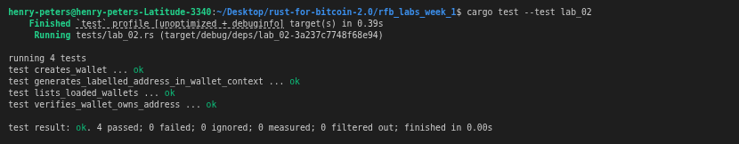

# Lab 02 — Wallets and addresses

## Commands used

```bash
# Rust test suite
cargo test --test lab_02

# Create two wallets
bitcoin-cli createwallet "miner"
bitcoin-cli createwallet "receiver"

# Confirm both are loaded
bitcoin-cli listwallets

# Generate addresses with labels
bitcoin-cli -rpcwallet=miner getnewaddress "miner_address"
bitcoin-cli -rpcwallet=receiver getnewaddress "receiver_address"

# Verify each address belongs to the expected wallet
bitcoin-cli -rpcwallet=miner getaddressinfo bcrt1qp83jqswduwkhy494f86kyrvk36xnqrpn553e03   # miner address
bitcoin-cli -rpcwallet=receiver getaddressinfo bcrt1qry57tkfsw9t6xp2m97y94ac5f7mj242f3a56mu  # receiver address
```

## Terminal output

<!-- Paste the relevant terminal output here -->
```bash
bitcoin@backend1:/$ bitcoin-cli createwallet "miner"
{
  "name": "miner"
}
bitcoin@backend1:/$ bitcoin-cli createwallet "receiver"
{
  "name": "receiver"
}
bitcoin@backend1:/$ bitcoin-cli listwallets
[
  "",
  "miner",
  "receiver"
]
bitcoin@backend1:/$ bitcoin-cli -rpcwallet=miner getnewaddress "mining"
bcrt1qn4cual64ksxyzw86ej6a8dhzu22plz30lwd2gp
bitcoin@backend1:/$ bitcoin-cli -rpcwallet=receiver getnewaddress "receiver"
bcrt1qx4pls60x5d39ulwx3mchl3cx3aka4frvh7lzv6
bitcoin@backend1:/$ bitcoin-cli -rpcwallet=miner getnewaddress "miner_address"
bcrt1qp83jqswduwkhy494f86kyrvk36xnqrpn553e03
bitcoin@backend1:/$ bitcoin-cli -rpcwallet=receiver getnewaddress "receiver_address"
bcrt1qaddk7s8f3tavxaqrugjwmfqn73a6fsnrkh9gu2
bitcoin@backend1:/$ bitcoin-cli -rpcwallet=miner getaddressinfo miner_address
error code: -5
error message:
Invalid or unsupported Segwit (Bech32) or Base58 encoding.
bitcoin@backend1:/$ bitcoin-cli -rpcwallet=miner getaddressinfo <miner_address>
bash: syntax error near unexpected token `newline'
bitcoin@backend1:/$ bitcoin-cli -rpcwallet=miner getaddressinfo bcrt1qp83jqswduwkhy494f86kyrvk36xnqrpn553e03bcrt1qp83jqswduwkhy494f86kyrvk36xnqrpn553e03
error code: -5
error message:
Invalid checksum
bitcoin@backend1:/$ bitcoin-cli -rpcwallet=miner getaddressinfo bcrt1qp83jqswduwkhy494f86kyrvk36xnqrpn553e03
{
  "address": "bcrt1qp83jqswduwkhy494f86kyrvk36xnqrpn553e03",
  "scriptPubKey": "001409e32041cde3ad7254b549f5620d968e8d300c33",
  "ismine": true,
  "solvable": true,
  "desc": "wpkh([8aaef9c5/84h/1h/0h/0/1]02a016d02eed09f4474152796b722c3bad06ed261e2b52d0aa8a8d917ed5cd4819)#3zsu0j70",
  "parent_desc": "wpkh([8aaef9c5/84h/1h/0h]tpubDC4Y53dKMEJ2K9VSZjfkBqrfVisQeQQdgs5nTKi6EeCERsLdCscVQ1YKW7QsnXbzcU9kgCmtuLV6cjCNQ649Bdnuo1iyZxx51YWU16y2Uzg/0/*)#he6aekk7",
  "iswatchonly": false,
  "isscript": false,
  "iswitness": true,
  "witness_version": 0,
  "witness_program": "09e32041cde3ad7254b549f5620d968e8d300c33",
  "pubkey": "02a016d02eed09f4474152796b722c3bad06ed261e2b52d0aa8a8d917ed5cd4819",
  "ischange": false,
  "timestamp": 1785753713,
  "hdkeypath": "m/84h/1h/0h/0/1",
  "hdseedid": "0000000000000000000000000000000000000000",
  "hdmasterfingerprint": "8aaef9c5",
  "labels": [
    "miner_address"
  ]
}
bitcoin@backend1:/$ bitcoin-cli -rpcwallet=miner getaddressinfo bcrt1qaddk7s8f3tavxaqrugjwmfqn73a6fsnrkh9gu2
{
  "address": "bcrt1qaddk7s8f3tavxaqrugjwmfqn73a6fsnrkh9gu2",
  "scriptPubKey": "0014eb5b6f40e98afac37403e224eda413f47ba4c263",
  "ismine": true,
  "solvable": true,
  "desc": "wpkh([8aaef9c5/84h/1h/0h/0/2]03fc4007b14946c1ed8f1110c0098ba6cbef447f4b01748ff16890776be93cc3fa)#3tgugjpv",
  "parent_desc": "wpkh([8aaef9c5/84h/1h/0h]tpubDC4Y53dKMEJ2K9VSZjfkBqrfVisQeQQdgs5nTKi6EeCERsLdCscVQ1YKW7QsnXbzcU9kgCmtuLV6cjCNQ649Bdnuo1iyZxx51YWU16y2Uzg/0/*)#he6aekk7",
  "iswatchonly": false,
  "isscript": false,
  "iswitness": true,
  "witness_version": 0,
  "witness_program": "eb5b6f40e98afac37403e224eda413f47ba4c263",
  "pubkey": "03fc4007b14946c1ed8f1110c0098ba6cbef447f4b01748ff16890776be93cc3fa",
  "ischange": false,
  "timestamp": 1785753713,
  "hdkeypath": "m/84h/1h/0h/0/2",
  "hdseedid": "0000000000000000000000000000000000000000",
  "hdmasterfingerprint": "8aaef9c5",
  "labels": [
    "receiver_address"
  ]
}
bitcoin@backend1:/$ 
```

## Evidence references

<!-- Describe or link to screenshots, logs, or other supporting evidence -->
.png)
<!-- I made a mistake in my screenshot, instead of generating address of label `receiver_address` in `receiver` wallet, I generated the address in `miner` wallet. -->
<!-- But I've made the correction. Now the address is `bcrt1qry57tkfsw9t6xp2m97y94ac5f7mj242f3a56mu` -->

.png)
<!-- My tests -->
   

## Explanation

Bitcoin Core can host multiple independent wallets at the same time. When an RPC call operates on wallet-specific data — balances, addresses, transactions — the node needs to know *which* wallet to query. That is done by appending `-rpcwallet=<name>` to the `bitcoin-cli` command, which targets the `/wallet/<name>` RPC endpoint. Without it, on a node with multiple wallets loaded, the call either returns data from the wrong wallet or fails with "No wallet is loaded."

The `bcrt1` prefix is the bech32 human-readable part (HRP) for regtest native SegWit addresses. Mainnet uses `bc1`, testnet uses `tb1`, and regtest uses `bcrt1`. The prefix alone proves which network an address belongs to and prevents accidentally mixing up addresses across networks.
