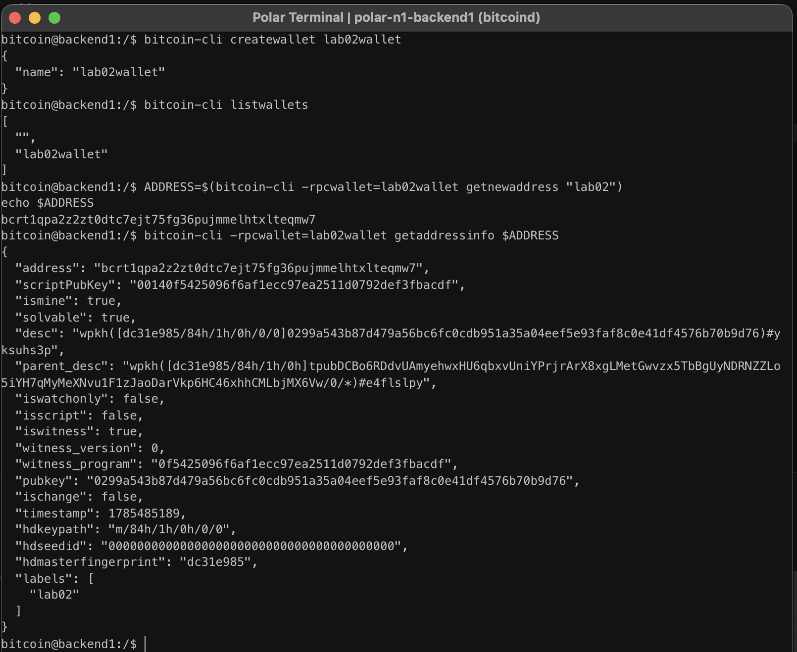

# Lab 02 — Wallets and addresses

## Commands used

```bash
cargo test --test lab_02

bitcoin-cli createwallet lab02wallet
bitcoin-cli listwallets

ADDRESS=$(bitcoin-cli -rpcwallet=lab02wallet getnewaddress "lab02")
echo $ADDRESS

bitcoin-cli -rpcwallet=lab02wallet getaddressinfo $ADDRESS
```

## Terminal output

```text
bitcoin@backend1:/$ bitcoin-cli createwallet lab02wallet
{
  "name": "lab02wallet"
}
bitcoin@backend1:/$ bitcoin-cli listwallets
[
  "",
  "lab02wallet"
]
bitcoin@backend1:/$ ADDRESS=$(bitcoin-cli -rpcwallet=lab02wallet getnewaddress "lab02")
echo $ADDRESS
bcrt1qpa2z2zt0dtc7ejt75fg36pujmmelhtxlteqmw7
bitcoin@backend1:/$ bitcoin-cli -rpcwallet=lab02wallet getaddressinfo $ADDRESS
{
  "address": "bcrt1qpa2z2zt0dtc7ejt75fg36pujmmelhtxlteqmw7",
  "scriptPubKey": "00140f5425096f6af1ecc97ea2511d0792def3fbacdf",
  "ismine": true,
  "solvable": true,
  "desc": "wpkh([dc31e985/84h/1h/0h/0/0]0299a543b87d479a56bc6fc0cdb951a35a04eef5e93faf8c0e41df4576b70b9d76)#yksuhs3p",
  "parent_desc": "wpkh([dc31e985/84h/1h/0h]tpubDCBo6RDdvUAmyehwxHU6qbxvUniYPrjrArX8xgLMetGwvzx5TbBgUyNDRNZZLo5iYH7qMyMeXNvu1F1zJaoDarVkp6HC46xhhCMLbjMX6Vw/0/*)#e4flslpy",
  "iswatchonly": false,
  "isscript": false,
  "iswitness": true,
  "witness_version": 0,
  "witness_program": "0f5425096f6af1ecc97ea2511d0792def3fbacdf",
  "pubkey": "0299a543b87d479a56bc6fc0cdb951a35a04eef5e93faf8c0e41df4576b70b9d76",
  "ischange": false,
  "timestamp": 1785485189,
  "hdkeypath": "m/84h/1h/0h/0/0",
  "hdseedid": "0000000000000000000000000000000000000000",
  "hdmasterfingerprint": "dc31e985",
  "labels": [
    "lab02"
  ]
}
bitcoin@backend1:/$ 
```

## Evidence references

The screenshot below shows the successful execution of the wallet and address commands.



## Explanation

A Bitcoin wallet manages keys, addresses, and transaction history. Multiple wallets can exist on the same Bitcoin Core node.

The `-rpcwallet` option tells Bitcoin Core which wallet an RPC command should operate on. Without specifying a wallet, wallet-specific RPCs such as `getnewaddress` or `getaddressinfo` may fail or use the wrong wallet.

In this lab, I created a wallet, listed the loaded wallets, generated a new receiving address within the selected wallet, and verified that the generated address belonged to that wallet using `getaddressinfo`.