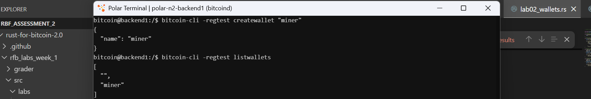
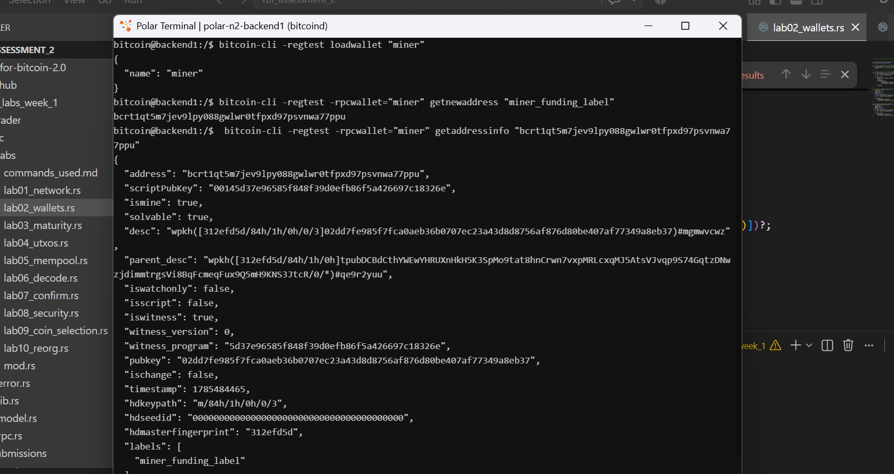

# Lab 02 — Wallets and addresses

## Commands used

bitcoin-cli -regtest createwallet "miner"
bitcoin-cli -regtest listwallets
bitcoin-cli -regtest -rpcwallet="miner" getnewaddress "miner_funding_label"
bitcoin-cli -regtest -rpcwallet="miner" getaddressinfo "bcrt1qt5m7jev9lpy088gwlwr0tfpxd97psvnwa77ppu"

TODO: Record how you created and inspected both wallets and addresses.

## Terminal output
loadwallet
```bash
{
  "name": "miner"
}
```
getnewaddress
```bash
bcrt1qt5m7jev9lpy088gwlwr0tfpxd97psvnwa77ppu
```
getaddressinfo
```bash
bitcoin@backend1:/$  bitcoin-cli -regtest -rpcwallet="miner" getaddressinfo "bcrt1qt5m7jev9lpy088gwlwr0tfpxd97psvnwa77ppu"
{
  "address": "bcrt1qt5m7jev9lpy088gwlwr0tfpxd97psvnwa77ppu",
  "scriptPubKey": "00145d37e96585f848f39d0efb86f5a426697c18326e",
  "ismine": true,
  "solvable": true,
  "desc": "wpkh([312efd5d/84h/1h/0h/0/3]02dd7fe985f7fca0aeb36b0707ec23a43d8d8756af876d80be407af77349a8eb37)#mgmwvcwz",
  "parent_desc": "wpkh([312efd5d/84h/1h/0h]tpubDCBdCthYWEwYHRUXnHkH5K3SpMo9tat8hnCrwn7vxpMRLcxqMJ5AtsVJvqp9S74GqtzDNwzjdimmtrgsVi8BqFcmeqFux9Q5mH9KNS3JtcR/0/*)#qe9r2yuu",
  "iswatchonly": false,
  "isscript": false,
  "iswitness": true,
  "witness_version": 0,
  "witness_program": "5d37e96585f848f39d0efb86f5a426697c18326e",
  "pubkey": "02dd7fe985f7fca0aeb36b0707ec23a43d8d8756af876d80be407af77349a8eb37",
  "ischange": false,
  "timestamp": 1785484465,
  "hdkeypath": "m/84h/1h/0h/0/3",
  "hdseedid": "0000000000000000000000000000000000000000",
  "hdmasterfingerprint": "312efd5d",
  "labels": [
    "miner_funding_label"
  ]
}
```

TODO: Include loaded wallets, addresses, and ownership evidence.

## Evidence references



* **Figure 1**: Terminal output demonstrating createwallet and listwallets execution.

---



* **Figure 2:** Terminal output showing loadwallet, getnewaddress, and getaddressinfo confirmation.


TODO: Link screenshots or describe the attached evidence.

## Explanation
- Bitcoin Core supports multi-wallet operation, allowing several distinct wallet files to be loaded concurrently in memory on a single node instance.

- Because multiple wallets can run simultaneously, wallet-specific commands (such as generating addresses or querying key ownership) require explicit targeted scope. The -rpcwallet=<name> CLI flag (or passing Some(wallet_name) to the JSON-RPC endpoint) specifies which wallet context should handle the RPC request.

- When querying getaddressinfo, the "ismine": true field proves that the selected wallet possesses the private key and public key derivation path necessary to sign transactions and spend funds arriving at that address.

TODO: Explain wallet context and the purpose of `-rpcwallet`.
