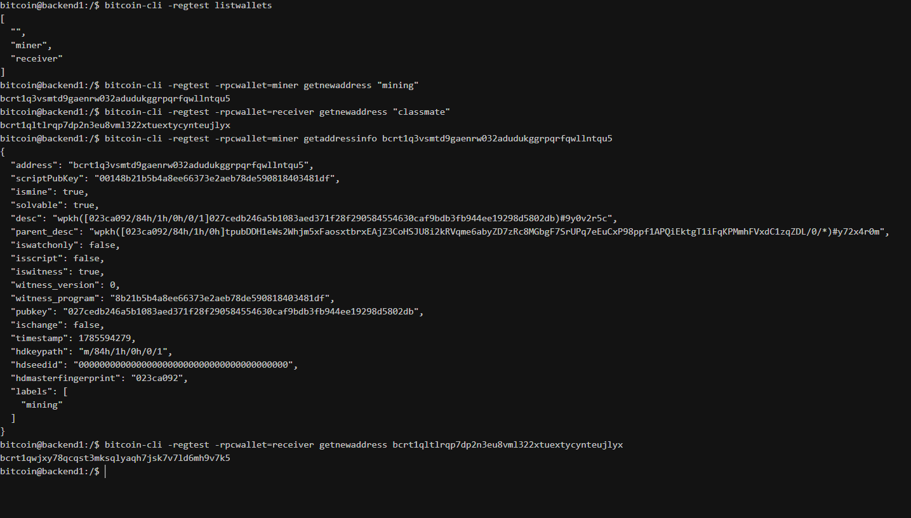

# Lab 02 — Wallets and addresses

## Commands used

bitcoin-cli -regtest createwallet "miner"
bitcoin-cli -regtest createwallet "receiver"
bitcoin-cli -regtest listwallets
bitcoin-cli -regtest -rpcwallet=miner getnewaddress "mining"
bitcoin-cli -regtest -rpcwallet=receiver getnewaddress "classmate"
bitcoin-cli -regtest -rpcwallet=miner getaddressinfo bcrt1q3vsmtd9gaenrw032adudukggrpqrfqwllntqu5
bitcoin-cli -regtest -rpcwallet=receiver getaddressinfo bcrt1qwjxy78qcqst3mksqlyaqh7jsk7v7ld6mh9v7k5

## Terminal output

{
  "name": "miner",
  
}
....
{
  "name": "receiver"
  
}
....
[
  "miner",
  "receiver"
]
....
bcrt1q3vsmtd9gaenrw032adudukggrpqrfqwllntqu5
....
bcrt1qwjxy78qcqst3mksqlyaqh7jsk7v7ld6mh9v7k5
....
{
  "address": "bcrt1q3vsmtd9gaenrw032adudukggrpqrfqwllntqu5",
  "scriptPubKey": "00148b21b5b4a8ee66373e2aeb78de590818403481df",
  "ismine": true,
  "solvable": true,
  "desc": "wpkh([023ca092/84h/1h/0h/0/1]027cedb246a5b1083aed371f28f290584554630caf9bdb3fb944ee19298d5802db)#9y0v2r5c",
  "parent_desc": "wpkh([023ca092/84h/1h/0h]tpubDDH1eWs2Whjm5xFaosxtbrxEAjZ3CoHSJU8i2kRVqme6abyZD7zRc8MGbgF7SrUPq7eEuCxP98ppf1APQiEktgT1iFqKPMmhFVxdC1zqZDL/0/*)#y72x4r0m",
  "iswatchonly": false,
  "isscript": false,
  "iswitness": true,
  "witness_version": 0,
  "witness_program": "8b21b5b4a8ee66373e2aeb78de590818403481df",
  "pubkey": "027cedb246a5b1083aed371f28f290584554630caf9bdb3fb944ee19298d5802db",
  "ischange": false,
  "timestamp": 1785594279,
  "hdkeypath": "m/84h/1h/0h/0/1",
  "hdseedid": "0000000000000000000000000000000000000000",
  "hdmasterfingerprint": "023ca092",
  "labels": [
    "mining"
  ]
}
....
bcrt1qwjxy78qcqst3mksqlyaqh7jsk7v7ld6mh9v7k5

## Evidence references

## Explanation

TODO: Explain wallet context and the purpose of `-rpcwallet`.
Bitcoin Core supports multiple named wallets, each with its own keypool and transaction history. 
The `-rpcwallet` flag tells `bitcoin-cli` which wallet context to use for the RPC call. Without it, node-wide commands like `getblockchaininfo` work fine, but wallet-scoped commands like `getnewaddress` or `sendtoaddress` fail with an error because the node does not know which wallet you intend to act on. If you accidentally pass the wrong wallet name—say `-rpcwallet=receiver` when you meant to spend from the miner wallet—the call may succeed but operate on the wrong keys and UTXO set, potentially sending from the wrong account or reporting a balance that belongs to a different wallet. This is why every wallet-scoped RPC in our Rust code explicitly passes the wallet parameter.