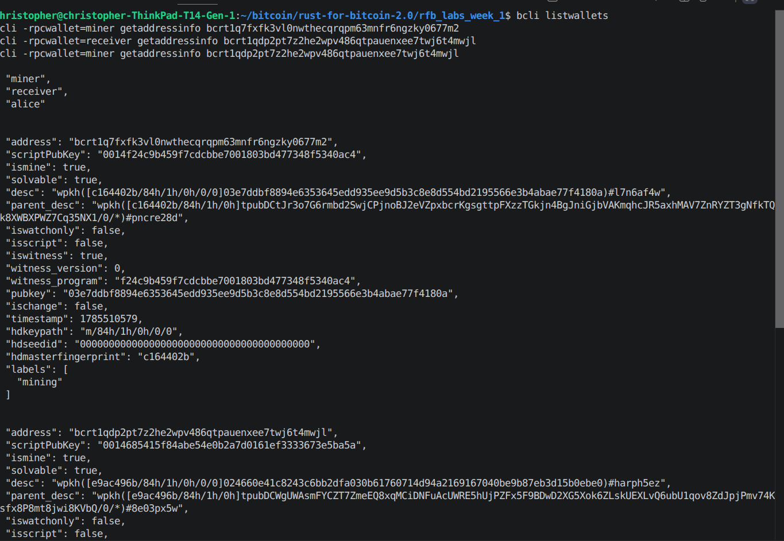

# Lab 02 — Wallets and addresses

## Commands used

```
cargo test --test lab_02
bitcoin-cli -regtest createwallet miner
bitcoin-cli -regtest createwallet receiver
bitcoin-cli -regtest listwallets
bitcoin-cli -regtest -rpcwallet=miner getnewaddress mining
bitcoin-cli -regtest -rpcwallet=receiver getnewaddress classmate
bitcoin-cli -regtest -rpcwallet=miner getaddressinfo <mining address>
bitcoin-cli -regtest -rpcwallet=receiver getaddressinfo <classmate address>
bitcoin-cli -regtest -rpcwallet=miner getaddressinfo <classmate address>   # wrong context, for contrast
```

## Terminal output

```
$ bitcoin-cli -regtest createwallet miner
{ "name": "miner" }

$ bitcoin-cli -regtest createwallet receiver
{ "name": "receiver" }

$ bitcoin-cli -regtest listwallets
[ "miner", "receiver" ]

$ bitcoin-cli -regtest -rpcwallet=miner getnewaddress mining
bcrt1q7fxfk3vl0nwthecqrqpm63mnfr6ngzky0677m2

$ bitcoin-cli -regtest -rpcwallet=receiver getnewaddress classmate
bcrt1qdp2pt7z2he2wpv486qtpauenxee7twj6t4mwjl

$ bitcoin-cli -regtest -rpcwallet=miner getaddressinfo bcrt1q7fxfk3vl0nwthecqrqpm63mnfr6ngzky0677m2
"address": "bcrt1q7fxfk3vl0nwthecqrqpm63mnfr6ngzky0677m2", "ismine": true

$ bitcoin-cli -regtest -rpcwallet=receiver getaddressinfo bcrt1qdp2pt7z2he2wpv486qtpauenxee7twj6t4mwjl
"address": "bcrt1qdp2pt7z2he2wpv486qtpauenxee7twj6t4mwjl", "ismine": true

$ bitcoin-cli -regtest -rpcwallet=miner getaddressinfo bcrt1qdp2pt7z2he2wpv486qtpauenxee7twj6t4mwjl
"address": "bcrt1qdp2pt7z2he2wpv486qtpauenxee7twj6t4mwjl", "ismine": false

$ cargo test --test lab_02
running 4 tests
test creates_wallet ... ok
test generates_labelled_address_in_wallet_context ... ok
test lists_loaded_wallets ... ok
test verifies_wallet_owns_address ... ok
test result: ok. 4 passed; 0 failed; 0 ignored; 0 measured; 0 filtered out
```

## Evidence references



- Both wallets loaded: `listwallets` → `["miner", "receiver"]`.
- `mining` address `bcrt1q7fxfk3...` starts with the regtest `bcrt1` prefix.
- `classmate` address `bcrt1qdp2pt7...` starts with the regtest `bcrt1` prefix.
- Each address is owned by its own wallet (`ismine: true` in the matching
  `-rpcwallet` context) and *not* owned by the other wallet (`ismine: false`
  when queried from `miner` for the `classmate` address) — proving wallet
  scoping is real, not cosmetic.

## Explanation

`bitcoind` can run several wallets at once inside one process, and most of
the wallet RPCs — `getnewaddress`, `getbalances`, `sendtoaddress`,
`getaddressinfo`, and so on — have no idea which wallet you mean unless you
tell them. That's what `-rpcwallet=<name>` is for. Leave it off and Core
either falls back to whatever single wallet is loaded, or just errors out if
there's more than one.

What actually bugs me about the wrong-context case is that it doesn't fail
loudly. Querying `miner`'s context for an address that belongs to `receiver`
doesn't throw an error — it just calmly reports `"ismine": false` and moves
on, which is exactly what happened above. In a real setup that's a genuine
footgun: send from the wrong wallet, or check a balance in the wrong
context, and you get a perfectly confident, perfectly wrong answer instead
of something that stops you and makes you notice.
