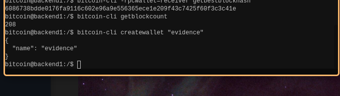
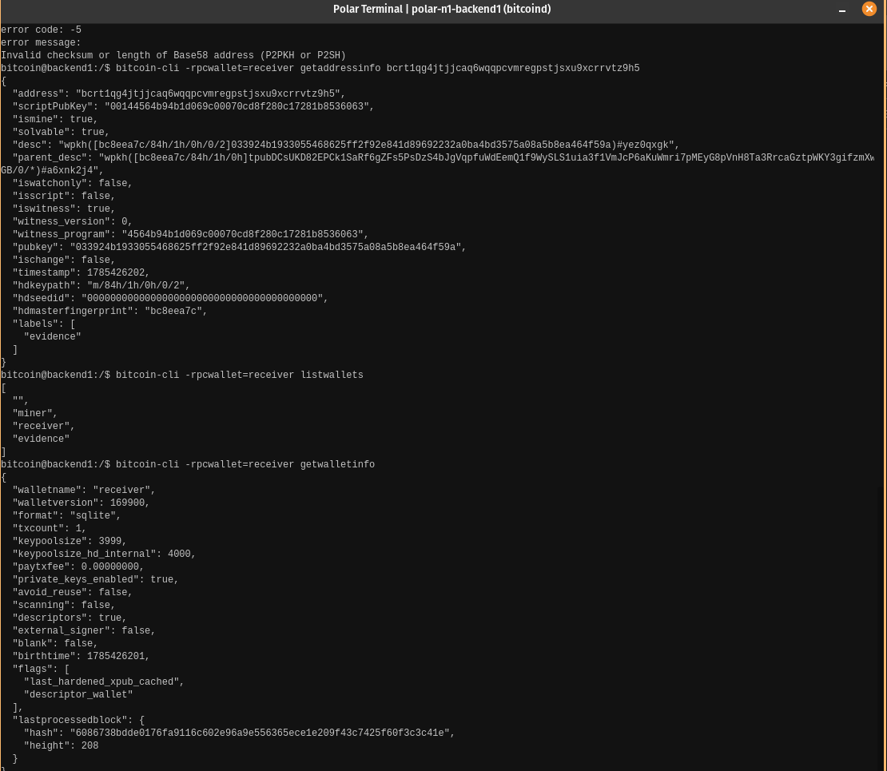

# Lab 02 — Wallets and addresses

## Commands used
I called the `createwallet` and `getaddressinfo <address>` commands

## Terminal output
```bash 

bitcoin@backend1:/$ bitcoin-cli -rpcwallet=receiver getnewaddress "evidence"
bcrt1qg4jtjjcaq6wqqpcvmregpstjsxu9xcrrvtz9h5

bitcoin@backend1:/$ bitcoin-cli -rpcwallet=receiver getaddressinfo bcrt1qg4jtjjcaq6wqqpcvmregpstjsxu9xcrrvtz9h5                                        
{
  "address": "bcrt1qg4jtjjcaq6wqqpcvmregpstjsxu9xcrrvtz9h5",
  "scriptPubKey": "00144564b94b1d069c00070cd8f280c17281b8536063",
  "ismine": true,
  "solvable": true,
  "desc": "wpkh([bc8eea7c/84h/1h/0h/0/2]033924b1933055468625ff2f92e841d89692232a0ba4bd3575a08a5b8ea464f59a)#yez0qxgk",
  "parent_desc": "wpkh([bc8eea7c/84h/1h/0h]tpubDCsUKD82EPCk1SaRf6gZFs5PsDzS4bJgVqpfuWdEemQ1f9WySLS1uia3f1VmJcP6aKuWmri7pMEyG8pVnH8Ta3RrcaGztpWKY3gifzmXwGB/0/*)#a6xnk2j4",
  "iswatchonly": false,
  "isscript": false,
  "iswitness": true,
  "witness_version": 0,
  "witness_program": "4564b94b1d069c00070cd8f280c17281b8536063",
  "pubkey": "033924b1933055468625ff2f92e841d89692232a0ba4bd3575a08a5b8ea464f59a",
  "ischange": false,
  "timestamp": 1785426202,
  "hdkeypath": "m/84h/1h/0h/0/2",
  "hdseedid": "0000000000000000000000000000000000000000",
  "hdmasterfingerprint": "bc8eea7c",
  "labels": [
    "evidence"
  ]
}

bitcoin@backend1:/$ bitcoin-cli -rpcwallet=receiver listwallets
[
  "",
  "miner",
  "receiver",
  "evidence"
]

bitcoin@backend1:/$ bitcoin-cli -rpcwallet=receiver getwalletinfo
{
  "walletname": "receiver",
  "walletversion": 169900,
  "format": "sqlite",
  "txcount": 1,
  "keypoolsize": 3999,
  "keypoolsize_hd_internal": 4000,
  "paytxfee": 0.00000000,
  "private_keys_enabled": true,
  "avoid_reuse": false,
  "scanning": false,
  "descriptors": true,
  "external_signer": false,
  "blank": false,
  "birthtime": 1785426201,
  "flags": [
    "last_hardened_xpub_cached",
    "descriptor_wallet"
  ],
  "lastprocessedblock": {
    "hash": "6086738bdde0176fa9116c602e96a9e556365ece1e209f43c7425f60f3c3c41e",
    "height": 208
  }
}

```

## Evidence references



## Explanation

Node RPCs inspect shared chain  or mempool state. Wallet RPCs inspect keys, balances, transactions, and UTXOs tracked by one selected wallet. The `-rpcwallet` flag enables this  
