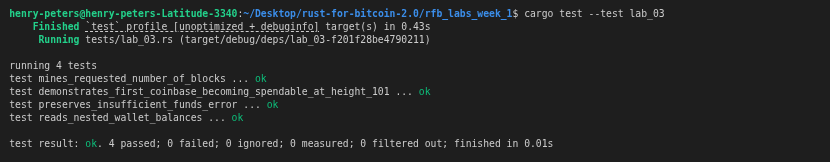

# Lab 03 — Coinbase maturity

## Commands used

```bash
# Rust test suite
cargo test --test lab_03

# Mine exactly one block to the miner address
bitcoin-cli generatetoaddress 1 bcrt1qp83jqswduwkhy494f86kyrvk36xnqrpn553e03  # miner address

# Inspect height and balances immediately after the first block
bitcoin-cli getblockcount
bitcoin-cli -rpcwallet=miner getbalances

# Attempt a premature spend (expected to fail)
bitcoin-cli -rpcwallet=miner sendtoaddress bcrt1qry57tkfsw9t6xp2m97y94ac5f7mj242f3a56mu 1  # receiver address

# Mine 100 more blocks to mature the first coinbase
bitcoin-cli generatetoaddress 100 bcrt1qp83jqswduwkhy494f86kyrvk36xnqrpn553e03  # miner address

# Confirm final height and balances
bitcoin-cli getblockcount   
bitcoin-cli -rpcwallet=miner getbalances
```

## Terminal output

<!-- Paste the relevant terminal output here -->
```bash
bitcoin@backend1:/$ bitcoin-cli generatetoaddress 1 bcrt1qp83jqswduwkhy494f86kyrvk36xnqrpn553e03
[
  "56367ea137540f81bf243214e0651650432c901b5d09a999bbdc88acc9b91fab"
]
bitcoin@backend1:/$ bitcoin-cli getblockcount
2
bitcoin@backend1:/$ bitcoin-cli -rpcwallet=miner getbalances
{
  "mine": {
    "trusted": 0.00000000,
    "untrusted_pending": 0.00000000,
    "immature": 50.00000000
  },
  "lastprocessedblock": {
    "hash": "56367ea137540f81bf243214e0651650432c901b5d09a999bbdc88acc9b91fab",
    "height": 2
  }
}
bitcoin@backend1:/$ bitcoin-cli -rpcwallet=miner listreceivedbyaddress
[
]
bitcoin@backend1:/$ bitcoin-cli -rpcwallet=miner listaddressgroupings
[
  [
    [
      "bcrt1qp83jqswduwkhy494f86kyrvk36xnqrpn553e03",
      0.00000000,
      "miner_address"
    ]
  ]
]
bitcoin@backend1:/$ bitcoin-cli -rpcwallet=receiver listaddressgroupings
[
]
bitcoin@backend1:/$ bitcoin-cli -rpcwallet=miner sendtoaddress bcrt1qry57tkfsw9t6xp2m97y94ac5f7mj242f3a56mu 1
error code: -6
error message:
Insufficient funds
bitcoin@backend1:/$ bitcoin-cli generatetoaddress 100 bcrt1qp83jqswduwkhy494f86kyrvk36xnqrpn553e03
[
  "778e048d83b4d248f75c030503ba719f20886f527d9f2d1e0179d5a25ea4c5d7",
  "33c0a06b63df0b5c588e954e70045986c3081340f7b093f81df39cca2d636646",
  "095669e2e4b81ee063fd6e29f7ada670360250484a7b842a5bfeb250fefb3b51",
  "59a7099da8b137bc8030cfa8a4dbf48c017e0ceeebadecad1ce7c96759e8456e",
  "53753d5b524d866cd57cfefbe9729d3f942a7d0964a9aff205ad5339c1feb1e5",
  "7764faa77eac2dc0c8824e9970c88da650477a2e6e681eef4b8efe322ae166b6",
  "3806a904606680d4d5a06190ba97d71a6aec9186592d23c3fb2e310a8d5cd7fd",
  "7a9e3d10febe625212b13d65411f29a5eda52a10e69dbf6f15a90959c2d5086a",
  "1aa8aec5ce62384a7172ad7a0b6dd2dc3f350967ed1471ceb3621f6a7ab7e71f",
  "00a25989d39522d84210ad20a082a846b1e3127b7cf4e4408e3bb2413f400489",
  "646ab3d9013e3b4b2ce8b0ac2ac2a5e0830a647f7a3f836f208d9b406e95a1c7",
  "33f137588f1c93b39366538712b8d2836e76d50716fcfd78b492a614b3a39e3f",
  "0f0d5a06fdf5ebe44b73d0fd1ff89cd3bb39cfb7aae54a2694092bcfe0f14d06",
  "258e1831da3333392549102cdceb3ef3434905f0c4af320a26e4b69b4e0b331d",
  "5633cf65fca5c0b36e4d2f5f34e13cdb8722476870097aafded76a856b3c8175",
  "35223b7c38d88579a8925dc1ec24c015e873b3c91dab8b8d15a7c00e9eecd592",
  "76e9d97221419cf42b8528a9b9d82d33d15e4a039cd068b3aa0ffcaae0454202",
  "01b5d578f7d0f80b528312e97dc54285edb9a879351a7154579ab1d8ad1b9310",
  "3abfcc29e5c8c1292e5086afe842f4a637ae16a4b63f4015f8b7c5b5776eebc7",
  "7c279a0cfc74c5e481bc947745e0dbe9a21b52d935de9f6a200188afe944f2ef",
  "3793d5e81b2ba172237193da92b0cf32ae8685a56892e2e8d4fc1956fa2b726d",
  "2ae4e59eb5fddbee7ac827e8b756ca8288d0f44501a6b7a55dceb87c05b3fbfe",
  "7c024b265b0a2177f842f0b25af954f29d1934db52f8e5ac9acd40f9f62a15f4",
  "6f165d500ae6aec03ffe7474731b360a13a28d4c7a455ec39850cdc73b938a84",
  "27b75120de840b9b73d646a79b06938c4e8922138c987b8b513bcc66536edb3c",
  "22a78933e042eea10fea0a6d3ba2ea13683a047f34e396d64df8ba9f06c0f006",
  "22e9afd9f2d17e23d1a2b1811ae511a4c97ee04850f73bbe096e07eda52e45c8",
  "3b3a0e2525cffdd2fcd115e17e4a8a381fef21bbd84bba40a7417b961ad7fb2c",
  "09a9bf06943b360237fee54eb86cf55a62377077c551bb60c51ef68c6831c1c6",
  "22ea775ebb80a36c3ee1662c245efcdc1800bf5cb0d436485c2589623ab901ec",
  "0ae7b86ed30f10ce8af7cf7807fc3069630a4f5fa3efb3e27408e6a90b2a760c",
  "1c7f6419fdccc91b688162596a6d0f6da39f2cc6966785eb7f45fec6988e981e",
  "3faa5964202093156476e127d67d61ce26c96f0d67ac297503491437805d29ad",
  "25fdd0d00dd82e8f87da162d90a191936f89c5db5ed654c223effba6644f0c14",
  "0b8f298e4ec133f979074e1732fdfda9ea675dd4a3a77731c80f8554966ce725",
  "008e7364771f23919f2b9f6d43d9a4692104d8b86d91cfc85aecefc5021a55da",
  "6967f53d38aab15ba6da0c557d66d1384dc92b6eda0c1a0a7ad23e0d16f0c96d",
  "2efa3bc12593f1916447926ce919eccdc7871e6f746397df84a25c84bed7d7de",
  "6c54ae63663fd8499fc8cc1b286d8d7e175d534a8b4cc359c10aae5ffbeee7d7",
  "28f6be6b2994da36b167eb6c32d3c86562752367c9f31cdbeca2ec051ab24986",
  "689932e7ec4f94b0c5607f60bbdd1c80dc33b9353542c1f6f94071a0e1df509b",
  "41282cad61059df4bb39d378d6036aa11f03ba3e67c6759627944ebfeaa96ed9",
  "2cb5ad063a4e2653566561ddd257e875b8354b0bada3d7b17ecce10d3968c927",
  "0df4aeb7b2d819bbf0c9321ba455695d023654d569789951dd9c0fa247998e04",
  "28ad33ba3ff4df5fcdcb43dcf2ebf74aca0f2a2660659279eaa1d814e77aa060",
  "5d72710d19763daadc6ceed19dffad3776a4ec588bdde4855f07585a02215f0e",
  "4158e99070420516111d10626fa247194ce7fdaec3e0889a3697ced9bd037e2b",
  "25634d3bba26d458336f7eb7a0a07409f092bca3a8ac465e061f99cb8d05b0ff",
  "58e75c2560b74d4fdaf535bcb2dec2eacbe15f8b8c59a23ef7348e908640c78a",
  "51da089148f34665913c8f9a2223de02048c0b2d6fb7bad29e404e999abdde0d",
  "4b3619999cda3eda656ac4b682563c48c6a79c82ab265dc2e0cd39ecd661a399",
  "28825e0719ea57c73b442c09111ff84ba15d5ae5c2787e94d1dc3346d0bf3094",
  "6584d779c936d7f6c977f6d631f0d6a503b5bb352e223d0e390ca21bda9b245a",
  "0548743744739349385313e8b83add8b8e9933db56c18c20a5832373b75d3098",
  "6524c00e22e4d89132adafe9e3d2039b7a3df1cba8bc9ec7d97f8f147c7b5b68",
  "18a4913f2477be319a23799950af00f871583682e437c94d5a525086b75eafd3",
  "5946df0f15da683b62c6ccd573e4540a3594bf62b562323d97820fd0c4676ba0",
  "21c779aebb8557aa1f18e8ac4eff4ba2d4fce9b676e5c6b92602ad7297c0885c",
  "6fd7e41fd79fdaf2c005d30eb2a6ad978d2331bf7a3a690cc96eb2a4b2a36d72",
  "33b65497e54a0a23344e2001779b1b8158d9bf84c0b1e1bac09e8237d4e6bbe5",
  "0f26f72214ae8ac59161b104d88512d9d910f2679606c22479dfe340bcaea8a5",
  "723645d8fe96f6ca2474372ae71dc72fa751fc525757aa9b4d9865558c0c721d",
  "0ff7505340331fc535842df472fee5fe94f29e1194cfbc489eb37a9e8d050a8f",
  "23446fba66367885448f4c7cd19d9c3a6cb9e7c4cead11f92529dd6f72ee8568",
  "4c7bb5df3e8b00cc0d3e1ff106f304bb460836e93d3ba47e540df80761ee5d42",
  "146b3a9dc699c75c6176e75a41732f9ad62cebbbee8d326a90348a7a2fe0679f",
  "2e456eac86dca2bfab79c603007fefdb6154c6a9d5fc08882b97bfd42ff923e0",
  "2de1966c6cbcc13509d35d056f368d19a43d6c41cbf8889d807ee7698671f1ff",
  "3a6f43ea132a0ee926fa445452a374140dbc1d68c76c7fa84c6948299e0669c9",
  "52cafb58c5068dd8388c827cef4cb2964e0428553b9f634b6b355879cc4220c5",
  "701261987afcbaf16d76f2767c555c9914f5c77ea08ec9f27c9229a80f7cf47e",
  "46182d565bd2ac045504992b38463f186966beb0c3f8b798c6f615df1e49324b",
  "33a4e8b70e616c359e1023c2392e8bb6d50d6f45b5c8105bdf79717cb7aae9ec",
  "56ddb1d334b7b272d5c0a5a2147c4bea61ec57c408c03df0238ef43b99d687b0",
  "2bf4ed64371e1202e9af7cc161a8272c466c6b1c476b866a3258a982b3b1ba8c",
  "2484f4d047b512aeb9fe96c39e0f2c96b754a7088720f8b79c96c74be8da5a4d",
  "78ad5cf08f128cc845cd2c9372986ec582c3efdea55a5bd9212b288280d4e6f4",
  "0d8502c426b1c2e8edc98273a7db2c671fd52873c0ef7e4a7021485a5aae3d83",
  "62b1d47ec65599abda71d60dac8c231b6616bf1caaec2c84c21b0d629e11f310",
  "548283b4da28bd64e2321c45783d410978f6dc161fd4f1c7aac98542d8216709",
  "0a20c0ef04e81c8b04ae07ba75056984127d71d1d74efbbb7f34a15d76ff21c2",
  "2b6bb6e3e9d717e722d39d181659ac078a44c3b7ccb6acea3f79df3f79d6f3f0",
  "7b04b5fd6e640064dd1319e3fb4ff70624d324136930c902ef68fc1b9ad726c7",
  "2665e81417a22588f14907c448d2d7549c72cfedcf8db58045c30287b27c6056",
  "1fe3e942bf7b75c670fd5a7ff153d1e3784cc96d8899e3a20c0816e2d6a56743",
  "45011dbe9e7a79650422fa6df571c454d52e5cd7ff9321d958587a237b699764",
  "5c16a02584906416f7a2a3d9983f9300612e373a2cf72c6697729821b6a48975",
  "23d9ba5c6a0dcc1e2d61c84a450dff040810a65b5035c15d0379cc8456403fda",
  "1b1fafed53695309864e2825d9755b22b3c7a12b62853dfec8c64ea488b33623",
  "7f32b26b5f005697591b810d46af3e473f4e13b660256d7615375a54219f583f",
  "67e6b7934bae903d81783a7f4da3c1716c6b6e34fa3309678f647812692603a8",
  "476cd9b078ca78aaa6e398a73330b838d60d0d1bcfb4aec0eee63773c1741a57",
  "38d54010f8d13f6dd6a5b0e9e00a97885be63cadae46bef99e30a1c79b45fc26",
  "75ccd60ed669e30d52b5054292369dbef9a1995ff0260cb9c8078e8a0b76603f",
  "67665ad5226cd5ba4e730f3c1ba8f45a634af009c89d044926a3c22c0e065d5f",
  "57f39f095d0895f48b0ec84ada08ea5dd3fc63e6205d49919170411cc7e52af5",
  "26d47b79ed63377f068a318bf4c002bc67a5046246bc4f4d1ea631f76dad8cff",
  "229aa861799ce7df3d326ef1b48452007d444f23f1256e7a50c820348bb3bedc",
  "6e417ca180468d65ba78817d192a7d255fa0c4b1674fc2fdd365405522de0d49",
  "5a7fd655c8fe1de5d36326211f06eb495690b6b6619e7b5b76396a0ba2f00504"
]
bitcoin@backend1:/$ bitcoin-cli getblockcount
102
bitcoin@backend1:/$ bitcoin-cli -rpcwallet=miner getbalances
{
  "mine": {
    "trusted": 50.00000000,
    "untrusted_pending": 0.00000000,
    "immature": 5000.00000000
  },
  "lastprocessedblock": {
    "hash": "5a7fd655c8fe1de5d36326211f06eb495690b6b6619e7b5b76396a0ba2f00504",
    "height": 102
  }
}
bitcoin@backend1:/$ 
```

## Evidence references

<!-- Describe or link to screenshots, logs, or other supporting evidence -->
.png)
.png)
<!-- My tests -->


## Explanation

**Coinbase maturity** is the rule that a coinbase output (the block reward paid to the miner) cannot be spent until 100 more blocks have been built on top of the block that contains it. Bitcoin Core enforces this at the protocol level — any attempt to spend an immature coinbase is rejected.

**Why the rule exists:** if a miner spent a fresh coinbase immediately and a chain reorganisation then removed that block, the spending transaction would reference a UTXO that no longer exists, invalidating every downstream transaction with it. The 100-block wait makes this scenario negligible in practice.

**The 101-block convention:** block 1 creates the first coinbase. That coinbase becomes mature once 100 more blocks exist on top of it — i.e. at height 101. Mining 1 block then 100 more is the minimum sequence that makes exactly one coinbase spendable (`trusted`), while all 100 subsequent coinbases remain `immature` because each has fewer than 100 confirmations on top of it.
