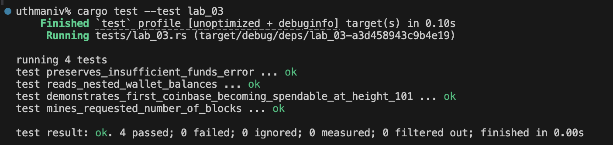

# Lab 03 — Coinbase maturity

## Commands used

- Mine first block: `bitcoin-cli generatetoaddress 1 "$MINER_ADDRESS"`
- Height after first block: `bitcoin-cli getblockcount`
- Initial miner balances: `bitcoin-cli -rpcwallet=miner getbalances`
- Premature payment: `bitcoin-cli -rpcwallet=miner sendtoaddress "$RECEIVER_ADDRESS" 1`
- Mine maturity blocks: `bitcoin-cli generatetoaddress 100 "$MINER_ADDRESS"`
- Final height: `bitcoin-cli getblockcount`
- Final miner balances: `bitcoin-cli -rpcwallet=miner getbalances`

## Terminal output

```text
height_after_first_block: 1
balance_after_first_block:
  trusted: 0.0 BTC
  untrusted_pending: 0.0 BTC
  immature: 50.0 BTC

premature_spend_error:
  error code: -6
  error message: Insufficient funds

final_height: 101
final_balance:
  trusted: 50.0 BTC
  untrusted_pending: 0.0 BTC
  immature: 5000.0 BTC
```

## Evidence references


## Explanation

A coinbase output cannot be spent until 100 blocks have been added after its
creation. The reward created in block 1 therefore remains immature through height
100 and becomes spendable when block 101 is added. Mining 101 blocks on a fresh
chain demonstrates both states: the first 50 BTC reward becomes trusted while the
100 newer rewards remain immature.
