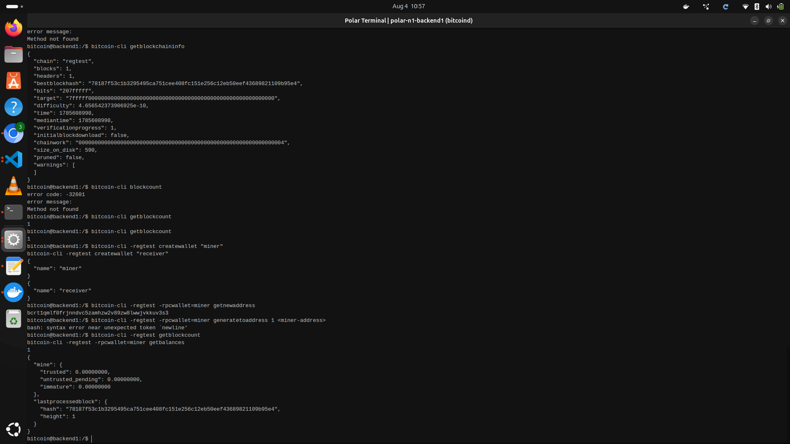

# Lab 03 — Coinbase maturity

## Commands used

TODO: Record mining, balance inspection, and premature-spend commands.
bitcoin-cli -regtest getblockcount
bitcoin-cli -regtest -rpcwallet=miner getbalances 
## Terminal output

TODO: Show balances at heights 1 and 101 plus the failed premature spend.
bitcoin@backend1:/$ bitcoin-cli -regtest createwallet "miner"
bitcoin-cli -regtest createwallet "receiver"
{
  "name": "miner"
}
{
  "name": "receiver"
}
bitcoin@backend1:/$ bitcoin-cli -regtest -rpcwallet=miner getnewaddress
bcrt1qmlf0frjnndvc5zamhzw2v89zw8lwwjvkkuv3s3
bitcoin@backend1:/$ bitcoin-cli -regtest -rpcwallet=miner generatetoaddress 1 <miner-address>
bash: syntax error near unexpected token `newline'
bitcoin@backend1:/$ bitcoin-cli -regtest getblockcount
bitcoin-cli -regtest -rpcwallet=miner getbalances
1
{
  "mine": {
    "trusted": 0.00000000,
    "untrusted_pending": 0.00000000,
    "immature": 0.00000000
  },
  "lastprocessedblock": {
    "hash": "78187f53c1b3295495ca751cee408fc151e256c12eb50eef43689821109b95e4",
    "height": 1
  }
}
bitcoin@backend1:/$ 

## Evidence references

TODO: Link screenshots or describe the attached evidence.

## Explanation

TODO: Explain why the first coinbase reward becomes spendable at height 101.
**Coinbase maturity, simply:** a miner's block reward can't be spent until it has 100 confirmations. Mining the first block gets you to height 1 with 1 confirmation on that reward. Mining 100 more blocks brings you to height 101 — at that point the reward has 100 confirmations and becomes spendable.