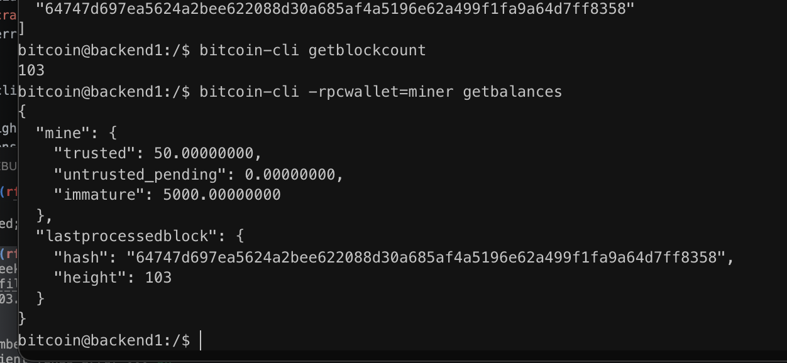

# Lab 03 — Coinbase maturity

## Commands used

```bash
bitcoin-cli createwallet miner

MINER=$(bitcoin-cli -rpcwallet=miner getnewaddress)
echo $MINER

bitcoin-cli generatetoaddress 1 $MINER
bitcoin-cli getblockcount
bitcoin-cli -rpcwallet=miner getbalances

bitcoin-cli createwallet receiver
RECEIVER=$(bitcoin-cli -rpcwallet=receiver getnewaddress)
echo $RECEIVER

bitcoin-cli -rpcwallet=miner sendtoaddress $RECEIVER 1

bitcoin-cli generatetoaddress 100 $MINER
bitcoin-cli getblockcount
bitcoin-cli -rpcwallet=miner getbalances
```

## Terminal output

```text
Initial height after mining:
3

Balances after first block:
trusted: 0.00000000
untrusted_pending: 0.00000000
immature: 50.00000000

Attempted payment:
error code: -6
Insufficient funds

Final height:
103

Final balances:
trusted: 50.00000000
untrusted_pending: 0.00000000
immature: 5000.00000000
```

## Evidence references



## Explanation

Coinbase rewards cannot be spent immediately after a block is mined. After mining one block, the wallet showed the reward as **immature**, and attempting to spend 1 BTC resulted in an **Insufficient funds** error. After mining 100 additional blocks, the original 50 BTC reward matured and became **trusted**, demonstrating Bitcoin's 100-block coinbase maturity rule.