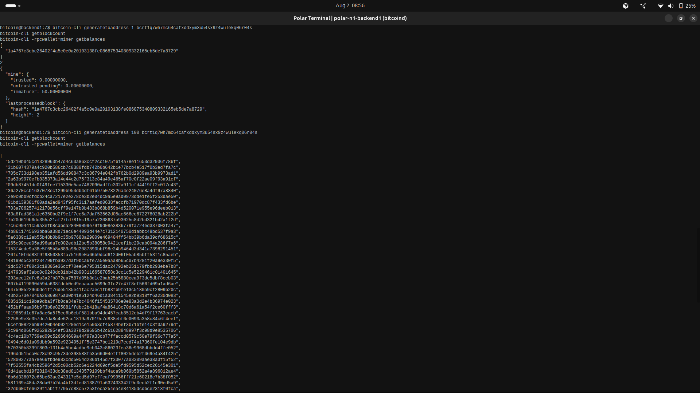
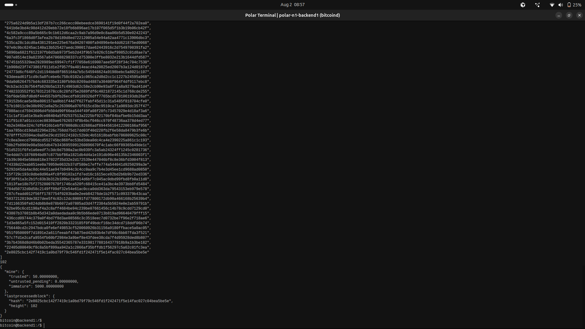
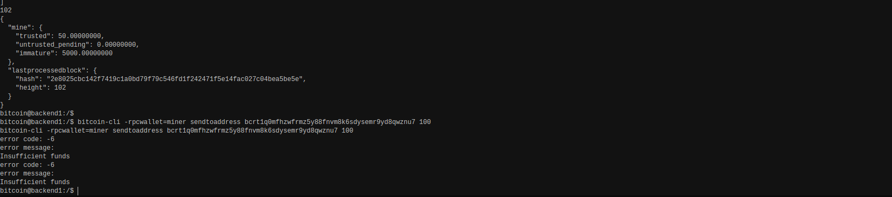

# Lab 03 — Coinbase maturity

<!-- Replace every TODO line. The grader scores a section 0 while a TODO remains in it. Rewrite the Explanation in your own words. -->

## Commands used

```bash
# 1. Mine a single block to the miner address.
bitcoin-cli generatetoaddress 1 <mining-address>
bitcoin-cli getblockcount
bitcoin-cli -rpcwallet=miner getbalances

# 2. Attempt to spend the reward before it matures. This is expected to FAIL.
bitcoin-cli -rpcwallet=miner sendtoaddress <classmate-address> 1

# 3. Mine 100 more blocks, then re-inspect.
bitcoin-cli generatetoaddress 100 <mining-address>
bitcoin-cli getblockcount
bitcoin-cli -rpcwallet=miner getbalances
```

Tests:

```bash
cargo test --test lab_03
```

`demonstrate_coinbase_maturity` performs exactly that sequence. `attempt_payment`
deliberately does not swallow the RPC error — the refusal is the evidence.

## Terminal output

Heights below read 2 and 102 rather than 1 and 101, because Polar mines one block
when it creates the network, so this chain started at height 1 rather than 0. The
maturity arithmetic is unchanged: the first reward I mined sits in block 2 and
becomes spendable once the chain reaches height 102.

Step 1 — mine one block to the `mining` address and inspect the reward:

```
$ bitcoin-cli generatetoaddress 1 bcrt1q7wh7mc64cafxddxym3u54sx9z4wulekq06r04s
[
  "1a4767c3cbc26402f4a5c0e0a20103138fe086875340809332165eb5de7a8729"
]

$ bitcoin-cli getblockcount
2

$ bitcoin-cli -rpcwallet=miner getbalances
{
  "mine": {
    "trusted": 0.00000000,
    "untrusted_pending": 0.00000000,
    "immature": 50.00000000
  },
  "lastprocessedblock": {
    "hash": "1a4767c3cbc26402f4a5c0e0a20103138fe086875340809332165eb5de7a8729",
    "height": 2
  }
}
```

The 50 BTC reward exists and the wallet can see it, but every satoshi of it is
`immature` and `trusted` is 0. Spendable balance is zero.

Step 2 — mine 100 more blocks so the first reward matures:

```
$ bitcoin-cli generatetoaddress 100 bcrt1q7wh7mc64cafxddxym3u54sx9z4wulekq06r04s
[
  "5d210b045cd1328963b47d4c63a863ccf2cc1075f614a78e11653d32936f786f",
  ... 98 block hashes omitted ...
  "2e8025cbc142f7419c1a0bd79f79c546fd1f242471f5e14fac027c04bea5be5e"
]

$ bitcoin-cli getblockcount
102

$ bitcoin-cli -rpcwallet=miner getbalances
{
  "mine": {
    "trusted": 50.00000000,
    "untrusted_pending": 0.00000000,
    "immature": 5000.00000000
  },
  "lastprocessedblock": {
    "hash": "2e8025cbc142f7419c1a0bd79f79c546fd1f242471f5e14fac027c04bea5be5e",
    "height": 102
  }
}
```

Exactly one reward matured. The block-2 coinbase reached 100 confirmations and moved
into `trusted`; the 100 rewards mined after it are still `immature`, totalling 5000
BTC. The wallet now holds 5050 BTC of which 50 is spendable.

Step 3 — attempt to spend immature coins. The wallet holds 5050 BTC, so asking it
for 100 BTC can only be satisfied out of the immature rewards:

```
$ bitcoin-cli -rpcwallet=miner sendtoaddress bcrt1q0mfhzwfrmz5y88fnvm8k6sdysemr9yd8qwznu7 100
error code: -6
error message:
Insufficient funds
```

"Insufficient funds" from a wallet holding 5050 BTC is the maturity rule refusing the
spend. Bitcoin Core does not offer the immature coins to coin selection at all, so
from the wallet's point of view only 50 BTC exists to spend from.

I ran this refusal against the matured chain at height 102 rather than at height 2.
The rule under test is identical — immature coinbase outputs are not spendable — and
the contrast is if anything sharper here, since the wallet visibly holds 5050 BTC
while refusing to send 100.

Tests:

```
$ cargo test --test lab_03
running 4 tests
test preserves_insufficient_funds_error ... ok
test mines_requested_number_of_blocks ... ok
test reads_nested_wallet_balances ... ok
test demonstrates_first_coinbase_becoming_spendable_at_height_101 ... ok

test result: ok. 4 passed; 0 failed; 0 ignored; 0 measured; 0 filtered out; finished in 0.00s
```

## Evidence references

The required `getbalances` evidence is split across two screenshots, one per height,
because the intervening 100 block hashes do not fit on a single screen.



Height 2, immediately after mining the first block to the `mining` address:
`trusted: 0.00000000` with `immature: 50.00000000`.



Height 102, after mining 100 more blocks: `trusted: 50.00000000` with
`immature: 5000.00000000`. Comparing the two, the 50 BTC moved from `immature` to
`trusted` while the newer rewards took its place.



The refusal itself: `sendtoaddress` for 100 BTC returning error code `-6`,
"Insufficient funds". The `getbalances` output directly above it in the same terminal
shows the 5050 BTC the wallet was holding at the time.

All three were taken in the `backend1` node terminal opened from Polar, shown by the
`bitcoin@backend1` prompt.

## Explanation

A coinbase transaction is the first transaction in every block. It has no real
inputs and creates new coins out of nothing, paying the block subsidy plus the fees
of the other transactions in that block to whoever mined it.

Consensus imposes `COINBASE_MATURITY = 100`: a coinbase output cannot be spent until
100 further blocks are built on top of the block that created it. The rule exists
because of reorganizations. Blocks near the tip can still be replaced by a
competing branch, and if that happens the coinbase from an orphaned block never
existed. Ordinary transactions can be re-mined into the new branch, but a coinbase
is bound to one specific block and simply disappears with it. Without the delay,
anyone paid from a fresh coinbase could see that payment vanish through no fault of
their own. A hundred blocks makes such a deep reorganization prohibitively
expensive, so by the time the coins move they are effectively settled.

That is why the lab mines 101 blocks in total. The reward I mined sits in block 2 and
needs 100 confirmations *on top of* block 2, which arrives only when the chain
reaches height 102. Mining exactly 100 would leave it one block short. This is also
why a fresh regtest chain is conventionally advanced by 101 blocks: it is the
smallest number that yields any spendable balance at all. My chain reads 102 rather
than the 101 in the lab text only because Polar had already mined block 1 when it
created the network — the 100-confirmation distance is what matters, not the
absolute height.

The balance fields report this directly. `immature` holds coinbase rewards that have
not yet reached 100 confirmations. `trusted` holds confirmed, spendable funds.
`untrusted_pending` holds incoming unconfirmed transactions. At height 2 the entire
50 BTC sits in `immature`, so the wallet declines to build a spend and Bitcoin Core
returns an insufficient-funds error even though the coins visibly exist. At height
102 exactly one reward has matured and moves to `trusted`, while the 100 rewards
from blocks 3 through 102 remain immature — they are younger and each needs its own
100 confirmations. That is the 5000 BTC still held back once 50 became spendable.

The wallet refuses the premature spend locally rather than broadcasting something
the network would reject. The error is the enforcement mechanism working, not a bug.
