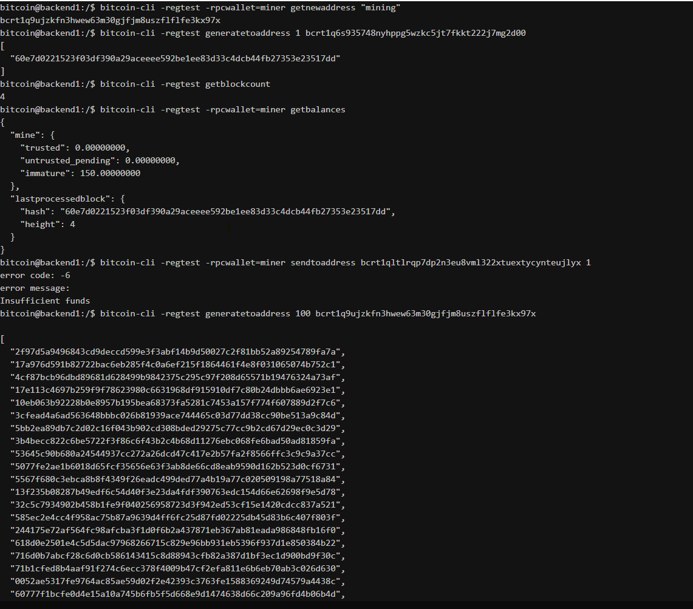
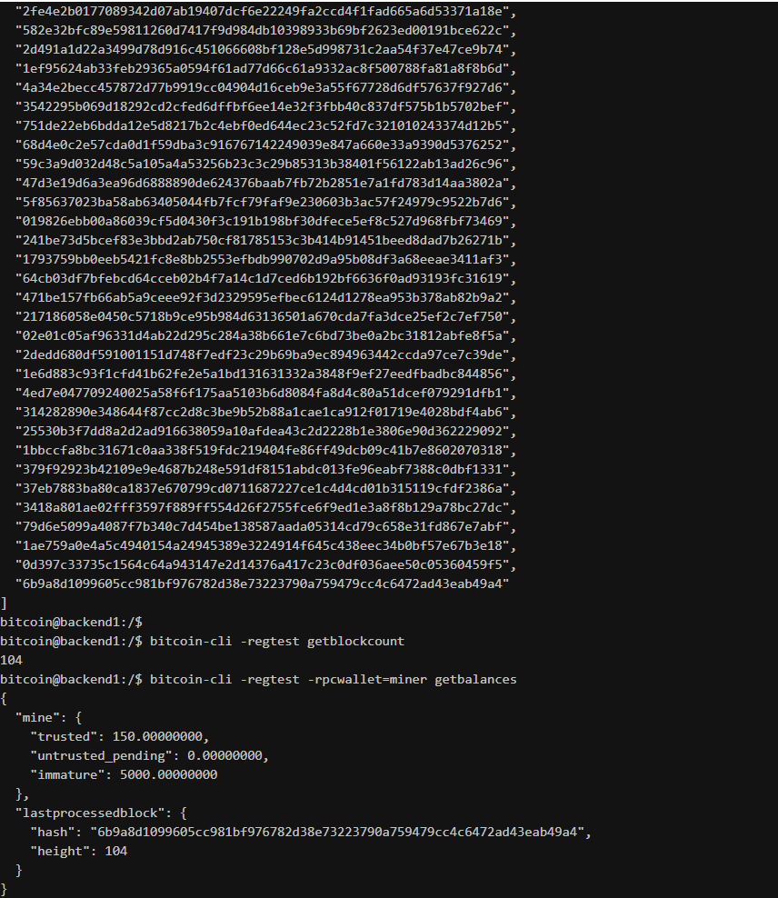

# Lab 03 — Coinbase maturity

## Commands used

bitcoin-cli -regtest -rpcwallet=miner getnewaddress "mining"
bitcoin-cli -regtest generatetoaddress 1 bcrt1q9ujzkfn3hwew63m30gjfjm8uszflflfe3kx97x
bitcoin-cli -regtest getblockcount
bitcoin-cli -regtest -rpcwallet=miner getbalances
bitcoin-cli -regtest -rpcwallet=miner sendtoaddress bcrt1q...receiver 1
bitcoin-cli -regtest generatetoaddress 100 bcrt1q...mining
bitcoin-cli -regtest getblockcount
bitcoin-cli -regtest -rpcwallet=miner getbalances

## Terminal output
....
bcrt1q9ujzkfn3hwew63m30gjfjm8uszflflfe3kx97x
....
[
  "60e7d0221523f03df390a29aceeee592be1ee83d33c4dcb44fb27353e23517dd"
]
....
4
....
{
  "mine": {
    "trusted": 0.00000000,
    "untrusted_pending": 0.00000000,
    "immature": 150.00000000
  },
  "lastprocessedblock": {
    "hash": "60e7d0221523f03df390a29aceeee592be1ee83d33c4dcb44fb27353e23517dd",
    "height": 4
  }
}
....
error code: -6
error message:
Insufficient funds
....        
[
  "2f97d5a9496843cd9deccd599e3f3abf14b9d50027c2f81bb52a89254789fa7a",
  "17a976d591b82722bac6eb285f4c0a6ef215f1864461f4e8f031065074b752c1",
  "4cf87bcb96dbd89681d628499b9842375c295c97f208d65571b19476324a73af",
  "17e113c4697b259f9f78623980c6631968df915910df7c80b24dbbb6ae6923e1",
  "10eb063b92228b0e8957b195bea68373fa5281c7453a157f774f607889d2f7c6",
  "3cfead4a6ad563648bbbc026b81939ace744465c03d77dd38cc90be513a9c84d",
  "5bb2ea89db7c2d02c16f043b902cd308bded29275c77cc9b2cd67d29ec0c3d29",
  "3b4becc822c6be5722f3f86c6f43b2c4b68d11276ebc068fe6bad50ad81859fa",
  "53645c90b680a24544937cc272a26dcd47c417e2b57fa2f8566ffc3c9c9a37cc",
  "5077fe2ae1b6018d65fcf35656e63f3ab8de66cd8eab9590d162b523d0cf6731",
  "5567f680c3ebca8b8f4349f26eadc499ded77a4b19a77c020509198a77518a84",
  "13f235b08287b49edf6c54d40f3e23da4fdf390763edc154d66e62698f9e5d78",
  "32c5c7934902b458b1fe9f040256958723d3f942ed53cf15e1420cdcc837a521",
  "585ec2e4cc4f958ac75b87a9639d4ff6fc25d87fd02225db45d83b6c407f803f",
  "244175e72af564fc98afcba3f1d0f6b2a437871eb367ab81eada986848fb16f0",
  "618d0e2501e4c5d5dac97968266715c829e96bb931eb5396f937d1e850384b22",
  "716d0b7abcf28c6d0cb586143415c8d88943cfb82a387d1bf3ec1d900bd9f30c",
  "71b1cfed8b4aaf91f274c6ecc378f4009b47cf2efa811e6b6eb70ab3c026d630",
  "0052ae5317fe9764ac85ae59d02f2e42393c3763fe1588369249d74579a4438c",
  "60777f1bcfe0d4e15a10a745b6fb5f5d668e9d1474638d66c209a96fd4b06b4d",
  "1133b0d943a529c914b76f0c3b1164750aa5a0b6bd252cc5b73a3e75ee51c8ba",
  "1fdd6ecd8cc4fff360f644b6f0286c6f384f26590fcf30cf02d954b704f142b7",
  "64af59712452077398a72437769c4c66521d3e9b92d040b794f592a3c9d6b43e",
  "66bb1610853415ec94492eeda3850cdbe5c374fc4e855c97f9199a143e1f5877",
  "4226dac08527b25f9afcb14acf1605effa0a14e2c17066caf4c02e8b0ef88f67",
  "151ece2881c26b575b5a76be5c8b31ec956460767b0fb885825dfdbdded2ebec",
  "2d0935fbcebeccd7c385ad730889a9fcf4a887b8558a50ce5be721ecc7685a13",
  "02af5ee6e9ff0f23dc75a076a71caa57fc7677aea21f2b0ed2207c001e488081",
  "1d26f4c0837ea9ecddbcc5dc7d21c1a63a59f3a132ebad40ec8a8838e67b75d0",
  "1ed9509edc8e5e512f21224c65324206d44ec15ba0f2fa299b17371ca4586b31",
  "476eaf393050320490b0e317714d6542b3c8e227bc0d63753bc91b641b36d7f9",
  "05175e2c58bd8a9d6d9174175c58d527bd5f8d1181d19776768ed2cc8fd3f058",
  "186880b1daf98b6c4d4523f6c8568fc4487beb04686f8d684c65a141b26a7dba",
  "15d1b73921b5be49b6920e1dcb4e0e544788c6199b28530c1d819141ad2387dd",
  "41b78f5c1eccb358b27345226478609bf2da0d8abba0e76435922dc56299cf0b",
  "0b77097175d8411d5c7ffef2e2e115325e3ac06ec0aa5c0a37605a3ef7a9eb1a",
  "43c6a00402c7da55ad879f0cce450e36231758e0d594bb8a56a6d04befe4dcea",
  "2ab46a20f97313443275749c6b7781225d15cc0c6a9f03fcbbd8e5605ffc6fc8",
  "3f55a4d03833f8b3012d92070e5b3683795aa4cfc91c07abc5786b42ec51b2ad",
  "6ba23188853fe035070b3362c9edf2c8a7f896277ebc9c0cd163e45023ed0b63",
  "6a36ad0d15140fdc6807f489b38932a90b1818913b277ea92d65a4540c82a77e",
  "14a73ab24f42a3264ef5ed32a060b8b993d7ce247bfe93bfaf394acf0cd2b86f",
  "7cb0403c64b1e62a47dd044c3d8d98a64c4a8b5e491d7a853c7b273a7b1dcf49",
  "475965967c9ccccfc50b3baa82711038f023836ea6831556457fdecb17893ec6",
  "40ef10142c88bde34c9eeb5789caa05c3ea7cfdc80ef0dd2b1e3140e4b1cecca",
  "06de1d7ae6421f5711e62c6edc6b028e5fdb446e116ebcaaa45c3bdf5922a3b7",
  "3f37abe092ba422c9ddf6eaeb48a45c2e10c2e55fa038e34fa1c26c7665c51a1",
  "161b01d63e3aef2fd10b8c92c342fe47f6aa4825f13c5750c498dfaa25805c5a",
  "79a9210235f79452e81041cba4b9c15a0645e7c919331e6a08d119d4f3f09214",
  "07340cfe83ebddfc6ffbf6f5121832e4271790d7d50a810395443928ccfe86a7",
  "02584ce3c9c3d6fb878d8e9c246da4b4d981439f8e1230e586fa2ac80441f7fb",
  "16cd8812a254092774c59c8076f94a553933d9af05d370c413f92ac602139d87",
  "02db129ad4e16a53d54dc5e13ca39d5a20841428ec8c9ccadd5b93dcc35a1f82",
  "08ea566d5f9c8633fc918799cd58f4a73ed67d90d1add3a42dc993a2138537ea",
  "25b786a4ee09f5baf4fbef73c1b2a4b57e70163f927543487c1ef57f1628e811",
  "3d862c1f578156f3c44439ef3cf65a9f6172fb0962bc8b2678ffe2d764af2034",
  "78e1a834c02bee6f8d74de13b71f4f031c0305cdfaefa39fbc8b92ccd92faad0",
  "767c374a7fca7c589278692fab128db24f5e293a55e459589580caf98fd5a2a8",
  "6c53ad92184b0c08c5939ad34e0e1ae7850d51b6b9fbdf2b1980b1a87632d6a1",
  "417aef16dbc2e90aadfc04addb588210c36cbe72a2143b5c794a29447243dd2b",
  "7df4cdde13ffabacc81bf3915bf6716946c0c2d46e3f19d54dddb281f43db940",
  "1533be88efec1c8866e923b42a54d8801574531997e8a9db3b35ecdda9a80488",
  "20082034871fbcb8fa12e72081a7a768922dc5f6fb79d32f32cbeb0637416a06",
  "79a48d43c55704e98d4d348e86ebd52cb6a4ba0206a42b80e2131390b70deb10",
  "5cd67ab8ab8880ce337c58453f03c89b17d997847d640ec60a4c894677fc0243",
  "073ea096844a38ae5fadec637d8d1ad24c0f825d002d9efeb930bb30d57e69fa",
  "050f407512217fa54ccac69c806322a6346eb2afd13e156e2a3e6b68c8083aa2",
  "44911d06c75c78db2007c437e2283c3e02219c69d12e151f9084587f8da88e84",
  "6988e8286820e2c62e39400f32dcf71620216f9f3a3f56fe99743cd92c2a9c1e",
  "2fe4e2b0177089342d07ab19407dcf6e22249fa2ccd4f1fad665a6d53371a18e",
  "582e32bfc89e59811260d7417f9d984db10398933b69bf2623ed00191bce622c",
  "2d491a1d22a3499d78d916c451066608bf128e5d998731c2aa54f37e47ce9b74",
  "1ef95624ab33feb29365a0594f61ad77d66c61a9332ac8f500788fa81a8f8b6d",
  "4a34e2becc457872d77b9919cc04904d16ceb9e3a55f67728d6df57637f927d6",
  "3542295b069d18292cd2cfed6dffbf6ee14e32f3fbb40c837df575b1b5702bef",
  "751de22eb6bdda12e5d8217b2c4ebf0ed644ec23c52fd7c321010243374d12b5",
  "68d4e0c2e57cda0d1f59dba3c916767142249039e847a660e33a9390d5376252",
  "59c3a9d032d48c5a105a4a53256b23c3c29b85313b38401f56122ab13ad26c96",
  "47d3e19d6a3ea96d6888890de624376baab7fb72b2851e7a1fd783d14aa3802a",
  "5f85637023ba58ab63405044fb7fcf79faf9e230603b3ac57f24979c9522b7d6",
  "019826ebb00a86039cf5d0430f3c191b198bf30dfece5ef8c527d968fbf73469",
  "241be73d5bcef83e3bbd2ab750cf81785153c3b414b91451beed8dad7b26271b",
  "1793759bb0eeb5421fc8e8bb2553efbdb990702d9a95b08df3a68eeae3411af3",
  "64cb03df7bfebcd64cceb02b4f7a14c1d7ced6b192bf6636f0ad93193fc31619",
  "471be157fb66ab5a9ceee92f3d2329595efbec6124d1278ea953b378ab82b9a2",
  "217186058e0450c5718b9ce95b984d63136501a670cda7fa3dce25ef2c7ef750",
  "02e01c05af96331d4ab22d295c284a38b661e7c6bd73be0a2bc31812abfe8f5a",
  "2dedd680df591001151d748f7edf23c29b69ba9ec894963442ccda97ce7c39de",
  "1e6d883c93f1cfd41b62fe2e5a1bd131631332a3848f9ef27eedfbadbc844856",
  "4ed7e047709240025a58f6f175aa5103b6d8084fa8d4c80a51dcef079291dfb1",
  "314282890e348644f87cc2d8c3be9b52b88a1cae1ca912f01719e4028bdf4ab6",
  "25530b3f7dd8a2d2ad916638059a10afdea43c2d2228b1e3806e90d362229092",
  "1bbccfa8bc31671c0aa338f519fdc219404fe86ff49dcb09c41b7e8602070318",
  "379f92923b42109e9e4687b248e591df8151abdc013fe96eabf7388c0dbf1331",
  "37eb7883ba80ca1837e670799cd0711687227ce1c4d4cd01b315119cfdf2386a",
  "3418a801ae02fff3597f889ff554d26f2755fce6f9ed1e3a8f8b129a78bc27dc",
  "79d6e5099a4087f7b340c7d454be138587aada05314cd79c658e31fd867e7abf",
  "1ae759a0e4a5c4940154a24945389e3224914f645c438eec34b0bf57e67b3e18",
  "0d397c33735c1564c64a943147e2d14376a417c23c0df036aee50c05360459f5",
  "6b9a8d1099605cc981bf976782d38e73223790a759479cc4c6472ad43eab49a4"
]
....
104
....
{
  "mine": {
    "trusted": 150.00000000,
    "untrusted_pending": 0.00000000,
    "immature": 5000.00000000
  },
  "lastprocessedblock": {
    "hash": "6b9a8d1099605cc981bf976782d38e73223790a759479cc4c6472ad43eab49a4",
    "height": 104
  }
}

## Evidence references

## Explanation

Bitcoin enforces a coinbase maturity rule: newly created coins from mining (coinbase transactions) cannot be spent until 100 additional blocks have been mined on top of the block containing that coinbase. This rule (COINBASE_MATURITY = 100) exists to protect against fraudulent spends that could arise if a miner could immediately spend a coinbase reward from a block that might later be invalidated during a chain reorganization. By requiring 100 confirmations, the network makes it extremely expensive to reverse a coinbase spend because an attacker would need to redo the proof-of-work for over 100 blocks.

The lab conventionally mines 101 blocks on a fresh chain because the genesis block is at height 0. Mining one block produces the first coinbase at height 1 with a 50 BTC subsidy. That reward is immature until 100 more blocks are mined, bringing the chain to height 101. At that point, the block at height 1 has 100 confirmations and its reward becomes part of the trusted balance. The remaining 100 coinbase rewards (from heights 2–101) are still immature, which is why the immature balance shows 5,000 BTC (100 × 50).