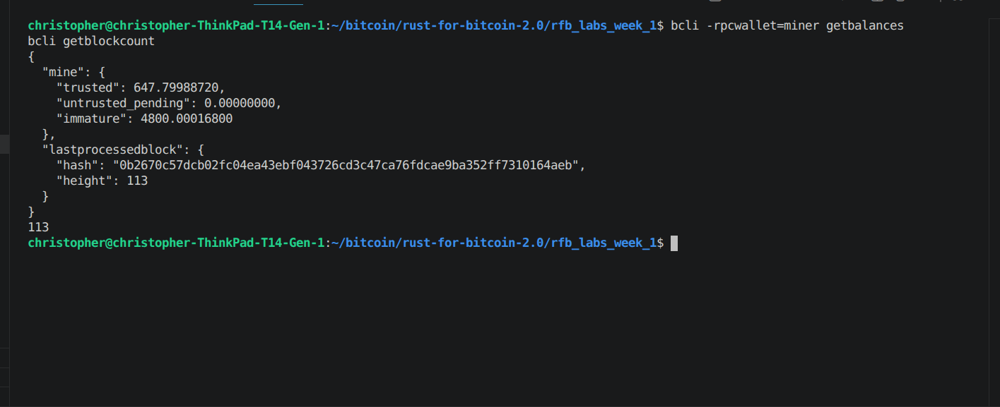

# Lab 03 — Coinbase maturity

## Commands used

```
cargo test --test lab_03
bitcoin-cli -regtest -rpcwallet=miner generatetoaddress 1 <mining address>
bitcoin-cli -regtest getblockcount
bitcoin-cli -regtest -rpcwallet=miner getbalances
bitcoin-cli -regtest -rpcwallet=miner sendtoaddress <classmate address> 1
bitcoin-cli -regtest -rpcwallet=miner generatetoaddress 100 <mining address>
bitcoin-cli -regtest getblockcount
bitcoin-cli -regtest -rpcwallet=miner getbalances
```

## Terminal output

```
$ bitcoin-cli -regtest -rpcwallet=miner generatetoaddress 1 bcrt1q7fxfk3vl0nwthecqrqpm63mnfr6ngzky0677m2
[ "4fb483c3a2126fe95a13cdb4ab8f5bca9073146ed5a3b3a3064dfc6ebe952d87" ]

$ bitcoin-cli -regtest getblockcount
1

$ bitcoin-cli -regtest -rpcwallet=miner getbalances
{
  "mine": {
    "trusted": 0.00000000,
    "untrusted_pending": 0.00000000,
    "immature": 50.00000000
  },
  "lastprocessedblock": { "height": 1 }
}

$ bitcoin-cli -regtest -rpcwallet=miner sendtoaddress bcrt1qdp2pt7z2he2wpv486qtpauenxee7twj6t4mwjl 1
error code: -6
error message:
Insufficient funds

$ bitcoin-cli -regtest -rpcwallet=miner generatetoaddress 100 bcrt1q7fxfk3vl0nwthecqrqpm63mnfr6ngzky0677m2
[ ... 100 block hashes ..., "07135a4ca2ef27de272a0840258150f31ce091877df164a75e10ade88a0a3bd6" ]

$ bitcoin-cli -regtest getblockcount
101

$ bitcoin-cli -regtest -rpcwallet=miner getbalances
{
  "mine": {
    "trusted": 50.00000000,
    "untrusted_pending": 0.00000000,
    "immature": 5000.00000000
  },
  "lastprocessedblock": { "height": 101 }
}

$ cargo test --test lab_03
running 4 tests
test demonstrates_first_coinbase_becoming_spendable_at_height_101 ... ok
test mines_requested_number_of_blocks ... ok
test preserves_insufficient_funds_error ... ok
test reads_nested_wallet_balances ... ok
test result: ok. 4 passed; 0 failed; 0 ignored; 0 measured; 0 filtered out
```

## Evidence references



(Screenshot shows live balances at the time it was taken, height 113 — chain
had already progressed past the originally-recorded height 101 snapshot
above; the underlying maturity mechanism is the same.)

- Height 1: `immature = 50 BTC`, `trusted = 0` — the first block's coinbase
  reward exists but cannot be spent yet.
- Premature spend of 1 BTC to the receiver's `classmate` address fails with
  `error code: -6, Insufficient funds` — the error string is preserved by
  `attempt_payment` in `lab03_maturity.rs`.
- Height 101 (after mining 100 more blocks): `trusted = 50 BTC` — exactly the
  first block's reward, now spendable. `immature = 5000 BTC` — the 100 later
  rewards (blocks 2–101), still locked.

## Explanation

Core enforces something called `COINBASE_MATURITY`, set to 100: a coinbase
output can't be spent until it has 100 confirmations sitting on top of it.
The reason is reorg protection — if the block that created the reward gets
orphaned by a longer competing chain, that reward (and anything spent from
it downstream) just disappears. Waiting 100 blocks is Core's way of making
that scenario astronomically unlikely by the time you'd actually spend it.

That's also why the lab has you mine 101 blocks on a fresh chain instead of
100. Block 1 is the one that creates the very first reward, so it's the one
that needs 100 blocks stacked on top of it to mature — meaning the chain
has to reach height 101 before that reward is spendable. Mine only 100
blocks total and you're one confirmation short, as the failed `sendtoaddress`
above demonstrates.
