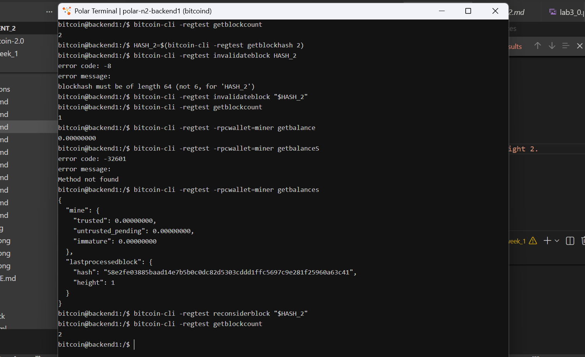
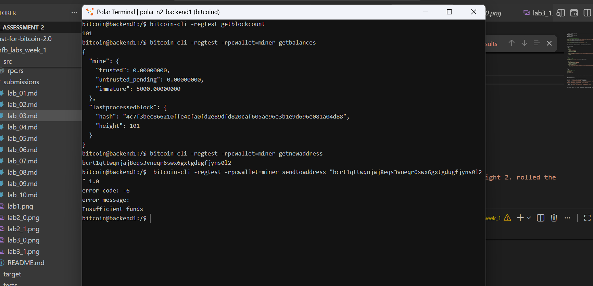

# Lab 03 — Coinbase maturity

## Commands used
# Lab 03 — Coinbase maturity

## Commands used
TODO: Record mining, balance inspection, and premature-spend commands.


```bash
# 1. Mine 1 block to miner address
bitcoin-cli -regtest -rpcwallet=miner generatetoaddress 1 "bcrt1qety7m5vfegcajf0yg6e7c7zqsawq94zmmx7mda"
# wallet balances
bitcoin-cli -regtest -rpcwallet=miner getbalances

# 3. Attempt premature payment of 1 BTC (will fail)
bitcoin-cli -regtest -rpcwallet=miner sendtoaddress "bcrt1qttwqnjaj8eqs3vneqr6swx6gxtgdugfjyns0l2" 1.0

```

## Terminal output

TODO: Show balances at heights 1 and 101 plus the failed premature spend.

```bash
# balances at 1
{
  "mine": {
    "trusted": 0.00000000,
    "untrusted_pending": 0.00000000,
    "immature": 50.00000000
  },
  "lastprocessedblock": {
    "hash": "2a5f390e779ce7300502b9ea3b150eafcfad3c5dad19dc76a25b41e34f7a2fa4",
    "height": 1
  }
}
```

```bash
# balances at 101
bitcoin@backend1:/$ bitcoin-cli -regtest getblockcount
101
bitcoin@backend1:/$ bitcoin-cli -regtest -rpcwallet=miner getbalances  
{
  "mine": {
    "trusted": 0.00000000,
    "untrusted_pending": 0.00000000,
    "immature": 5000.00000000
  },
  "lastprocessedblock": {
    "hash": "4c7f3bec866210ffe4cfa0fd2e89dfd820caf605ae96e3b1e9d696e081a04d88",
    "height": 101
  }
}
```
---
```bash
# failed premature spend
error code: -6
error message:
Insufficient funds
bitcoin@backend1:/$ 
```


## Evidence references

TODO: Link screenshots or describe the attached evidence.



* **Figure 1**: Terminal output demonstrating getting balance at height 1 with a chain of height 2. rolled the chain back and forth for specified  height balance inspection .

---
* **Figure 2**: Terminal output demonstrating mining of wallet balances at height 101 and insufficient balance

## Explanation

TODO: Explain why the first coinbase reward becomes spendable at height 101.

- In Bitcoin consensus rules, newly mined block rewards (coinbase transactions) are subject to a 100-block maturity rule (COINBASE_MATURITY = 100). A coinbase output requires 100 additional blocks mined on top of it—meaning 101 total confirmations—before it can be spent in a new transaction.

