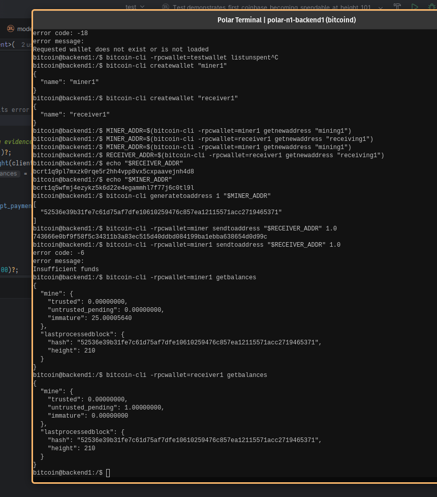

# Lab 03 — Coinbase maturity

## Commands used

TODO: Record mining, balance inspection, and premature-spend commands.

bitcoin@backend1:/$ bitcoin-cli generatetoaddress 1 "$MINER_ADDR"
bitcoin@backend1:/$ bitcoin-cli -rpcwallet=miner1 sendtoaddress "$RECEIVER_ADDR" 1.0
bitcoin@backend1:/$ bitcoin-cli -rpcwallet=miner1 getbalances
bitcoin@backend1:/$ bitcoin-cli -rpcwallet=receiver1 getbalances

## Terminal output

TODO: Show balances at heights 1 and 101 plus the failed premature spend.

```bash
bitcoin@backend1:/$ bitcoin-cli generatetoaddress 1 "$MINER_ADDR"
[
  "6086738bdde0176fa9116c602e96a9e556365ece1e209f43c7425f60f3c3c41e"
]

bitcoin@backend1:/$ bitcoin-cli generatetoaddress 100 "$MINER_ADDR"
    
[
  "0870b121141d1575257a2a73c0875a521e9dbfca15e20e586c8ea3ccd2f3bf61",
  "5c0b73be23cb452d8a4a4a9dc20a2309ebafbb0f248f20463574ff0225e6c5e0",
  "2997000d360ae1efbfb2d0ffa1ee93d7b6a70720afea39013f92937989081f06",
  "0b89034767d44d82cc0f29dfdc94327c7f5a40e74b39a17d64a01c7f2dcb176d",
  "5d482eace144bba353e1aa2def4ae85049c371495a6b32da5919f215bc8b1623",
  "24775f70cb9bfd0e9ecfa2c7515dac19601d6da87a670f68bfc44b37bcacdb39",
  "43222140588e687d7bf7a900cbee51a373a31009b7fe6c2defbe761c44ac3e57",
  "06cd3522fcb2eec82adeddd20d5cd6b1009243006423ccc7c1617085b9329c09",
  "4a45f2b69874f09822431c8d6cb68a5ead21127140478bca29f93ee04fe2b88d",
  "3df8d6f32645076ee3a8124384b0c52fef5c9478931d94401f0bec7f84939530",
  "277523ee004a32744198c03160008953a7ba896bf9944a07268416655b88c1e5",
  "0082059b04bcd8221f9e4e7626308d266f71deeb60a7f939d32d963f64e68381",
  "2b9fd1429ff0293cecfd18f50a8391e1b59c3b75f66545e70bafa9c1846528c6",
  "68abdcfb01cb7d03e5ff3cc1e8f6ccf0f9e15379d053a4527c21f4aaf2c78d3e",
  "523c4d27d652cb48716e4fbecd49a1eb464f7d3aec8dab36691c9c14dbf6f6f5",
  "56d74932c3336fd71cdf2197301dbc88056dcbab1ded9f3e16d6543d67c9b819",
  "0ad675035500507a60b17e2d7c70fa2e32ea70c34c7fefd744594804d0764e20",
  "112cb67e9c51ef91c5b496fefc8f4231c3ef05342447f823cc0b68edf4a75d77",
  "0ff59bff87e4aa6d4e6c8530d6a1cc1304fdb41f14848a760ff16e6464a61a38",
  "5befa4877a61f200abec3786586fffbdc72b9cae8f8e1a9603bc700aaf613a61",
  "26e5e7537c791b82511b0561776cc1528842cda2594680f4f33068b80c98c6b6",
  "4470b000168c3ca16055b468f9bf1b8efce8cf88236e3540a5806fc9e1f586ff",
  "6edfc4dbd1a977b7f13e6e207f48396105ae7949cb6411e50f15712a7751a113",
  "64f4a486780816e1d179cd4112699d08b921e51363e9b73dc7c2614b47110884",
  "261faaa4d8489faf3bcef215bb30dc6abfae83f06de66cd8867c1d757bb8d06b",
  "14957d20641c820712d4cc8b7312aa116ac4e2080cc78920651df57401b8f679",
  "14901cfcc00ea436ef4c57be5255f0be83b8558d1dee6a8ae54fb6f680f52d93",
  "0ea0fe19122e44fa31db4b5ffb573cd48c6df9609b5f8fb3767b64bb911d6b27",
  "4aabca8e2e3a583e62c85855a156643d1fe1def33ec6b8d69dbd99f52dff8f59",
  "07953c90da7c4e3ce0ec619463501e3c123fc76e3af8a3fdda87e6e35b0e4e2c",
  "4cb34aa8ca5a83245e9640a131d2e62e6587d469b970b63f7755ea4ca49aafe9",
  "5e3b0ecb1cc30553952eeed1e4d21db403d840f3a69ce7c49aff0d5fcfb8db72",
  "2866b98197202fe24e7a657208a7a40d1ab755f96fe70d06ef10a78f16f3c6e9",
  "20cb473847fd72604427cc4d2092d85398fbefa658ee00f842dce04328eff7b8",
  "5f7e87bc7ef2404b77e992e8ed16c3d72322bc85b5667462743c6909add9d461",
  "63feb29a6dd21d24ed2e2d88e091a4adabaaf1ebf7c17a8a98d8a6bc4cfa076b",
  "1678b4e70cd5eb240599c9fd63f967eab6ec4600acdbc9eb7883e18300312162",
  "5ffe882ec7d6bb1a043c331fd6e4d142f0a340491b7a6fc014726d278e8ff0c4",
  "27c4cf3a3272fa10aa5fc3f87832886fee0f528387bc07395c9849c7d723d22c",
  "200792e478f55ba36e066acee7b8bf3deecd3e61ca5299f2ee6648abba6eef28",
  "7145a2405fe3ec795f18239f149e1bb20a174e68ca5a6aef9417912cb24338a1",
  "3863042e2f087dadaf7fbe2d929099ad8dc67ff51b7cbfb5b255624ea556eef6",
  "7c207e254795b5e1262a45d99440d20ae7679833b7d28d808cb3bb0895e659d7",
  "39fc67cf456a671c80f5cc797c4e73de0b83b762ef3942b8128918da19e01b6a",
  "49ce580245a540cef3df2c5630e6b175843fd6d72d44b3feb5c6ae1f5f2000b0",
  "764e9cb0df0b27ae69bb92d5c3f9627faa579f94997c281ec5b41e964f103b72",
  "06b9c755d53aa40acadc024118bc557b6d75ad64c69f094cf6cc0f6e8669c434",
  "78c25de90961caab83233214e70b2b5322cc45e843b750b54ba3c3ae30abdd20",
  "1023e7232079b563fb11bad6b37cd9bd15096386033b32fb10b969c5c778c590",
  "3de830c3731b256e362463d5a10608c9a2a18a7382f8d8437c9a820bf2d1831d",
  "2dacb8ed5cfdce0f1c21d72faae208fd9b1af2f351329f70a2c08ce5e7e27b6e",
  "62cdd9f24190432979bc4f6c18debd234248b85f3b4255cd047c0c6ed623e752",
  "6d7be47151e8ba6709247c9a65c31e82a9dd54d95e8238663b3fcb57e8f29cd6",
  "2993b8947078ff6d7cb4a6b441cbf675b84250cb6e093d84d4bfb97b84a0bbf7",
  "4519f1827528e577c8b5846967a1391ee4f39529a340c9eb4eb19b11aafb9f80",
  "4841167c663a6e38dac64861f3c9a82809d56a0306adb2e82f3ede9186b9edcf",
  "418cdb5c0b3c7bbd9804666686363d84ee60997ac8e3764fed02f0d2ceefd779",
  "050ca48aef096099651b19814b7cd1ca05a7c33ca5cc141c23772ce08c4f6cbe",
  "09a2c92d17c7b63ed596678af8e59efa55b9524eebde09af38d046625f466fb3",
  "1b0e934f4566a58a54c911111244da48f4f95649c140be1b8a0470ca5f7b0fdd",
  "7f3e55832ca5633e7eb7ce5d3354cb3c572b8d172da02ad5179827826feeb7b9",
  "76cc95683304ab1becdc7bd7958e0ba7fd9375be99466b701458a0636ef54b7e",
  "66c45a29bd2cd474763371904a061f43c377c078f6147e4be43748ec09c2716f",
  "62d73f97c6ff7f35af39a6aea0a95ddf2ab838c936bd1f99d45a6f5d9dd96526",
  "1aba6dac1834d30e8c40b8abe745bb750c3581d8aca9bfe6ebe7050e0bfa50bb",
  "7b12360175138c9a936152a062327c565a4093433c917af2279ebe6d1a69e818",
  "628e5d5709151626425fd518a9b86dd524e1fce6a5619486203f399db3f7e2a3",
  "320c24a45f00b77cfbc372733140609701846173ea0e279bf570de3082dfdf61",
  "5d2300fb0ecb6a82377cd07163d74bb0572e4eb1ea8914ca842c1d2c4df5b77f",
  "7d42f97054ee939cd03e5ecfe01d83ce7ede7aaf1fd47b514b2c828730a264ab",
  "10b5f419c2786ddb81703c12865dbfe7084f3bc045e1deb77353c79ec15ac6f5",
  "1db401e8349fe078da9b4a6b931d4ddbaa01a154030214f740acca8be9530c0b",
  "3e20648fd1ee364c214c553ac8f4351792c8d2257dbf2cdde1b0a4ab90540c3f",
  "633c3034b729b52643a681d1e458f78100851c881772d67be59d8e587b92e024",
  "60338377e7ac8619f8468942f8985fa703b7efb7a8170c6c15ed77c5070bb37b",
  "272a9157b8a215b5d295b96fa402d83f1331f07e06aead8f7febedbb4c3072cf",
  "1084a068a6c85a2f29dcde2fe236c1c3899cc4c107451b842a686f677f9d0081",
  "0bdc73282289c64c8fb668cea3c955d0e14f28dfbcf0d618edb3b0b00ca33460",
  "5fe8abef86abf0cd36d26c48b9f3e3751bf17031db8ea0ffeb64cc7f7e219dff",
  "33baad4772fbf2a6df1fe446a6fb10558244a98ebdd966d3a271c0bb36ab2d1d",
  "1cba4e650d9590320ce9eeef65dd3a44908e2cf765931d59fbb96f073e49ec24",
  "6f42f0d146ad8041d146076c635f906be417223e46f4e1a67a2e014eeecd3b29",
  "06b563f96747f3ef545897edf096c7828c2613b515d46071c381f67cf64c9942",
  "20227ce4ecd134d5a642edc18b91599dd4e790bec42fbe3560d237730001cca5",
  "4d710ef84f6cc07704529270f59b33c08857ed2e0ac57beddaa54632de1067f3",
  "720a440f5f748fcf102f99aa1ad4f8bce9b175366ebbab4e328839014de42a2a",
  "15fa0d8fdba76041dc1035fe36ee1abd469c47a2698c3a8265283590e2625791",
  "72ee9f4b6961f292643a88603e81be6cb7e2a233da0e0f4f12e2b941dd1446d9",
  "2881a65b00fd4e40dfd6de3a5e9f389905bc89d0fe0dfdce37f58dfef2832448",
  "2aa401dd3136ac6e42d6b0b51d27a4c49ce557a4db7b7fbbdd20c0c0f6a64e77",
  "6090f503743dea4efd883e54add5087278ebd6ab3fe02c98a4d21790b96ee7cf",
  "0b59863886f4f6f619fd03f53fd67f0f05242bca603148decea2985921e83511",
  "7d38e16d5b6a2fcce4a923bf852a1ad458fee7bab9891d0a2f092d8d58ffb74b",
  "3e6c2ddfbd3be496495ed44e8944f0553063710ce54d2a9a103d9f3d3d9fd4c7",
  "5eb62a82358cf8b5c211238dde8f885e5088a08a30dd62bdbde762b4fb1774bd",
  "6ebe08e939abab1b9e862966bfef2097495cf56c4e414c11a8461d2b7e7af123",
  "3b0dba5b34e43edd3776f51453110d757140343ae0155cbf6afe0851a2580c89",
  "2353fd2dcbf87698767b8630613e43d23c60dce7d0586d080d628e3cfe4d9260",
  "0ea64d420f05e0e950ccb49bbf74c5009963df956c29dc910fd872af3434a0b4",
  "3bd58fc397b1a107a1d08a7403149d00fcce5ec837ae40fcd18d69da32fe95a3",
  "3263b99dafa7b55ecad945df4835fdd65545dddbe672d5d97f2f803aa469bd68"
]

bitcoin@backend1:/$ bitcoin-cli -rpcwallet=miner1 sendtoaddress "$RECEIVER_ADDR" 1.0
error code: -6
error message:
Insufficient funds

bitcoin@backend1:/$ bitcoin-cli -rpcwallet=miner1 getbalances                       
{
  "mine": {
    "trusted": 0.00000000,
    "untrusted_pending": 0.00000000,
    "immature": 25.00005640
  },
  "lastprocessedblock": {
    "hash": "52536e39b31fe7c61d75af7dfe10610259476c857ea12115571acc2719465371",
    "height": 210
  }
}
bitcoin@backend1:/$ bitcoin-cli -rpcwallet=receiver1 getbalances
{
  "mine": {
    "trusted": 0.00000000,
    "untrusted_pending": 1.00000000,
    "immature": 0.00000000
  },
  "lastprocessedblock": {
    "hash": "52536e39b31fe7c61d75af7dfe10610259476c857ea12115571acc2719465371",
    "height": 210
  }
}

bitcoin@backend1:/$ bitcoin-cli -rpcwallet=miner1 sendtoaddress "$RECEIVER_ADDR" 1.0
31320512472671286073dcff374a9a93fdedfef7b1a11ce5ce4b01a020c4d38b
bitcoin@backend1:/$ bitcoin-cli -rpcwallet=receiver1 getbalances
{
  "mine": {
    "trusted": 1.00000000,
    "untrusted_pending": 1.00000000,
    "immature": 0.00000000
  },
  "lastprocessedblock": {
    "hash": "5c3513c33fb0ea5144901aca1a8106615f303d4893fae3d373de5f3ee4d88187",
    "height": 310
  }
}
bitcoin@backend1:/$ bitcoin-cli -rpcwallet=miner1 getbalances
{
  "mine": {
    "trusted": 24.00002820,
    "untrusted_pending": 0.00000000,
    "immature": 2362.50002820
  },
  "lastprocessedblock": {
    "hash": "5c3513c33fb0ea5144901aca1a8106615f303d4893fae3d373de5f3ee4d88187",
    "height": 310
  }
}

```

## Evidence references



## Explanation

TODO: Explain why the first coinbase reward becomes spendable at height 101.
because if the reward becomes spendable after 1 and the block later turns out to be invalid, there will be losses
This rule limits damage if a mined block later disappears during a chain reorganization.
