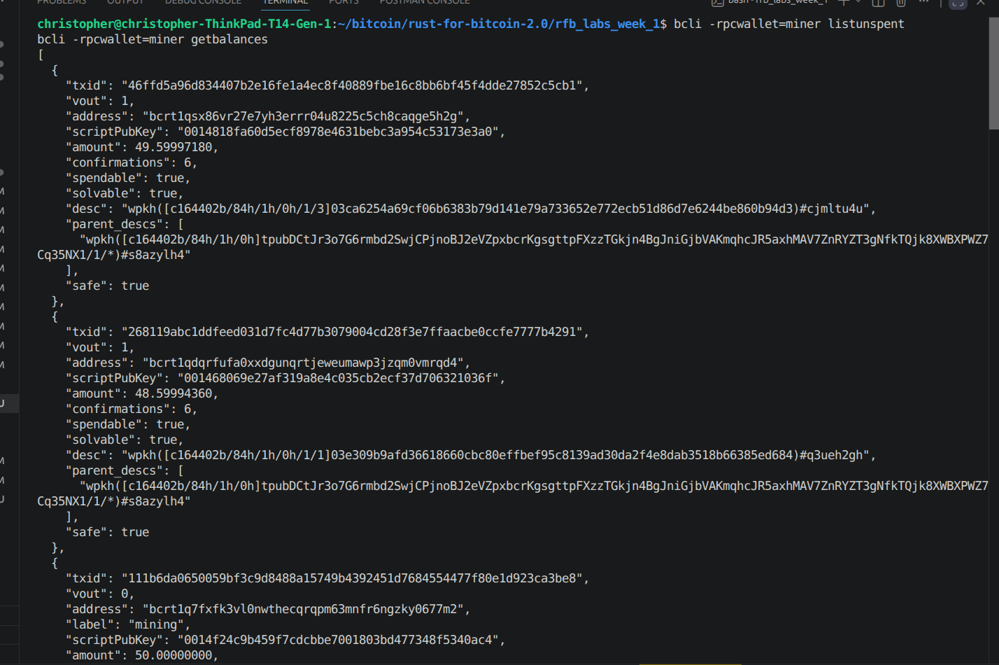

# Lab 04 — UTXOs and outpoints

## Commands used

```
cargo test --test lab_04
bitcoin-cli -regtest -rpcwallet=miner listunspent
bitcoin-cli -regtest -rpcwallet=miner getbalances
```

## Terminal output

```
$ bitcoin-cli -regtest -rpcwallet=miner listunspent
[
  {
    "txid": "3d0fc0039af7fc60b444b45783057044853b95e7d924f1d62204573d342735eb",
    "vout": 0,
    "address": "bcrt1q7fxfk3vl0nwthecqrqpm63mnfr6ngzky0677m2",
    "scriptPubKey": "0014f24c9b459f7cdcbbe7001803bd477348f5340ac4",
    "amount": 50.00000000,
    "confirmations": 101,
    "spendable": true,
    "solvable": true,
    "safe": true
  }
]

$ bitcoin-cli -regtest -rpcwallet=miner getbalances
{
  "mine": {
    "trusted": 50.00000000,
    "untrusted_pending": 0.00000000,
    "immature": 5000.00000000
  }
}
```

## Evidence references



Only one UTXO is spendable at this point (the miner wallet's immature
coinbase rewards from blocks 2–101 don't even appear in `listunspent`):

- `txid`: `3d0fc0039af7fc60b444b45783057044853b95e7d924f1d62204573d342735eb`
- `vout`: `0`
- amount: `50.00000000` BTC
- confirmations: `101`
- address: `bcrt1q7fxfk3vl0nwthecqrqpm63mnfr6ngzky0677m2`
- locking script (`scriptPubKey`): `0014f24c9b459f7cdcbbe7001803bd477348f5340ac4`
- spendable: `true`

Outpoint (uniquely identifies this coin): `3d0fc0039af7fc60b444b45783057044853b95e7d924f1d62204573d342735eb:0`

Sum of spendable UTXOs = `50.00000000` BTC, which matches `getbalances`'
`trusted` field exactly (`50.00000000`). The `immature` figure (`5000`) is
not counted — it isn't spendable yet, and `listunspent` correctly omits it.

## Explanation

An outpoint is just `txid:vout` — a pointer at one specific output of one
specific past transaction. A UTXO is the actual output that pointer resolves
to, as long as nobody's spent it yet.

The part that took a minute to really click is that a wallet doesn't hold
"money" as a number anywhere. It holds a pile of these UTXOs, and a balance
is nothing more than a sum computed on the fly over whichever of them are
currently spendable — which is exactly why the immature coinbase outputs
above got filtered out of `listunspent` but still counted separately in
`getbalances`. Practically, that means spending isn't "decrement an
account" — it's picking specific UTXOs to consume as inputs, and whatever's
left over comes back as a brand-new UTXO called change. There's no shared
ledger row quietly getting updated in place the way a bank balance works.
