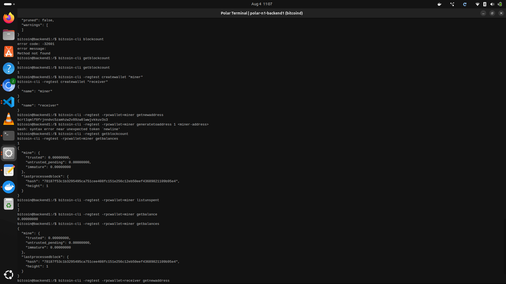

# Lab 04 — UTXOs and outpoints

## Commands used

TODO: Record the commands used to inspect and calculate wallet UTXOs.
# List every UTXO the wallet currently tracks
bitcoin-cli -regtest -rpcwallet=miner listunspent

# Check the current wallet balance
bitcoin-cli -regtest -rpcwallet=miner getbalance

# For comparison: check confirmed vs unconfirmed breakdown
bitcoin-cli -regtest -rpcwallet=miner getbalances

## Terminal output

TODO: Include txid, vout, amount, confirmations, script, and spendable state.
/Documents/rustforbitcoin/rust-for-bitcoin-2.0/rfb_labs_week_1$ cargo test --test lab_04
   Compiling rfb-labs-week-1 v0.1.0 (/home/jemiah/Documents/rustforbitcoin/rust-for-bitcoin-2.0/rfb_labs_week_1)
    Finished `test` profile [unoptimized + debuginfo] target(s) in 0.21s
     Running tests/lab_04.rs (target/debug/deps/lab_04-8dafdd90455a2232)

running 4 tests
test constructs_unique_outpoint ... ok
test sums_only_spendable_outputs ... ok
test selects_most_confirmed_spendable_utxo ... ok
test decodes_listunspent_response ... ok

test result: ok. 4 passed; 0 failed; 0 ignored; 0 measured; 0 filtered out; finished in 0.00s

## Evidence references

TODO: Link screenshots or describe the attached evidence.

## Explanation

TODO: Explain outpoints, UTXOs, and why a wallet balance is their sum.
## Evidence references

- `evidence/lab04-listunspent.png` — screenshot of the wallet's UTXO set.
- `evidence/lab04-after-spend.png` — screenshot showing UTXOs changing after a spend + confirmation.

## Explanation

A **UTXO** (Unspent Transaction Output) is a discrete "chunk" of bitcoin that hasn't been spent yet. Every Bitcoin transaction consumes some existing UTXOs as inputs and creates new UTXOs as outputs — there's no running account balance like in a bank; instead, a wallet's balance is simply the sum of every UTXO it currently controls and hasn't spent.

An **outpoint** is the unique identifier for a specific UTXO — it's the pair `(txid, vout)`, where `txid` is the transaction that created it and `vout` is its position (index) among that transaction's outputs. This pair is how Bitcoin references "this exact coin" unambiguously, since a single transaction can create several outputs (e.g. a payment output and a change output), and each needs its own distinct identifier.

A wallet's balance is the sum of its UTXOs' amounts because that's literally what a wallet "owns" at any moment — a collection of individually spendable coin-fragments, each traceable back to the transaction that created it, rather than one continuously updated number. When you spend bitcoin, your wallet picks one or more of its UTXOs as inputs to a new transaction (this selection process is called "coin selection," covered in a later lab), spends their combined value, and typically creates a new "change" UTXO for whatever wasn't sent to the recipient.

In this lab, `list_unspent` retrieves the wallet's current UTXO set from the node, `select_spendable_utxo` and `sum_spendable_utxos` demonstrate working with that set programmatically (choosing one to spend, or totaling them into a balance), and `outpoint` shows how to extract a UTXO's unique `(txid, vout)` identity from it.