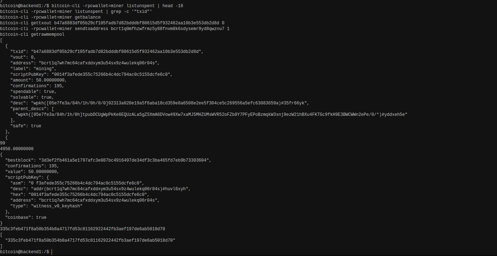

# Lab 04 — UTXOs and outpoints

<!-- Replace every TODO line. The grader scores a section 0 while a TODO remains in it. Rewrite the Explanation in your own words. -->

## Commands used

```bash
# Every unspent output the miner wallet controls.
bitcoin-cli -rpcwallet=miner listunspent

# Bitcoin Core's own balance figure, for reconciliation.
bitcoin-cli -rpcwallet=miner getbalance
bitcoin-cli -rpcwallet=miner getbalances
```

Optional, to inspect the chosen output on its own:

```bash
bitcoin-cli gettxout <txid> <vout>
```

Tests:

```bash
cargo test --test lab_04
```

`list_unspent` decodes each entry field by field, because Bitcoin Core spells the
locking script `scriptPubKey` while the model uses `script_pub_key`.
`select_spendable_utxo` filters to spendable outputs and picks the most-confirmed
one deterministically. `sum_spendable_utxos` totals them independently of
`getbalance`, which is what makes the reconciliation meaningful.

## Terminal output

The `miner` wallet holds 99 spendable UTXOs at this point, so `listunspent` is piped
through `head -18` to show the first entry in full rather than printing all 99.

```
$ bitcoin-cli -rpcwallet=miner listunspent | head -18
[
  {
    "txid": "b47a6883df05b29cf105fadb7d82bdddbf80615d5f932462aa10b3e553db2d8d",
    "vout": 0,
    "address": "bcrt1q7wh7mc64cafxddxym3u54sx9z4wulekq06r04s",
    "label": "mining",
    "scriptPubKey": "0014f3afede355c75266b4c4dc794ac0c5155dcfe6c0",
    "amount": 50.00000000,
    "confirmations": 195,
    "spendable": true,
    "solvable": true,
    "desc": "wpkh([05e7fe3a/84h/1h/0h/0/0]02313a020e19a5f6aba18cd359e8a6508e2ee5f304ce5c269556a5efc63083659a)#35fr66yk",
    "parent_descs": [
      "wpkh([05e7fe3a/84h/1h/0h]tpubDCUgWpPkKe6EQUzALa5gZSXmA6DVow49Xw7xaMJ5MHZUMsWVR52oFZb8Y7PFyEPoBzmqkW3snj9ezW21hBXu4FKTGc9fkH9E3BWCWWn2ePe/0/*)#yddxeh5e"
    ],
    "safe": true
  },
  {
```

The chosen UTXO, field by field:

| Field | Value |
| --- | --- |
| `txid` | `b47a6883df05b29cf105fadb7d82bdddbf80615d5f932462aa10b3e553db2d8d` |
| `vout` | `0` |
| `amount` | `50.00000000` |
| `confirmations` | `195` |
| `address` | `bcrt1q7wh7mc64cafxddxym3u54sx9z4wulekq06r04s` |
| `scriptPubKey` | `0014f3afede355c75266b4c4dc794ac0c5155dcfe6c0` |
| `spendable` | `true` |

Written as an outpoint, that output is:

```
b47a6883df05b29cf105fadb7d82bdddbf80615d5f932462aa10b3e553db2d8d:0
```

Reconciliation — the UTXO count, then Bitcoin Core's own balance figure:

```
$ bitcoin-cli -rpcwallet=miner listunspent | grep -c '"txid"'
99

$ bitcoin-cli -rpcwallet=miner getbalance
4950.00000000
```

Ninety-nine spendable outputs of 50.00000000 BTC each sum to **4950.00000000 BTC**,
computed from the `listunspent` entries alone. `getbalance` reports
**4950.00000000 BTC**. The two figures match. Summing the outputs and asking the
wallet for a balance are two independent routes to the same number, which is the
point: the balance is not stored anywhere, it is derived by adding up UTXOs.

The immature coinbases are absent from both figures. `listunspent` omits them and
`getbalance` excludes them, which is why this total is 4950 rather than the 8650 the
wallet holds in all — the remaining 3700 BTC is still maturing, exactly as Lab 03
described.

Querying the chain's UTXO set directly, rather than the wallet:

```
$ bitcoin-cli gettxout b47a6883df05b29cf105fadb7d82bdddbf80615d5f932462aa10b3e553db2d8d 0
{
  "bestblock": "3d3ef2fb461a5e1797afc3e087bc4916497de34df3c3ba465fd7eb9b73303604",
  "confirmations": 195,
  "value": 50.00000000,
  "scriptPubKey": {
    "asm": "0 f3afede355c75266b4c4dc794ac0c5155dcfe6c0",
    "desc": "addr(bcrt1q7wh7mc64cafxddxym3u54sx9z4wulekq06r04s)#huvl6xyh",
    "hex": "0014f3afede355c75266b4c4dc794ac0c5155dcfe6c0",
    "address": "bcrt1q7wh7mc64cafxddxym3u54sx9z4wulekq06r04s",
    "type": "witness_v0_keyhash"
  },
  "coinbase": true
}
```

`gettxout` answers from the chainstate database, not from any wallet, so a result at
all proves the output is genuinely unspent as far as consensus is concerned. It also
adds two facts `listunspent` did not: `type` is `witness_v0_keyhash`, identifying the
P2WPKH script behind that `0014...` hex, and `coinbase: true`, marking it as a block
reward rather than an ordinary payment.

Tests:

```
$ cargo test --test lab_04
running 4 tests
test selects_most_confirmed_spendable_utxo ... ok
test constructs_unique_outpoint ... ok
test sums_only_spendable_outputs ... ok
test decodes_listunspent_response ... ok

test result: ok. 4 passed; 0 failed; 0 ignored; 0 measured; 0 filtered out; finished in 0.00s
```

## Evidence references



A single frame from the `backend1` node terminal holding the whole reconciliation:
the first `listunspent` entry in full, the UTXO count `99` directly beneath it, and
`getbalance` reporting `4950.00000000` on the next line. The `gettxout` response for
the chosen outpoint follows, showing `coinbase: true` and the
`witness_v0_keyhash` script type.

The `bitcoin@backend1` prompt places these calls inside the Bitcoin Core container of
the `Week 1 Bitcoin Fundamentals` Polar network.

## Explanation

Bitcoin has no accounts and stores no balances. What the chain stores is a set of
unspent transaction outputs — UTXOs. Each one is a discrete chunk of value locked by
a script that says who may spend it. The full set of UTXOs *is* the ledger state.

An **outpoint** is the coordinate that identifies a single output: the `txid` of the
transaction that created it, plus `vout`, the index of that output within it. A
transaction identifies what it is spending by listing outpoints. Because a txid is a
hash of the transaction's contents, an outpoint is globally unique and cannot be
confused with any other output in history.

A **wallet balance is therefore a derived figure, not a stored one.** When
`getbalance` reports 4950 BTC, Bitcoin Core has scanned the UTXO set for outputs this
wallet's keys can spend, applied maturity and confirmation rules, and summed the
amounts. Nothing anywhere holds the number 4950 — it exists only as the total of 99
separate 50 BTC outputs. That is exactly what this lab proves:
summing `listunspent` by hand reproduces `getbalance`, because the balance was
always just that sum. In an account-based system the balance is authoritative and
transactions adjust it; in Bitcoin the transactions are authoritative and the
balance is recomputed from them.

Two practical consequences follow.

First, UTXOs are **atomic**. An output is spent whole or not at all. There is no way
to spend 1 BTC of a 50 BTC output and leave 49 behind — the whole 50 is consumed and
the remainder must be returned as a new change output. Labs 06 and 09 rest on this.

Second, the wallet distinguishes `spendable` from merely present. An output can
appear in `listunspent` yet be unspendable: an immature coinbase, or one the wallet
can see but has no key for (watch-only). Summing only the spendable entries is what
makes the total match the spendable balance rather than a larger figure.
