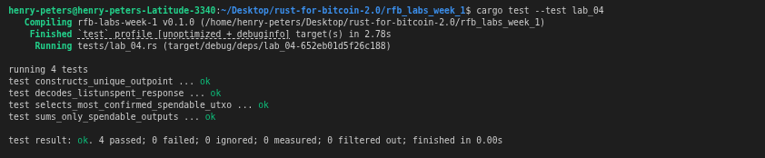

# Lab 04 — UTXOs and outpoints

## Commands used

```bash
# Rust test suite
cargo test --test lab_04

# List all unspent outputs in the miner wallet
bitcoin-cli -rpcwallet=miner listunspent

# Inspect the locking script and address of a specific UTXO
bitcoin-cli -rpcwallet=miner getaddressinfo bcrt1qp83jqswduwkhy494f86kyrvk36xnqrpn553e03

# Confirm the wallet's total balance matches the spendable UTXO sum
bitcoin-cli -rpcwallet=miner getbalances
```

## Terminal output
<!-- Paste the relevant terminal output here -->
```bash
bitcoin@backend1:/$ bitcoin-cli -rpcwallet=miner listunspent
[
  {
    "txid": "9215a769808de7b501f1ddf5b689830ad028a95651029851bfedd8086bcb7165",
    "vout": 0,
    "address": "bcrt1qp83jqswduwkhy494f86kyrvk36xnqrpn553e03",
    "label": "miner_address",
    "scriptPubKey": "001409e32041cde3ad7254b549f5620d968e8d300c33",
    "amount": 50.00000000,
    "confirmations": 101,
    "spendable": true,
    "solvable": true,
    "desc": "wpkh([8aaef9c5/84h/1h/0h/0/1]02a016d02eed09f4474152796b722c3bad06ed261e2b52d0aa8a8d917ed5cd4819)#3zsu0j70",
    "parent_descs": [
      "wpkh([8aaef9c5/84h/1h/0h]tpubDC4Y53dKMEJ2K9VSZjfkBqrfVisQeQQdgs5nTKi6EeCERsLdCscVQ1YKW7QsnXbzcU9kgCmtuLV6cjCNQ649Bdnuo1iyZxx51YWU16y2Uzg/0/*)#he6aekk7"
    ],
    "safe": true
  }
]
bitcoin@backend1:/$ bitcoin-cli -rpcwallet=miner getaddressinfo bcrt1qp83jqswduwkhy494f86kyrvk36xnqrpn553e03
{
  "address": "bcrt1qp83jqswduwkhy494f86kyrvk36xnqrpn553e03",
  "scriptPubKey": "001409e32041cde3ad7254b549f5620d968e8d300c33",
  "ismine": true,
  "solvable": true,
  "desc": "wpkh([8aaef9c5/84h/1h/0h/0/1]02a016d02eed09f4474152796b722c3bad06ed261e2b52d0aa8a8d917ed5cd4819)#3zsu0j70",
  "parent_desc": "wpkh([8aaef9c5/84h/1h/0h]tpubDC4Y53dKMEJ2K9VSZjfkBqrfVisQeQQdgs5nTKi6EeCERsLdCscVQ1YKW7QsnXbzcU9kgCmtuLV6cjCNQ649Bdnuo1iyZxx51YWU16y2Uzg/0/*)#he6aekk7",
  "iswatchonly": false,
  "isscript": false,
  "iswitness": true,
  "witness_version": 0,
  "witness_program": "09e32041cde3ad7254b549f5620d968e8d300c33",
  "pubkey": "02a016d02eed09f4474152796b722c3bad06ed261e2b52d0aa8a8d917ed5cd4819",
  "ischange": false,
  "timestamp": 1785753713,
  "hdkeypath": "m/84h/1h/0h/0/1",
  "hdseedid": "0000000000000000000000000000000000000000",
  "hdmasterfingerprint": "8aaef9c5",
  "labels": [
    "miner_address"
  ]
}
bitcoin@backend1:/$ bitcoin-cli -rpcwallet=miner getbalances
{
  "mine": {
    "trusted": 50.00000000,
    "untrusted_pending": 0.00000000,
    "immature": 5000.00000000
  },
  "lastprocessedblock": {
    "hash": "5a7fd655c8fe1de5d36326211f06eb495690b6b6619e7b5b76396a0ba2f00504",
    "height": 102
  }
}
bitcoin@backend1:/$ 
```

## Evidence references
<!-- Describe or link to screenshots, logs, or other supporting evidence -->
.png)
.png)
<!-- My test -->


## Explanation

A **UTXO** (Unspent Transaction Output) is a discrete chunk of bitcoin created by a previous transaction that has not yet been spent. Each UTXO has a value, a locking script that defines who can spend it, and an outpoint that uniquely identifies it in the entire blockchain.

An **outpoint** is the pair `(txid, vout)` — the transaction ID of the transaction that created the output and the zero-based index of that output within that transaction. It is the canonical way to refer to a specific coin without ambiguity.

A **wallet balance is not an account entry** like a bank balance. There is no single ledger line that says "you have X BTC." Instead, the wallet scans the blockchain for UTXOs whose locking scripts it can satisfy (because it controls the corresponding private key), and the balance is simply the sum of those UTXOs' values. When you spend, you consume one or more UTXOs entirely and create new ones — there is no partial debit. This is why `sum_spendable_utxos` returns exactly the `trusted` balance: both are derived from the same underlying UTXO set.
