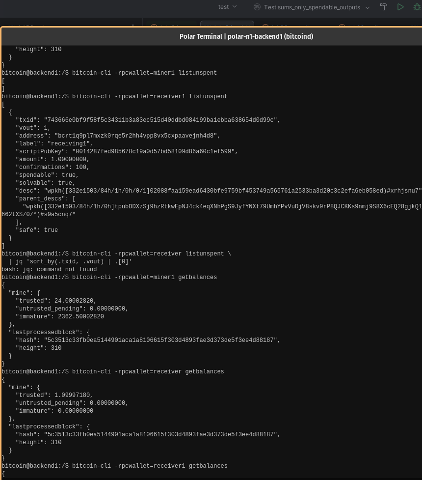

# Lab 04 — UTXOs and outpoints

## Commands used

TODO: Record the commands used to inspect and calculate wallet UTXOs.
```bitcoin@backend1:/$ bitcoin-cli -rpcwallet=miner listunspent```

## Terminal output

TODO: Include txid, vout, amount, confirmations, script, and spendable state.
```bash
bitcoin@backend1:/$ bitcoin-cli -rpcwallet=miner listunspent
[
  {
    "txid": "45506176ba3840c4adb446f5e12b0801a668f056ddb7f3c5045db25b5ad464b5",
    "vout": 0,
    "address": "bcrt1qxetgpp04f842uc887ms5pwg9ukyqrwhgq57jcd",
    "label": "mining",
    "scriptPubKey": "001436568085f549eaae60e7f6e140b905e58801bae8",
    "amount": 50.00000000,
    "confirmations": 101,
    "spendable": true,
    "solvable": true,
    "desc": "wpkh([26ebb991/84h/1h/0h/0/1]025bf621b659a4c75851cece39f52c09a1c65dc8facc95d6547d4cdfabd2927596)#dm7x3lzw",
    "parent_descs": [
      "wpkh([26ebb991/84h/1h/0h]tpubDCZ6ihemHZQrWe3kPhc9M9ZF3wXNVV1yFhL6fD6cptWjTvJLnYQnxeF8YLdyattsjYWk3tFeBWQk9h2xe3x7MF97DjKWoKx5LkJb2ci4GHE/0/*)#a8pnrwuh"
    ],
    "safe": true
  }
]
```

## Evidence references

TODO: Link screenshots or describe the attached evidence.


## Explanation

TODO: Explain outpoints, UTXOs, and why a wallet balance is their sum.
- outpoint is the `vout`:`txid`
- UTXOs is the unspent txn balance which can be a lists of unspent utxos
- wallet balance is the list of utxos your keys can unlock