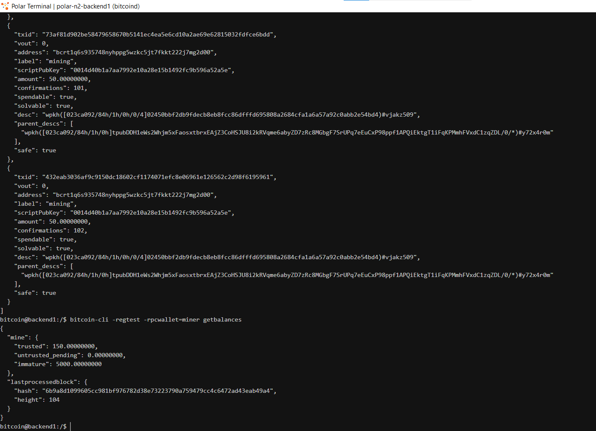

# Lab 04 — UTXOs and outpoints

## Commands used

bitcoin-cli -regtest -rpcwallet=miner listunspent
bitcoin-cli -regtest -rpcwallet=miner getbalances

## Terminal output
...........................
[
  {
    "txid": "2f84a7d33c1c6b4c1bb00dca018c953400f25b31a0d0f22b8779817e1fdb4b0a",
    "vout": 0,
    "address": "bcrt1q8wqsjrysxe9wlpnwe7ngg095570uq308nktqcl",
    "label": "mining",
    "scriptPubKey": "00143b81090c90364aef866ecfa6843cb4a79fc045e7",
    "amount": 50.00000000,
    "confirmations": 103,
    "spendable": true,
    "solvable": true,
    "desc": "wpkh([023ca092/84h/1h/0h/0/3]02c3bfad2b4215e11fd00fdd53ef11bb78706d03b5adc4961d41cd761a8fc01851)#24yy73uu",
    "parent_descs": [
      "wpkh([023ca092/84h/1h/0h]tpubDDH1eWs2Whjm5xFaosxtbrxEAjZ3CoHSJU8i2kRVqme6abyZD7zRc8MGbgF7SrUPq7eEuCxP98ppf1APQiEktgT1iFqKPMmhFVxdC1zqZDL/0/*)#y72x4r0m"
    ],
    "safe": true
  },
  {
    "txid": "73af81d902be58479658670b5141ec4ea5e6cd10a2ae69e62815032fdfce6bdd",
    "vout": 0,
    "address": "bcrt1q6s935748nyhppg5wzkc5jt7fkkt222j7mg2d00",
    "label": "mining",
    "scriptPubKey": "0014d40b1a7aa7992e10a28e15b1492fc9b596a52a5e",
    "amount": 50.00000000,
    "confirmations": 101,
    "spendable": true,
    "solvable": true,
    "desc": "wpkh([023ca092/84h/1h/0h/0/4]02450bbf2db9fdecb8eb8fcc86dfffd695808a2684cfa1a6a57a92c0abb2e54bd4)#vjakz509",
    "parent_descs": [
      "wpkh([023ca092/84h/1h/0h]tpubDDH1eWs2Whjm5xFaosxtbrxEAjZ3CoHSJU8i2kRVqme6abyZD7zRc8MGbgF7SrUPq7eEuCxP98ppf1APQiEktgT1iFqKPMmhFVxdC1zqZDL/0/*)#y72x4r0m"
    ],
    "safe": true
  },
  {
    "txid": "432eab3036af9c9150dc18602cf1174071efc8e06961e126562c2d98f6195961",
    "vout": 0,
    "address": "bcrt1q6s935748nyhppg5wzkc5jt7fkkt222j7mg2d00",
    "label": "mining",
    "scriptPubKey": "0014d40b1a7aa7992e10a28e15b1492fc9b596a52a5e",
    "amount": 50.00000000,
    "confirmations": 102,
    "spendable": true,
    "solvable": true,
    "desc": "wpkh([023ca092/84h/1h/0h/0/4]02450bbf2db9fdecb8eb8fcc86dfffd695808a2684cfa1a6a57a92c0abb2e54bd4)#vjakz509",
    "parent_descs": [
      "wpkh([023ca092/84h/1h/0h]tpubDDH1eWs2Whjm5xFaosxtbrxEAjZ3CoHSJU8i2kRVqme6abyZD7zRc8MGbgF7SrUPq7eEuCxP98ppf1APQiEktgT1iFqKPMmhFVxdC1zqZDL/0/*)#y72x4r0m"
    ],
    "safe": true
  }
]
.......................
{
  "mine": {
    "trusted": 150.00000000,
    "untrusted_pending": 0.00000000,
    "immature": 5000.00000000
  },
  "lastprocessedblock": {
    "hash": "6b9a8d1099605cc981bf976782d38e73223790a759479cc4c6472ad43eab49a4",
    "height": 104
  }
}
## Evidence references

## Explanation

A UTXO (Unspent Transaction Output) is an output of a confirmed transaction that has not yet been spent by any subsequent transaction. Each UTXO is uniquely identified by its outpoint—the pair (txid, vout)—which together form a coordinate into the global set of unspent outputs.

A wallet balance is not an account entry in the sense of a traditional bank ledger. Bitcoin has no accounts, no balances field stored on-chain. Instead, the wallet software scans the chain for outputs whose locking scripts it can satisfy (i.e., outputs payable to addresses it controls). It sums the values of those unspent outputs and presents that total as the "balance." This means the balance is always a derived computation from the actual UTXO set, not a stored counter. If a UTXO is spent in a new transaction, it is removed from the set and the balance decreases. If a new transaction pays to one of the wallet's addresses, a new UTXO is added and the balance increases.

The `spendable` field in `listunspent` can be false for outputs that are locked by other mechanisms (e.g., time-locked or coinbase outputs not yet mature), which is why the wallet separates spendable from immature balances.
