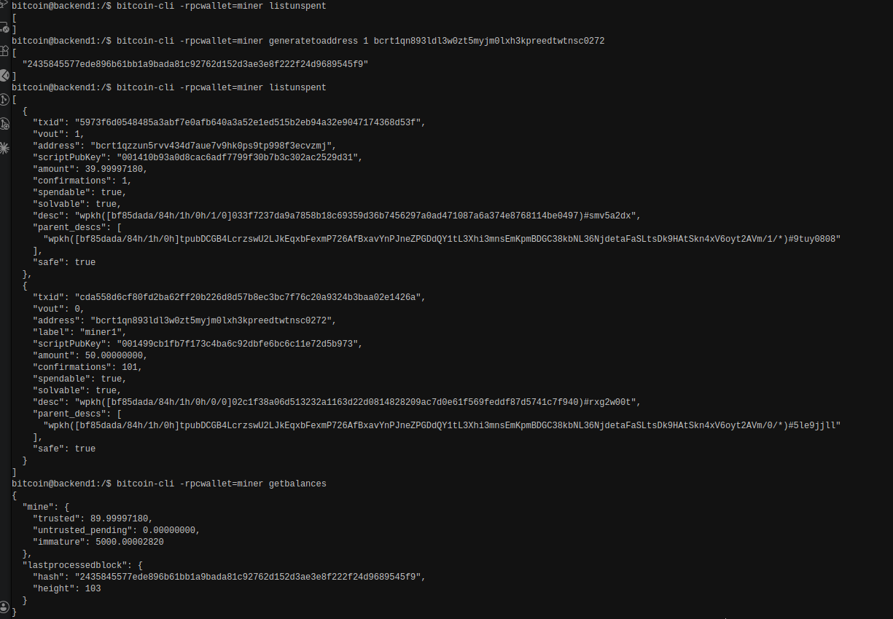
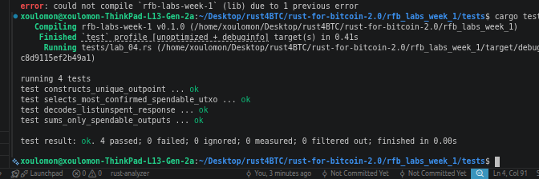

# Lab 04 — UTXOs and outpoints

## Commands used

<!-- TODO: Record the commands used to inspect and calculate wallet UTXOs. -->
```bash
bitcoin-cli -rpcwallet=miner listunspent  # List all UTXOs


bitcoin-cli -rpcwallet=miner getbalances # Get wallet balances


bitcoin-cli getrawtransaction <txid> true # Get transaction details
```

## Terminal output

<!-- TODO: Include txid, vout, amount, confirmations, script, and spendable state. -->
```bash
bitcoin@backend1:/$ bitcoin-cli -rpcwallet=miner listunspent
[
  {
    "txid": "5973f6d0548485a3abf7e0afb640a3a52e1ed515b2eb94a32e9047174368d53f",
    "vout": 1,
    "address": "bcrt1qzzun5rvv434d7aue7v9hk0ps9tp998f3ecvzmj",
    "scriptPubKey": "001410b93a0d8cac6adf7799f30b7b3c302ac2529d31",
    "amount": 39.99997180,
    "confirmations": 1,
    "spendable": true,
    "solvable": true,
    "desc": "wpkh([bf85dada/84h/1h/0h/1/0]033f7237da9a7858b18c69359d36b7456297a0ad471087a6a374e8768114be0497)#smv5a2dx",
    "parent_descs": [
      "wpkh([bf85dada/84h/1h/0h]tpubDCGB4LcrzswU2LJkEqxbFexmP726AfBxavYnPJneZPGDdQY1tL3Xhi3mnsEmKpmBDGC38kbNL36NjdetaFaSLtsDk9HAtSkn4xV6oyt2AVm/1/*)#9tuy0808"
    ],
    "safe": true
  },
  {
    "txid": "cda558d6cf80fd2ba62ff20b226d8d57b8ec3bc7f76c20a9324b3baa02e1426a",
    "vout": 0,
    "address": "bcrt1qn893ldl3w0zt5myjm0lxh3kpreedtwtnsc0272",
    "label": "miner1",
    "scriptPubKey": "001499cb1fb7f173c4ba6c92dbfe6bc6c11e72d5b973",
    "amount": 50.00000000,
    "confirmations": 101,
    "spendable": true,
    "solvable": true,
    "desc": "wpkh([bf85dada/84h/1h/0h/0/0]02c1f38a06d513232a1163d22d0814828209ac7d0e61f569feddf87d5741c7f940)#rxg2w00t",
    "parent_descs": [
      "wpkh([bf85dada/84h/1h/0h]tpubDCGB4LcrzswU2LJkEqxbFexmP726AfBxavYnPJneZPGDdQY1tL3Xhi3mnsEmKpmBDGC38kbNL36NjdetaFaSLtsDk9HAtSkn4xV6oyt2AVm/0/*)#5le9jjll"
    ],
    "safe": true
  }
]
bitcoin@backend1:/$ bitcoin-cli -rpcwallet=miner getbalances 
{
  "mine": {
    "trusted": 89.99997180,
    "untrusted_pending": 0.00000000,
    "immature": 5000.00002820
  },
  "lastprocessedblock": {
    "hash": "2435845577ede896b61bb1a9bada81c92762d152d3ae3e8f222f24d9689545f9",
    "height": 103
  }
}
bitcoin@backend1:/$ bitcoin-cli -rpcwallet=miner getrawtransaction 5973f6d0548485a3abf7e0afb640a3a52e1ed515b2eb94a32e9047174368d53f true                                    
{
  "txid": "5973f6d0548485a3abf7e0afb640a3a52e1ed515b2eb94a32e9047174368d53f",
  "hash": "e94420a677791be16709181715a3a53d1f9bb6e0536eb8f14de5bb576ae2aa81",
  "version": 2,
  "size": 222,
  "vsize": 141,
  "weight": 561,
  "locktime": 48,
  "vin": [
    {
      "txid": "88c7b609b4cbf9283614549acc6b62bb0a404312c4b0496a45502d087ce6db8e",
      "vout": 0,
      "scriptSig": {
        "asm": "",
        "hex": ""
      },
      "txinwitness": [
        "3044022051613181b3224c8078ed8a6beafe9205e927cd8f0fcde1166a0fed8d58b66b9f022018eb3d017b93203756f94c419ad1a6c0017cb53dc4eda03237cd33318e9f260e01",
        "02c1f38a06d513232a1163d22d0814828209ac7d0e61f569feddf87d5741c7f940"
      ],
      "sequence": 4294967293
    }
  ],
  "vout": [
    {
      "value": 10.00000000,
      "n": 0,
      "scriptPubKey": {
        "asm": "0 c435efcb40d70359f5b242316c0736579cb1d902",
        "desc": "addr(bcrt1qcs67lj6q6up4nadjggckcpek27wtrkgz8h58wr)#mgm0llaa",
        "hex": "0014c435efcb40d70359f5b242316c0736579cb1d902",
        "address": "bcrt1qcs67lj6q6up4nadjggckcpek27wtrkgz8h58wr",
        "type": "witness_v0_keyhash"
      }
    },
    {
      "value": 39.99997180,
      "n": 1,
      "scriptPubKey": {
        "asm": "0 10b93a0d8cac6adf7799f30b7b3c302ac2529d31",
        "desc": "addr(bcrt1qzzun5rvv434d7aue7v9hk0ps9tp998f3ecvzmj)#k64mglhh",
        "hex": "001410b93a0d8cac6adf7799f30b7b3c302ac2529d31",
        "address": "bcrt1qzzun5rvv434d7aue7v9hk0ps9tp998f3ecvzmj",
        "type": "witness_v0_keyhash"
      }
    }
  ],
  "hex": "020000000001018edbe67c082d50456a49b0c41243400abb626bcc9a54143628f9cbb409b6c7880000000000fdffffff0200ca9a3b00000000160014c435efcb40d70359f5b242316c0736579cb1d902fc1c6bee0000000016001410b93a0d8cac6adf7799f30b7b3c302ac2529d3102473044022051613181b3224c8078ed8a6beafe9205e927cd8f0fcde1166a0fed8d58b66b9f022018eb3d017b93203756f94c419ad1a6c0017cb53dc4eda03237cd33318e9f260e012102c1f38a06d513232a1163d22d0814828209ac7d0e61f569feddf87d5741c7f94030000000",
  "blockhash": "2435845577ede896b61bb1a9bada81c92762d152d3ae3e8f222f24d9689545f9",
  "confirmations": 1,
  "time": 1785587064,
  "blocktime": 1785587064
}
bitcoin@backend1:/$ 

```

## Evidence references

<!-- TODO: Link screenshots or describe the attached evidence. -->
The first screenshot show list of utxo of miner wallets




The second screensht show transaction details of one of the UTXO from the transaction id


The third screenshot show the test result of lba004 implementation



## Explanation

<!-- TODO: Explain outpoints, UTXOs, and why a wallet balance is their sum. -->

Outpoint
A pointer to a specific output — identified by (txid, index). It says "output #N of transaction X."

UTXO (Unspent Transaction Output)
An output that hasn't been spent yet. Each UTXO has a value (in BTC/sats) and a locking condition (who can spend it). An outpoint is how you reference a UTXO; the UTXO is the actual coin sitting there.

Why balance = sum of UTXOs
Bitcoin has no account balances. Your wallet doesn't store "you have 2 BTC" — it just tracks which UTXOs are spendable by your keys. Balance is just the total value of all UTXOs the wallet controls:
