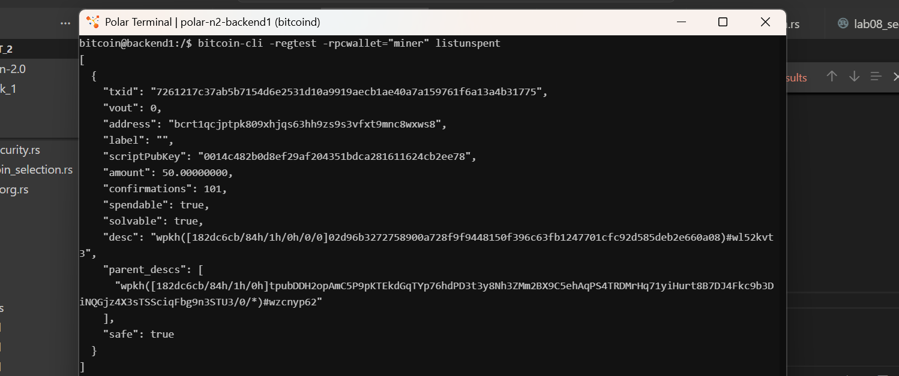
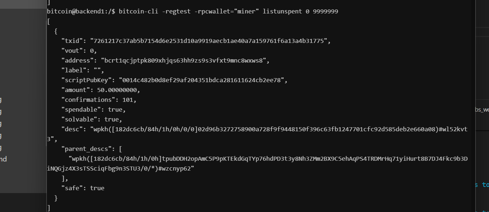

# Lab 04 — UTXOs and outpoints

## Commands used
```bash
bitcoin-cli -regtest -rpcwallet="miner" listunspent
bitcoin-cli -regtest -rpcwallet="miner" listunspent 0 9999999

```

## Terminal output

``` bash
[
  {
    "txid": "7261217c37ab5b7154d6e2531d10a9919aecb1ae40a7a159761f6a13a4b31775",
    "vout": 0,
    "address": "bcrt1qcjptpk809xhjqs63hh9zs9s3vfxt9mnc8wxws8",
    "label": "",
    "scriptPubKey": "0014c482b0d8ef29af204351bdca281611624cb2ee78",
    "amount": 50.00000000,
    "confirmations": 101,
    "spendable": true,
    "solvable": true,
    "desc": "wpkh([182dc6cb/84h/1h/0h/0/0]02d96b3272758900a728f9f9448150f396c63fb1247701cfc92d585deb2e660a08)#wl52kvt3",
    "parent_descs": [
      "wpkh([182dc6cb/84h/1h/0h]tpubDDH2opAmC5P9pKTEkdGqTYp76hdPD3t3y8Nh3ZMm2BX9C5ehAqPS4TRDMrHq71yiHurt8B7DJ4Fkc9b3DiNQGjz4X3sTSSciqFbg9n3STU3/0/*)#wzcnyp62"
    ],
    "safe": true
  }
]
```

## Evidence references


* **Figure 1**: Terminal output demonstrating list of current utxos in miner wallet
---

* **Figure 1**: Terminal output demonstrating list of current utxos in miner wallet with mini and max conf values to overide the default ones


## Explanation

* **outpoint**
- OutPoints are the global coordinate of a UTXO, defined by a 32-byte Transaction ID (txid) and an output index (vout).
* **outpoints**
- these are unspent transaction outputs

* **why a wallet balance is their sum**
- Bitcoin operates strictly on a Unspent Transaction Output (UTXO) model. Bitcoin exists only as discrete chunks of value bound to specific scripts (addresses). There is no central register or balance entry on the blockchain.

