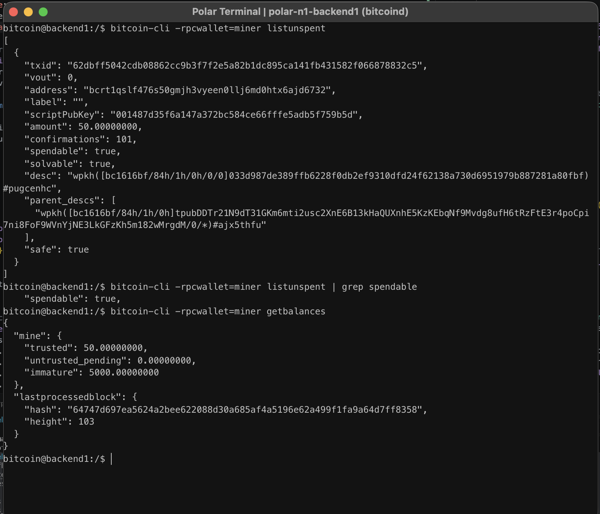

# Lab 04 — UTXOs and outpoints

## Commands used

```bash
bitcoin-cli -rpcwallet=miner listunspent

bitcoin-cli -rpcwallet=miner listunspent | grep spendable

bitcoin-cli -rpcwallet=miner getbalances
```

## Terminal output

```text
txid:
62dbff5042cdb08862cc9b3f7f2e5a82b1dc895ca141fb431582f066878832c5

vout:
0

address:
bcrt1qslf476s50gmjh3vyeen0llj6md0htx6ajd6732

scriptPubKey:
001487d35f6a147a372bc584ce66fffe5adb5f759b5d

amount:
50.00000000 BTC

confirmations:
101

spendable:
true

Wallet balances:
trusted: 50.00000000
untrusted_pending: 0.00000000
immature: 5000.00000000
```

## Evidence references

The screenshot below shows the wallet's unspent transaction outputs (UTXOs), including the transaction ID (`txid`), output index (`vout`), locking script (`scriptPubKey`), amount, number of confirmations, and spendable status.



## Explanation

A UTXO (Unspent Transaction Output) represents bitcoin that has been received but not yet spent. Each UTXO is uniquely identified by an **outpoint**, which consists of a transaction ID (`txid`) and an output index (`vout`). Bitcoin transactions spend existing UTXOs by referencing these outpoints as inputs. A wallet's available balance is the sum of all **spendable** UTXOs it controls, which is why inspecting `listunspent` provides the underlying data used to calculate the wallet balance.