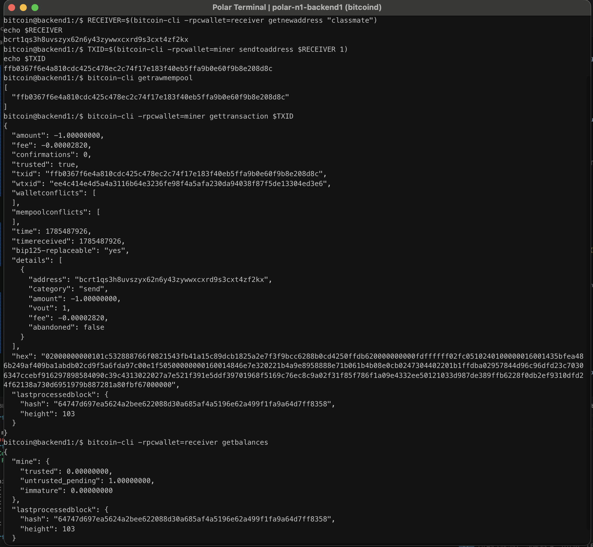

# Lab 05 — Broadcast and mempool

## Commands used

```bash
RECEIVER=$(bitcoin-cli -rpcwallet=receiver getnewaddress "classmate")
echo $RECEIVER

TXID=$(bitcoin-cli -rpcwallet=miner sendtoaddress $RECEIVER 1)
echo $TXID

bitcoin-cli getrawmempool

bitcoin-cli -rpcwallet=miner gettransaction $TXID

bitcoin-cli -rpcwallet=receiver getbalances
```

## Terminal output

```text
TXID:
ffb0367f6e4a810cdc425c478ec2c74f17e183f40eb5ffa9b0e60f9b8e208d8c

Mempool:
[
  "ffb0367f6e4a810cdc425c478ec2c74f17e183f40eb5ffa9b0e60f9b8e208d8c"
]

Sender transaction:
amount: -1.00000000 BTC
fee: -0.00002820 BTC
confirmations: 0

Receiver balances:
trusted: 0.00000000 BTC
untrusted_pending: 1.00000000 BTC
immature: 0.00000000 BTC
```

## Evidence references

The screenshot below shows the transaction being broadcast, its presence in the node's mempool, the sender's wallet reporting zero confirmations, and the receiver's wallet showing the funds as an unconfirmed pending balance.



## Explanation

A Bitcoin transaction is first **signed** by the sender's wallet and then **broadcast** to the network. Once broadcast, it is stored in the node's **mempool** while waiting to be included in a block. During this stage, the transaction has **zero confirmations**. The sender's wallet records the outgoing payment immediately, while the receiver's wallet shows the incoming funds as **untrusted pending** because they have not yet been confirmed in a block. After a miner includes the transaction in a block, it becomes **confirmed**, and the receiver's balance moves from pending to trusted.