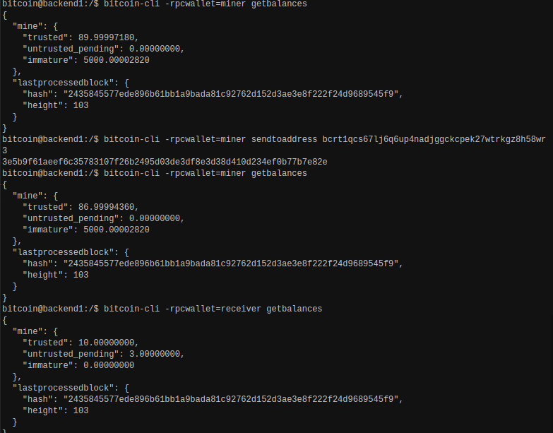
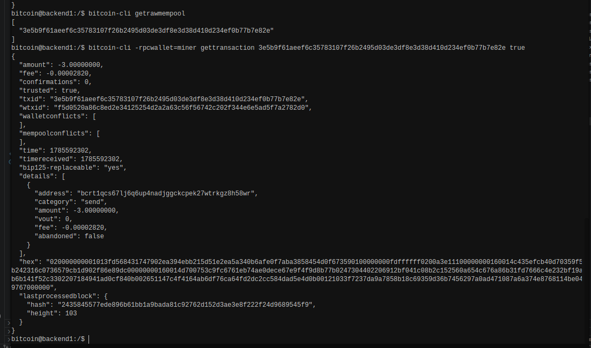
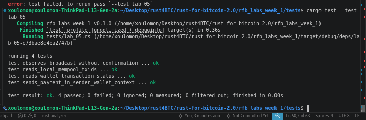

# Lab 05 — Broadcast and mempool

## Commands used

<!-- TODO: Record the payment, mempool, transaction, and balance commands. -->
```bash
bitcoin-cli -rpcwallet=miner sendtoaddress <address> <amount>  # Send payment
bitcoin-cli getrawmempool                                      # Check mempool
bitcoin-cli -rpcwallet=miner gettransaction <txid>             # Check tx status
bitcoin-cli -rpcwallet=receiver getbalances                    # Check receiver balance
```

## Terminal output

<!-- TODO: Show the TXID, zero confirmations, mempool entry, and pending balance. -->
TXID IN MEMPOOL
```bash
bitcoin@backend1:/$ bitcoin-cli getrawmempool 
[
  "3e5b9f61aeef6c35783107f26b2495d03de3df8e3d38d410d234ef0b77b7e82e"
]
```

Zero confirmation of tx 
```bash
bitcoin@backend1:/$ bitcoin-cli -rpcwallet=miner gettransaction 3e5b9f61aeef6c35783107f26b2495d03de3df8e3d38d410d234ef0b77b7e82e true
{
  "amount": -3.00000000,
  "fee": -0.00002820,
  "confirmations": 0,
  "trusted": true,
  "txid": "3e5b9f61aeef6c35783107f26b2495d03de3df8e3d38d410d234ef0b77b7e82e",
  "wtxid": "f5d0520a86c8ed2e34125254d2a2a63c56f56742c202f344e6e5ad5f7a2782d0",
  "walletconflicts": [
  ],
  "mempoolconflicts": [
  ],
  "time": 1785592302,
  "timereceived": 1785592302,
  "bip125-replaceable": "yes",
  "details": [
    {
      "address": "bcrt1qcs67lj6q6up4nadjggckcpek27wtrkgz8h58wr",
      "category": "send",
      "amount": -3.00000000,
      "vout": 0,
      "fee": -0.00002820,
      "abandoned": false
    }
  ],
  "hex": "020000000001013fd568431747902ea394ebb215d51e2ea5a340b6afe0f7aba3858454d0f673590100000000fdffffff0200a3e11100000000160014c435efcb40d70359f5b242316c0736579cb1d902f86e89dc00000000160014d700753c9fc6761eb74ae0dece67e9f4f9d8b77b0247304402206912bf041c08b2c152560a654c676a86b31fd7666c4e232bf19ab6b141f52c3302207184941ad0cf840b002651147c4f4164ab6df76ca64fd2dc2cc584dad5e4d0b00121033f7237da9a7858b18c69359d36b7456297a0ad471087a6a374e8768114be049767000000",
  "lastprocessedblock": {
    "hash": "2435845577ede896b61bb1a9bada81c92762d152d3ae3e8f222f24d9689545f9",
    "height": 103
  }
}
```

Pending Balance of receiver
```bash
bitcoin@backend1:/$ bitcoin-cli -rpcwallet=receiver getbalances
{
  "mine": {
    "trusted": 10.00000000,
    "untrusted_pending": 3.00000000,
    "immature": 0.00000000
  },
  "lastprocessedblock": {
    "hash": "2435845577ede896b61bb1a9bada81c92762d152d3ae3e8f222f24d9689545f9",
    "height": 103
  }
}
``` 


## Evidence references

<!-- TODO: Link screenshots or describe the attached evidence. -->

FIRST: THE BALANCE BEFORE AND AFTER, RUNNING THE SENDTOADDRESS METHOD



SECOND: SHOWS THE TX IN THE MEMPOOL, THE THE TRANSACTION DETAILS OF THE TRANSACTION, {Since the transaction is not yet mined and added to a block, it doesnt have a blockhash} 



THIRD: TEST OF LAB_05 IMPLEMENTATION



## Explanation

<!-- TODO: Distinguish signed, broadcast, mempool, and confirmed states. -->

Signed
Transaction is fully authorized (valid signatures on inputs) but exists only locally — not sent anywhere yet.

Broadcast
The signed transaction is sent to the network (peers/nodes). It's now propagating, but not yet accepted anywhere permanent.

Mempool
Nodes that received the transaction validate it and hold it in their "memory pool" — a waiting room of valid, unconfirmed transactions. It's visible to the network but not yet in a block. Can still be dropped, replaced (RBF), or evicted.

Confirmed
A miner includes the transaction in a mined block. Once in a block, it's "1 confirmation." Each new block on top adds another confirmation, making it progressively harder to reverse.

```
signed → broadcast → mempool → confirmed (in a block)
```