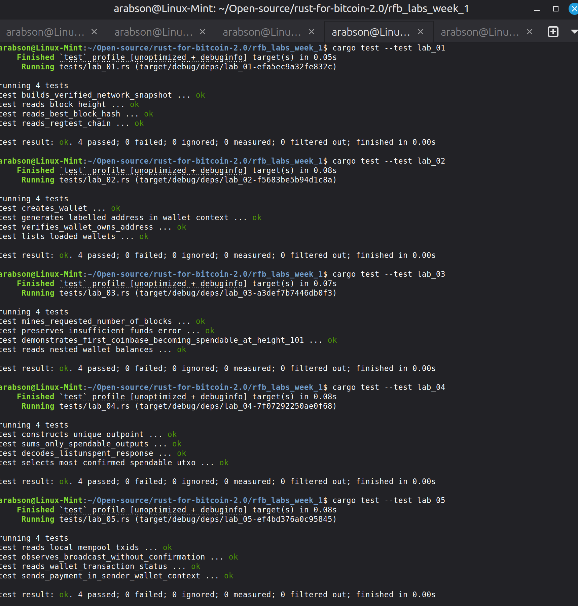

# Lab 05 — Broadcast and observe an unconfirmed payment

## Commands used

```bash
# 1. Send 1 BTC from miner to receiver address (unmined)
bitcoin-cli -rpcwallet=miner sendtoaddress "bcrt1qreceiveraddress" 1.0

# 2. Inspect local node mempool
bitcoin-cli getrawmempool

# 3. Query transaction status from sender wallet
bitcoin-cli -rpcwallet=miner gettransaction "payment-txid..."

# 4. Query balances from receiver wallet
bitcoin-cli -rpcwallet=receiver getbalances

# 5. Run Rust tests for Lab 05
cargo test --test lab_05
```

## Terminal output

```text
$ bitcoin-cli -rpcwallet=miner sendtoaddress "bcrt1qreceiveraddress" 1.0
42df86320b309d52b5f12402d7a3b90dabe933e12800303b63067bfe8537d4d1

$ bitcoin-cli getrawmempool
[
  "42df86320b309d52b5f12402d7a3b90dabe933e12800303b63067bfe8537d4d1"
]

$ bitcoin-cli -rpcwallet=miner gettransaction "42df86320b309d52b5f12402d7a3b90dabe933e12800303b63067bfe8537d4d1"
{
  "txid": "42df86320b309d52b5f12402d7a3b90dabe933e12800303b63067bfe8537d4d1",
  "amount": -1.00000000,
  "fee": -0.00001000,
  "confirmations": 0
}

$ bitcoin-cli -rpcwallet=receiver getbalances
{
  "mine": {
    "trusted": 0.00000000,
    "untrusted_pending": 1.00000000,
    "immature": 0.00000000
  }
}

$ cargo test --test lab_05
running 4 tests
test observes_broadcast_without_confirmation ... ok
test reads_local_mempool_txids ... ok
test reads_wallet_transaction_status ... ok
test sends_payment_in_sender_wallet_context ... ok
test result: ok. 4 passed; 0 failed
```

## Evidence references



## Explanation

**Transaction Lifecycle (Built/Signed -> Broadcast -> Mempool -> Confirmed):**
- **Built & Signed**: The sender wallet constructs a transaction, selects UTXOs, adds outputs for payment/change, and creates valid digital signatures (`scriptSig`/`witness`). At this stage, the transaction is local data.
- **Broadcast**: The signed transaction is sent to peer nodes over the P2P network.
- **Mempool**: Valid unconfirmed transactions sit in the node's in-memory transaction pool (mempool). Receiver nodes detect incoming payments as `untrusted_pending` balance with 0 confirmations. Broadcast is not confirmation; mempool transactions can be replaced (RBF), evicted, or double-spent before inclusion in a valid block.
- **Confirmed**: A miner includes the transaction in a valid block header with valid proof of work, moving it from the mempool into immutable block history.
