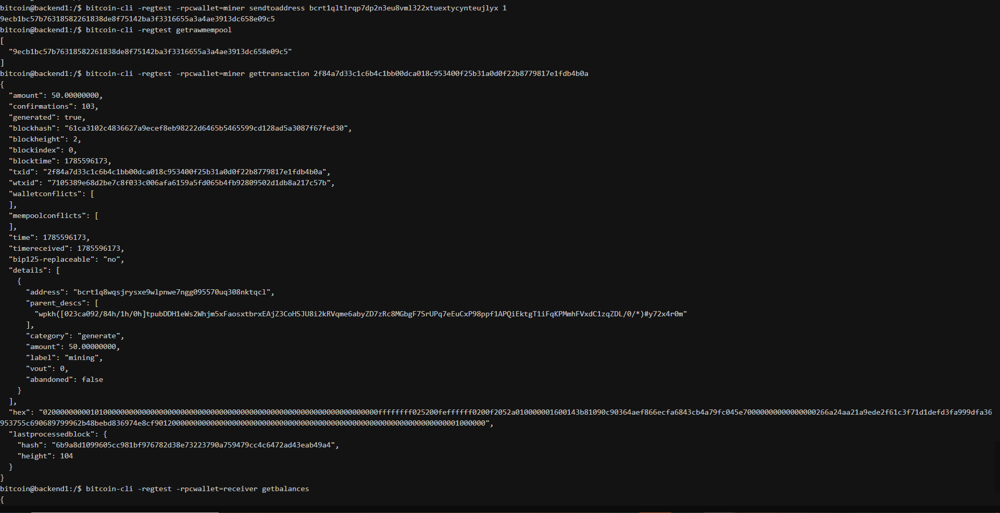
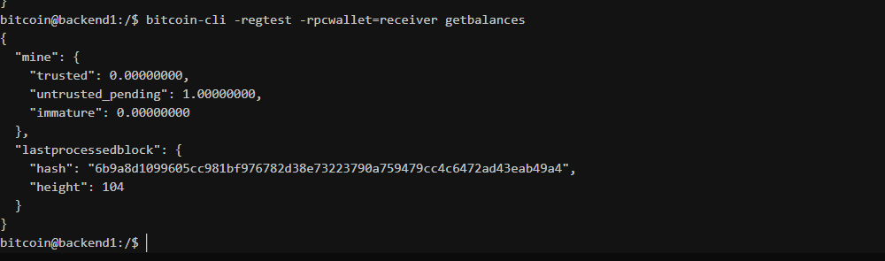

# Lab 05 — Broadcast and mempool

## Commands used

bitcoin-cli -regtest -rpcwallet=miner sendtoaddress bcrt1q8wqsjrysxe9wlpnwe7ngg095570uq308nktqcl 1
bitcoin-cli -regtest getrawmempool
bitcoin-cli -regtest -rpcwallet=miner gettransaction 2f84a7d33c1c6b4c1bb00dca018c953400f25b31a0d0f22b8779817e1fdb4b0a
bitcoin-cli -regtest -rpcwallet=receiver getbalances
## Terminal output

.............................................
9ecb1bc57b76318582261838de8f75142ba3f3316655a3a4ae3913dc658e09c5
.............................................
[
  "9ecb1bc57b76318582261838de8f75142ba3f3316655a3a4ae3913dc658e09c5"
]
...........................................
{
  "amount": 50.00000000,
  "confirmations": 103,
  "generated": true,
  "blockhash": "61ca3102c4836627a9ecef8eb98222d6465b5465599cd128ad5a3087f67fed30",
  "blockheight": 2,
  "blockindex": 0,
  "blocktime": 1785596173,
  "txid": "2f84a7d33c1c6b4c1bb00dca018c953400f25b31a0d0f22b8779817e1fdb4b0a",
  "wtxid": "7105389e68d2be7c8f033c006afa6159a5fd065b4fb92809502d1db8a217c57b",
  "walletconflicts": [
  ],
  "mempoolconflicts": [
  ],
  "time": 1785596173,
  "timereceived": 1785596173,
  "bip125-replaceable": "no",
  "details": [
    {
      "address": "bcrt1q8wqsjrysxe9wlpnwe7ngg095570uq308nktqcl",
      "parent_descs": [
        "wpkh([023ca092/84h/1h/0h]tpubDDH1eWs2Whjm5xFaosxtbrxEAjZ3CoHSJU8i2kRVqme6abyZD7zRc8MGbgF7SrUPq7eEuCxP98ppf1APQiEktgT1iFqKPMmhFVxdC1zqZDL/0/*)#y72x4r0m"
      ],
      "category": "generate",
      "amount": 50.00000000,
      "label": "mining",
      "vout": 0,
      "abandoned": false
    }
  ],
  "hex": "020000000001010000000000000000000000000000000000000000000000000000000000000000ffffffff025200feffffff0200f2052a010000001600143b81090c90364aef866ecfa6843cb4a79fc045e70000000000000000266a24aa21a9ede2f61c3f71d1defd3fa999dfa36953755c690689799962b48bebd836974e8cf90120000000000000000000000000000000000000000000000000000000000000000001000000",
  "lastprocessedblock": {
    "hash": "6b9a8d1099605cc981bf976782d38e73223790a759479cc4c6472ad43eab49a4",
    "height": 104
  }
}
..................................
{
  "mine": {
    "trusted": 0.00000000,
    "untrusted_pending": 1.00000000,
    "immature": 0.00000000
  },
  "lastprocessedblock": {
    "hash": "6b9a8d1099605cc981bf976782d38e73223790a759479cc4c6472ad43eab49a4",
    "height": 104
  }
}

## Evidence references

## Explanation

A Bitcoin transaction progresses through several distinct states. First, the transaction is **built and signed**—the sender's wallet selects input UTXOs, constructs outputs (payment + change), signs the inputs with the appropriate private keys, and produces a complete, valid transaction. Second, the transaction is **broadcast** to the network—it is sent to one or more peers who validate it and relay it further. Third, valid transactions sit in the node's local **mempool**—a staging area for unconfirmed transactions awaiting inclusion in a block. The transaction is not yet confirmed; it could theoretically be replaced (RBF) or dropped if fees are too low.

Broadcast is not confirmation. Being in the mempool means the transaction has been seen and validated by at least one node, but it has no proof-of-work commitment. The receiver's wallet correctly shows the incoming amount as "untrusted pending" rather than "trusted" because a confirmed transaction could theoretically be displaced in a reorganization. Only after a miner includes the transaction in a block that becomes part of the chain does the transaction achieve its first confirmation and the receiver's balance become trusted.