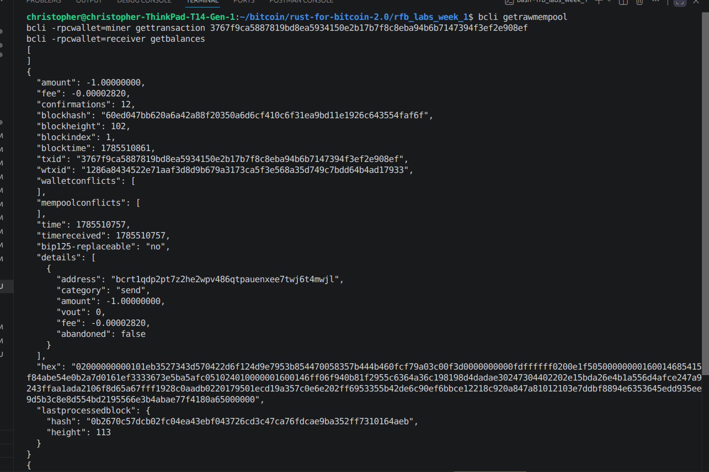

# Lab 05 — Broadcast and mempool

## Commands used

```
cargo test --test lab_05
bitcoin-cli -regtest -rpcwallet=miner sendtoaddress <classmate address> 1
bitcoin-cli -regtest getrawmempool
bitcoin-cli -regtest -rpcwallet=miner gettransaction <txid>
bitcoin-cli -regtest -rpcwallet=receiver getbalances
```

## Terminal output

```
$ bitcoin-cli -regtest -rpcwallet=miner sendtoaddress bcrt1qdp2pt7z2he2wpv486qtpauenxee7twj6t4mwjl 1
3767f9ca5887819bd8ea5934150e2b17b7f8c8eba94b6b7147394f3ef2e908ef

$ bitcoin-cli -regtest getrawmempool
[ "3767f9ca5887819bd8ea5934150e2b17b7f8c8eba94b6b7147394f3ef2e908ef" ]

$ bitcoin-cli -regtest -rpcwallet=miner gettransaction 3767f9ca5887819bd8ea5934150e2b17b7f8c8eba94b6b7147394f3ef2e908ef
{
  "amount": -1.00000000,
  "fee": -0.00002820,
  "confirmations": 0,
  "txid": "3767f9ca5887819bd8ea5934150e2b17b7f8c8eba94b6b7147394f3ef2e908ef",
  "bip125-replaceable": "yes",
  "details": [ { "category": "send", "amount": -1.00000000 } ]
}

$ bitcoin-cli -regtest -rpcwallet=receiver getbalances
{
  "mine": {
    "trusted": 0.00000000,
    "untrusted_pending": 1.00000000,
    "immature": 0.00000000
  }
}

$ cargo test --test lab_05
running 4 tests
test reads_local_mempool_txids ... ok
test sends_payment_in_sender_wallet_context ... ok
test reads_wallet_transaction_status ... ok
test observes_broadcast_without_confirmation ... ok
test result: ok. 4 passed; 0 failed; 0 ignored; 0 measured; 0 filtered out
```

## Evidence references



- TXID `3767f9ca5887819bd8ea5934150e2b17b7f8c8eba94b6b7147394f3ef2e908ef`
  appears directly in `getrawmempool`'s output.
- Sender (`miner`)'s `gettransaction` reports `confirmations: 0`.
- Receiver (`receiver`)'s `getbalances` shows `untrusted_pending: 1.0`, not
  `trusted` — the wallet sees the incoming payment but doesn't count it as
  settled.
- No block was mined between the send and these queries, so this is purely
  mempool-level visibility.

## Explanation

A transaction goes through a few distinct stages before anyone should treat
it as final:

- **Built and signed** — it exists only on the local machine at this point,
  as raw bytes. Nobody else on the network has any idea it exists yet.
- **Broadcast** — pushed out to peers over p2p. This is just gossip
  spreading, not agreement.
- **In the mempool** — nodes that received it and think it's valid hold onto
  it, waiting for a miner to pick it up. Not every node's mempool looks the
  same (policy differs, propagation takes time), and the transaction can
  still be replaced via RBF or just evicted.
- **Confirmed** — a miner actually included it in a block the network
  accepted as part of the chain. This is the only point where it's genuinely
  settled, and even then more confirmations just keep lowering the odds of
  a reorg undoing it.

The gap between broadcast and confirmed is really the whole point of this
lab: broadcasting only means the transaction is visible and probably going
to be mined, not that it's done. That's why the receiver's wallet shows the
incoming 1 BTC as `untrusted_pending` instead of `trusted` — it's seen the
payment, but it isn't ready to bet on it yet.
