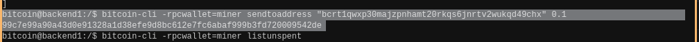
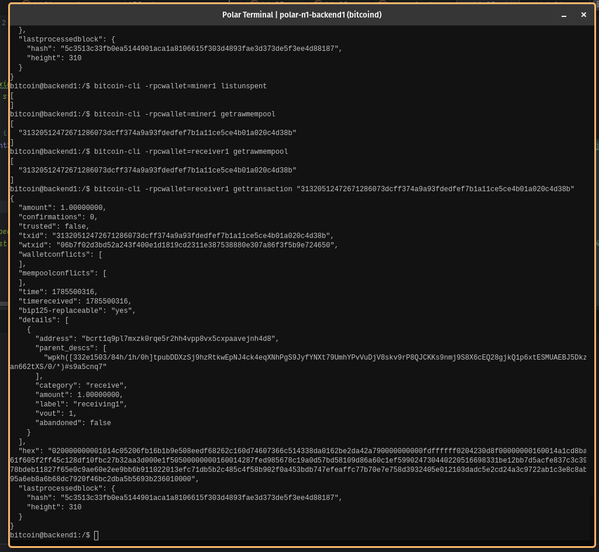

# Lab 05 — Broadcast and mempool

## Commands used

TODO: Record the payment, mempool, transaction, and balance commands.
```bash
TXID=$(bitcoin-cli -rpcwallet=miner sendtoaddress "$RECEIVER_ADDR" 1.0)
bitcoin-cli -rpcwallet=miner getbalances
bitcoin-cli getrawmempool
```

## Terminal output

TODO: Show the TXID, zero confirmations, mempool entry, and pending balance.
```bash
bitcoin@backend1:/$ bitcoin-cli -rpcwallet=miner sendtoaddress "bcrt1qwxp30majzpnhamt20rkqs6jnrtv2wukqd49chx" 0.1
99c7e99a90a43d0e91328a1d38efe9d8bc612e7fc6abaf999b3fd720009542de

bitcoin@backend1:/$ bitcoin-cli -rpcwallet=receiver1 getrawmempool
[
  "31320512472671286073dcff374a9a93fdedfef7b1a11ce5ce4b01a020c4d38b"
]

bitcoin@backend1:/$ bitcoin-cli -rpcwallet=receiver1 gettransaction "31320512472671286073dcff374a9a93fdedfef7b1a11ce5ce4b01a020c4d38b"
{
  "amount": 1.00000000,
  "confirmations": 0,
  "trusted": false,
  "txid": "31320512472671286073dcff374a9a93fdedfef7b1a11ce5ce4b01a020c4d38b",
  "wtxid": "06b7f02d3bd52a243f400e1d1819cd2311e387538880e307a86f3f5b9e724650",
  "walletconflicts": [
  ],
  "mempoolconflicts": [
  ],
  "time": 1785500316,
  "timereceived": 1785500316,
  "bip125-replaceable": "yes",
  "details": [
    {
      "address": "bcrt1q9pl7mxzk0rqe5r2hh4vpp8vx5cxpaavejnh4d8",
      "parent_descs": [
        "wpkh([332e1503/84h/1h/0h]tpubDDXzSj9hzRtkwEpNJ4ck4eqXNhPgS9JyfYNXt79UmhYPvVuDjV8skv9rP8QJCKKs9nmj9S8X6cEQ28gjkQ1p6xtESMUAEBJ5Dkzan662tXS/0/*)#s9a5cnq7"
      ],
      "category": "receive",
      "amount": 1.00000000,
      "label": "receiving1",
      "vout": 1,
      "abandoned": false
    }
  ],
  "hex": "020000000001014c05206fb16b1b9e508eedf68262c160d74607366c514338da0162be2da42a790000000000fdffffff0204230d8f00000000160014a1cd8ba61f605f2ff45c128df10fbc27b32aa3d000e1f50500000000160014287fed985678c19a0d57bd58109d86a60c1ef599024730440220516698331be12bb7d5acfe837c3c3978bdeb11827f65e0c9ae60e2ee9bb6b911022013efc71db5b2c485c4f58b902f0a453bdb747efeaffc77b70e7e758d3932405e012103dadc5e2cd24a3c9722ab1c3e8c8ab95a6eb8a6b68dc7920f46bc2dba5b5693b236010000",
  "lastprocessedblock": {
    "hash": "5c3513c33fb0ea5144901aca1a8106615f303d4893fae3d373de5f3ee4d88187",
    "height": 310
  }
}
```

## Evidence references

TODO: Link screenshots or describe the attached evidence.



## Explanation

TODO: Distinguish signed, broadcast, mempool, and confirmed states.
- `signed` means wallet uses its private keys to create a digital signature for the transaction
- `broadcast` means wallet asks a node to send the signed transaction to its peers
- `mempool` is a node's local collection of valid but unconfirmed transactions
- `confirmed states` is the state achieved once a miner includes the transaction inside a block