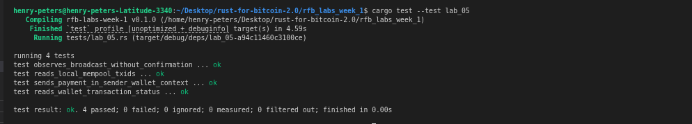

# Lab 05 — Broadcast and mempool

## Commands used

```bash
# Rust test suite
cargo test --test lab_05

# Send 1 BTC from miner to receiver without mining a block
bitcoin-cli -rpcwallet=miner sendtoaddress bcrt1qry57tkfsw9t6xp2m97y94ac5f7mj242f3a56mu 1 

# Check the node's local mempool for the returned TXID
bitcoin-cli getrawmempool

# Check sender's view of the transaction (0 confirmations expected)
bitcoin-cli -rpcwallet=miner gettransaction  85e8d711749065243ec2b80b9a3f451ca0c196e0f8cf27478718adcf36530bd8 # <txid>

# Check receiver's balance (should show untrusted_pending)
bitcoin-cli -rpcwallet=receiver getbalances
```

## Terminal output

<!-- Paste the relevant terminal output here -->
```bash
bitcoin@backend1:/$ bitcoin-cli -rpcwallet=miner sendtoaddress bcrt1qry57tkfsw9t6xp2m97y94ac5f7mj242f3a56mu 1
85e8d711749065243ec2b80b9a3f451ca0c196e0f8cf27478718adcf36530bd8
bitcoin@backend1:/$ bitcoin-cli getrawmempool
[
  "85e8d711749065243ec2b80b9a3f451ca0c196e0f8cf27478718adcf36530bd8"
]
bitcoin@backend1:/$ bitcoin-cli -rpcwallet=miner gettransaction 85e8d711749065243ec2b80b9a3f451ca0c196e0f8cf27478718adcf36530bd8
{
  "amount": -1.00000000,
  "fee": -0.00002820,
  "confirmations": 0,
  "trusted": true,
  "txid": "85e8d711749065243ec2b80b9a3f451ca0c196e0f8cf27478718adcf36530bd8",
  "wtxid": "6e3fe4d4fb5b8a4c067cc5318c576181130b2c87d2e254757a87cdf384e5c12b",
  "walletconflicts": [
  ],
  "mempoolconflicts": [
  ],
  "time": 1785788361,
  "timereceived": 1785788361,
  "bip125-replaceable": "yes",
  "details": [
    {
      "address": "bcrt1qry57tkfsw9t6xp2m97y94ac5f7mj242f3a56mu",
      "category": "send",
      "amount": -1.00000000,
      "vout": 0,
      "fee": -0.00002820,
      "abandoned": false
    }
  ],
  "hex": "020000000001016571cb6b08d8edbf5198025156a928d00a8389b6f5ddf101b5e78d8069a715920000000000fdffffff0200e1f505000000001600141929e5d9307157a3055b2f885af7144fb7255549fc05102401000000160014fedaea27707566a51be3d68ab38e3abc8a9ed2bb0247304402200dc3d4f9719ff14b7604fe3b40d1211f7e89f2cca452a32db77316df0c3621ef02205a23dbf51ee9912392a4a3a26178af34ed21c429822df9452c1b8e0ebcb98be4012102a016d02eed09f4474152796b722c3bad06ed261e2b52d0aa8a8d917ed5cd481968000000",
  "lastprocessedblock": {
    "hash": "04210b631d198bbe65227f395966fba035774b8785a23c60cebb5004aa964456",
    "height": 104
  }
}
bitcoin@backend1:/$ bitcoin-cli -rpcwallet=receiver getbalances
{
  "mine": {
    "trusted": 0.00000000,
    "untrusted_pending": 1.00000000,
    "immature": 0.00000000
  },
  "lastprocessedblock": {
    "hash": "04210b631d198bbe65227f395966fba035774b8785a23c60cebb5004aa964456",
    "height": 104
  }
}
```

## Evidence references
<!-- Describe or link to screenshots, logs, or other supporting evidence -->
.png)
.png)
<!-- My tests -->


## Explanation

A Bitcoin transaction passes through four distinct states:

**Built and signed** — the wallet selects UTXOs as inputs, constructs outputs for the receiver and change, and signs each input with the relevant private key. The transaction exists only in local memory at this point.

**Broadcast** — the signed transaction is serialised and sent to connected peers via the P2P network. It is a fire-and-forget announcement with no delivery guarantee.

**Mempool** — a node that receives a valid transaction holds it in its local mempool (memory pool) as a candidate for inclusion in the next block. The receiver's wallet shows the payment as `untrusted_pending` because the coins are visible but not yet secured by proof of work. Different nodes can have different mempools.

**Confirmed** — a miner includes the transaction in a block and the network accepts that block. The transaction now has one confirmation, and each subsequent block adds another. Broadcast is not confirmation — only inclusion in a valid, accepted block is.
