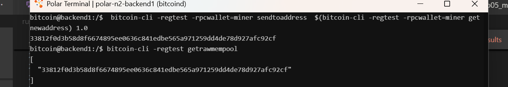
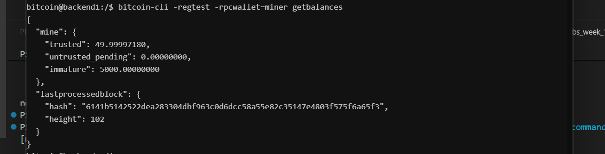

# Lab 05 — Broadcast and mempool

## Commands used

```bash
# 1. Send BTC from sender wallet to receiver address
 bitcoin-cli -regtest -rpcwallet=miner sendtoaddress  $(bitcoin-cli -regtest -rpcwallet=miner getnewaddress) 1.0

# 2. Inspect raw mempool array
 bitcoin-cli -regtest getrawmempool

# 3. Get sender transaction status and confirmation count
 bitcoin-cli -regtest -rpcwallet="miner" gettransaction "33812f0d3b58d8f6674895ee0636c841edbe565a971259dd4de78d927afc92cf"
 
# 4. Check receiver wallet balance states including pending funds
 bitcoin-cli -regtest -rpcwallet="miner" getbalances
```


## Terminal output

* **txid**
```bash
33812f0d3b58d8f6674895ee0636c841edbe565a971259dd4de78d927afc92cf
```
* **zero confirmation**
```bash

  "amount": 0.00000000,
  "fee": -0.00002820,
  "confirmations": 0,
  "trusted": true,
  "txid": "33812f0d3b58d8f6674895ee0636c841edbe565a971259dd4de78d927afc92cf",
  "wtxid": "221b270170190fc3f1648135718c83e05af00304519c6b737fd58f6d2f9b0bc6",
  "walletconflicts": [
  ],..
```

* **memepool entry**
```bash
[
  "33812f0d3b58d8f6674895ee0636c841edbe565a971259dd4de78d927afc92cf"
]
```
* **pending balance**
```bash
 "mine": {
    "trusted": 49.99997180,
    "untrusted_pending": 0.00000000,
    "immature": 5000.00000000
  },
```


## Evidence references


* **Figure 1**


* **Figure 2**

## Explanation

* **signed**
- when the transaction has been constructed with valid inputs and signed using the sender's private key

* **broadcast**
- The signed transaction payload is sent across the peer-to-peer network to connected Bitcoin nodes via the network protocol layer 

* **mempool**
- is a collection of uncomfirmed transaction

* **comfirmed**
- when a miner picks the transaction up from the mempool, includes it in a newly mined block, and publishes the block to the network.

