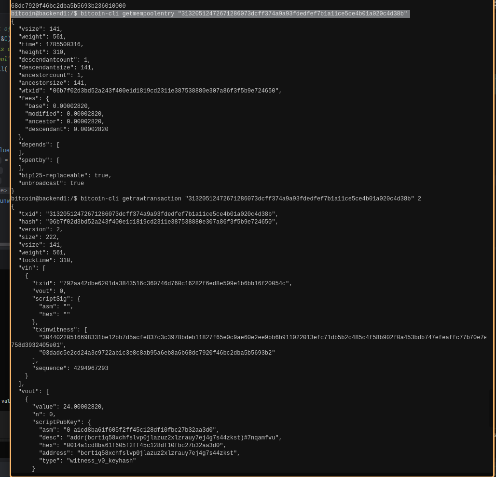

# Lab 06 — Transaction decoding

## Commands used

TODO: Record the verbose transaction-decoding commands.
```bash
bitcoin@backend1:/$ bitcoin-cli getrawtransaction "31320512472671286073dcff374a9a93fdedfef7b1a11ce5ce4b01a020c4d38b" true
bitcoin@backend1:/$ bitcoin-cli getmempoolentry "31320512472671286073dcff374a9a93fdedfef7b1a11ce5ce4b01a020c4d38b"
```

## Terminal output

TODO: Include vin, vout, addresses, values, vsize, and calculated fee.
```bash
bitcoin@backend1:/$ bitcoin-cli getmempoolentry "31320512472671286073dcff374a9a93fdedfef7b1a11ce5ce4b01a020c4d38b"
{
  "vsize": 141,
  "weight": 561,
  "time": 1785500316,
  "height": 310,
  "descendantcount": 1,
  "descendantsize": 141,
  "ancestorcount": 1,
  "ancestorsize": 141,
  "wtxid": "06b7f02d3bd52a243f400e1d1819cd2311e387538880e307a86f3f5b9e724650",
  "fees": {
    "base": 0.00002820,
    "modified": 0.00002820,
    "ancestor": 0.00002820,
    "descendant": 0.00002820
  },
  "depends": [
  ],
  "spentby": [
  ],
  "bip125-replaceable": true,
  "unbroadcast": true
}

bitcoin@backend1:/$ bitcoin-cli getrawtransaction "31320512472671286073dcff374a9a93fdedfef7b1a11ce5ce4b01a020c4d38b" true
{
  "txid": "31320512472671286073dcff374a9a93fdedfef7b1a11ce5ce4b01a020c4d38b",
  "hash": "06b7f02d3bd52a243f400e1d1819cd2311e387538880e307a86f3f5b9e724650",
  "version": 2,
  "size": 222,
  "vsize": 141,
  "weight": 561,
  "locktime": 310,
  "vin": [
    {
      "txid": "792aa42dbe6201da3843516c360746d760c16282f6ed8e509e1b6bb16f20054c",
      "vout": 0,
      "scriptSig": {
        "asm": "",
        "hex": ""
      },
      "txinwitness": [
        "30440220516698331be12bb7d5acfe837c3c3978bdeb11827f65e0c9ae60e2ee9bb6b911022013efc71db5b2c485c4f58b902f0a453bdb747efeaffc77b70e7e758d3932405e01",
        "03dadc5e2cd24a3c9722ab1c3e8c8ab95a6eb8a6b68dc7920f46bc2dba5b5693b2"
      ],
      "sequence": 4294967293
    }
  ],
  "vout": [
    {
      "value": 24.00002820,
      "n": 0,
      "scriptPubKey": {
        "asm": "0 a1cd8ba61f605f2ff45c128df10fbc27b32aa3d0",
        "desc": "addr(bcrt1q58xchfslvp0jlazuz2xlzrauy7ej4g7s44zkst)#7nqamfvu",
        "hex": "0014a1cd8ba61f605f2ff45c128df10fbc27b32aa3d0",
        "address": "bcrt1q58xchfslvp0jlazuz2xlzrauy7ej4g7s44zkst",
        "type": "witness_v0_keyhash"
      }
    },
    {
      "value": 1.00000000,
      "n": 1,
      "scriptPubKey": {
        "asm": "0 287fed985678c19a0d57bd58109d86a60c1ef599",
        "desc": "addr(bcrt1q9pl7mxzk0rqe5r2hh4vpp8vx5cxpaavejnh4d8)#r7pk75c2",
        "hex": "0014287fed985678c19a0d57bd58109d86a60c1ef599",
        "address": "bcrt1q9pl7mxzk0rqe5r2hh4vpp8vx5cxpaavejnh4d8",
        "type": "witness_v0_keyhash"
      }
    }
  ],
  "hex": "020000000001014c05206fb16b1b9e508eedf68262c160d74607366c514338da0162be2da42a790000000000fdffffff0204230d8f00000000160014a1cd8ba61f605f2ff45c128df10fbc27b32aa3d000e1f50500000000160014287fed985678c19a0d57bd58109d86a60c1ef599024730440220516698331be12bb7d5acfe837c3c3978bdeb11827f65e0c9ae60e2ee9bb6b911022013efc71db5b2c485c4f58b902f0a453bdb747efeaffc77b70e7e758d3932405e012103dadc5e2cd24a3c9722ab1c3e8c8ab95a6eb8a6b68dc7920f46bc2dba5b5693b236010000"
}
```

## Evidence references

TODO: Link screenshots or describe the attached evidence.


## Explanation

TODO: Prove value conservation and explain why the fee has no dedicated output.
- every input's prevout.value must fully reappear either as an output or as the miner fee — value can't be created or destroyed:                                                                                                                                                       
  sum(inputs) = sum(payment) + sum(change) + fee.
- A transaction is just inputs + outputs; the fee is defined as the difference between total input value and total output value. 