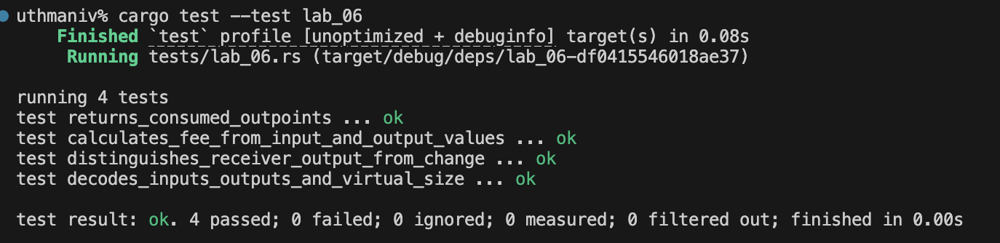

# Lab 06 — Transaction decoding

## Commands used

- Verbose transaction decode: `bitcoin-cli getrawtransaction "$TXID" 2`
- Previous-output lookup: `bitcoin-cli gettxout "$PREVIOUS_TXID" "$PREVIOUS_VOUT" false`

## Terminal output

```text
txid: fed36157b3cb634faf2ba9fb29adb0a8e6316599e59af7bb1f78db250f4ad070
vsize: 141 vB

vin[0]:
  outpoint: e539f2ff605f56b57e3cc791a06eec6c510d7cd64a58f4f0f6f368dd70e4ef35:0
  previous value: 50.0 BTC

vout[0] — change:
  address: bcrt1qd089w7a4sm7ru7heye68sk7ldxm506puqzw9pw
  value: 48.99997180 BTC
  scriptPubKey: 00146bce577bb586fc3e7af92674785bdf69b747e83c

vout[1] — receiver payment:
  address: bcrt1qn0a5sawrhah5wfdacckskhsxvmf068r34ktv3d
  value: 1.00000000 BTC
  scriptPubKey: 00149bfb4875c3bf6f4725bdc62d0b5e0666d2fd1c71

50.00000000 = 1.00000000 + 48.99997180 + 0.00002820 BTC
calculated fee: 0.00002820 BTC
```

## Evidence references

## Explanation

The input contributes 50 BTC. The transaction assigns 1 BTC to the receiver and
48.99997180 BTC back to the sender as change, leaving 0.00002820 BTC unassigned.
That difference is the miner fee, so input value equals payment plus change plus
fee. A fee has no dedicated output because miners claim the difference between all
transaction inputs and outputs when constructing the block's coinbase transaction.
