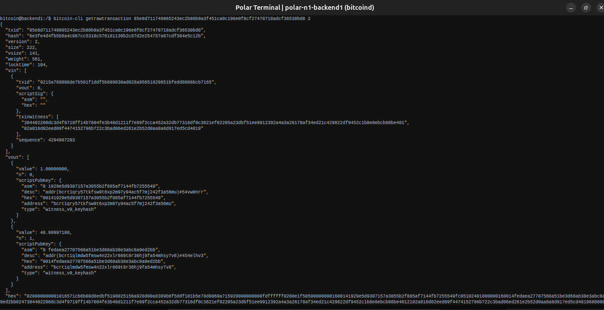
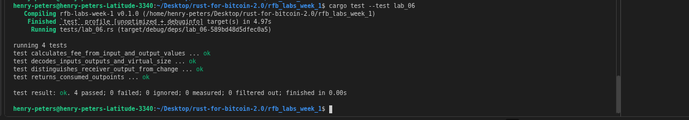

# Lab 06 — Transaction decoding

## Commands used

```bash
# Rust test suite
cargo test --test lab_06

# Decode the transaction with verbosity 2
# (verbosity 2 includes each input's previous output value)
bitcoin-cli getrawtransaction 85e8d711749065243ec2b80b9a3f451ca0c196e0f8cf27478718adcf36530bd8 2   # txid
```

## Terminal output
<!-- Paste the relevant terminal output here -->
```bash
bitcoin@backend1:/$ bitcoin-cli getrawtransaction 85e8d711749065243ec2b80b9a3f451ca0c196e0f8cf27478718adcf36530bd8 2
{
  "txid": "85e8d711749065243ec2b80b9a3f451ca0c196e0f8cf27478718adcf36530bd8",
  "hash": "6e3fe4d4fb5b8a4c067cc5318c576181130b2c87d2e254757a87cdf384e5c12b",
  "version": 2,
  "size": 222,
  "vsize": 141,
  "weight": 561,
  "locktime": 104,
  "vin": [
    {
      "txid": "9215a769808de7b501f1ddf5b689830ad028a95651029851bfedd8086bcb7165",
      "vout": 0,
      "scriptSig": {
        "asm": "",
        "hex": ""
      },
      "txinwitness": [
        "304402200dc3d4f9719ff14b7604fe3b40d1211f7e89f2cca452a32db77316df0c3621ef02205a23dbf51ee9912392a4a3a26178af34ed21c429822df9452c1b8e0ebcb98be401",
        "02a016d02eed09f4474152796b722c3bad06ed261e2b52d0aa8a8d917ed5cd4819"
      ],
      "sequence": 4294967293
    }
  ],
  "vout": [
    {
      "value": 1.00000000,
      "n": 0,
      "scriptPubKey": {
        "asm": "0 1929e5d9307157a3055b2f885af7144fb7255549",
        "desc": "addr(bcrt1qry57tkfsw9t6xp2m97y94ac5f7mj242f3a56mu)#54vw0nrr",
        "hex": "00141929e5d9307157a3055b2f885af7144fb7255549",
        "address": "bcrt1qry57tkfsw9t6xp2m97y94ac5f7mj242f3a56mu",
        "type": "witness_v0_keyhash"
      }
    },
    {
      "value": 48.99997180,
      "n": 1,
      "scriptPubKey": {
        "asm": "0 fedaea27707566a51be3d68ab38e3abc8a9ed2bb",
        "desc": "addr(bcrt1qlmdw5fmsw4n22xlr669t8r36hj9fa54mhsy7v8)#454elhv3",
        "hex": "0014fedaea27707566a51be3d68ab38e3abc8a9ed2bb",
        "address": "bcrt1qlmdw5fmsw4n22xlr669t8r36hj9fa54mhsy7v8",
        "type": "witness_v0_keyhash"
      }
    }
  ],
  "hex": "020000000001016571cb6b08d8edbf5198025156a928d00a8389b6f5ddf101b5e78d8069a715920000000000fdffffff0200e1f505000000001600141929e5d9307157a3055b2f885af7144fb7255549fc05102401000000160014fedaea27707566a51be3d68ab38e3abc8a9ed2bb0247304402200dc3d4f9719ff14b7604fe3b40d1211f7e89f2cca452a32db77316df0c3621ef02205a23dbf51ee9912392a4a3a26178af34ed21c429822df9452c1b8e0ebcb98be4012102a016d02eed09f4474152796b722c3bad06ed261e2b52d0aa8a8d917ed5cd481968000000"
}
```

## Evidence references
<!-- Describe or link to screenshots, logs, or other supporting evidence -->

<!-- My tests -->


## Explanation

**Value conservation** is a core Bitcoin protocol rule: for any non-coinbase transaction, the sum of all input values must equal the sum of all output values plus the miner fee. Nodes enforce this at validation time and reject any transaction that creates coins from nothing.

**The fee has no dedicated output** because it is defined by omission. A transaction simply does not assign all input value to outputs. Whatever input value is left unassigned — `sum(inputs) − sum(outputs)` — is implicitly claimed by the miner who includes the transaction in a block as part of the coinbase reward. This means the sender does not need to know the miner's address in advance.

**Virtual size (vsize)** is used rather than raw byte size because SegWit transactions have two components: base data (counted at full weight) and witness data (counted at one-quarter weight). Vsize = `ceil(weight / 4)`. Fees are priced in sat/vbyte against this virtual size, which is why SegWit transactions are cheaper to send than legacy transactions of similar byte length.
