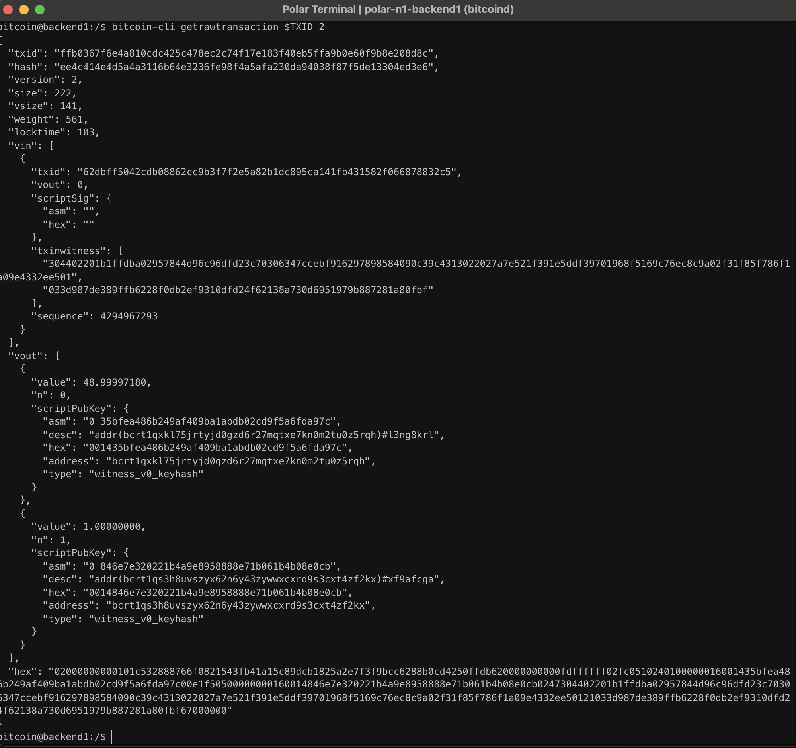

# Lab 06 — Transaction decoding

## Commands used

```bash
TXID=ffb0367f6e4a810cdc425c478ec2c74f17e183f40eb5ffa9b0e60f9b8e208d8c

bitcoin-cli getrawtransaction $TXID 2
```

## Terminal output

```text
Transaction ID:
ffb0367f6e4a810cdc425c478ec2c74f17e183f40eb5ffa9b0e60f9b8e208d8c

Virtual size:
141 vbytes

Input (vin):
txid: 62dbff5042cdb08862cc9b3f7f2e5a82b1dc895ca141fb431582f066878832c5
vout: 0

Outputs (vout):
Output 0:
  value: 48.99997180 BTC
  address: bcrt1qxkl75jrtyjd0gzd6r27mqtxe7kn0m2tu0z5rqh

Output 1:
  value: 1.00000000 BTC
  address: bcrt1qs3h8uvszyx62n6y43zywwxcxrd9s3cxt4zf2kx

Fee:
0.00002820 BTC
```

## Evidence references

The screenshot below shows the verbose decoded transaction, including its inputs (`vin`), outputs (`vout`), output addresses, output values, and virtual transaction size.



## Explanation

A decoded Bitcoin transaction shows exactly which previous outputs are being spent (`vin`) and which new outputs are being created (`vout`). Each input references a previous transaction output using its **txid** and **vout**, while each output specifies a destination address and value.

Bitcoin conserves value by ensuring that the total value of the inputs equals the total value of the outputs **plus the transaction fee**. The fee is **not represented as its own output**. Instead, it is the difference between the total input value and the total output value, and miners collect this difference when they include the transaction in a block.