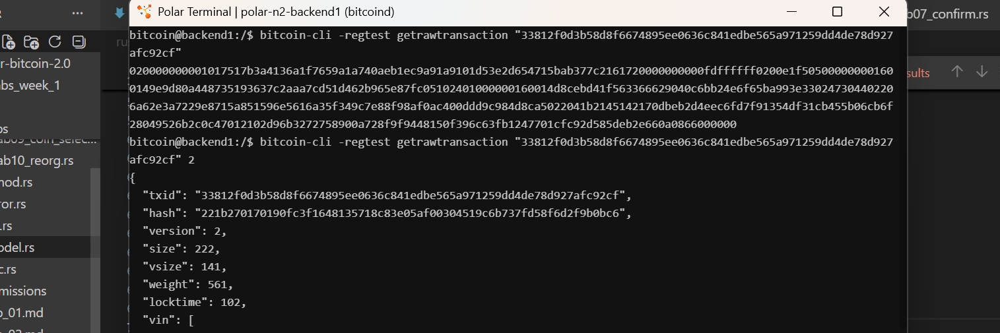
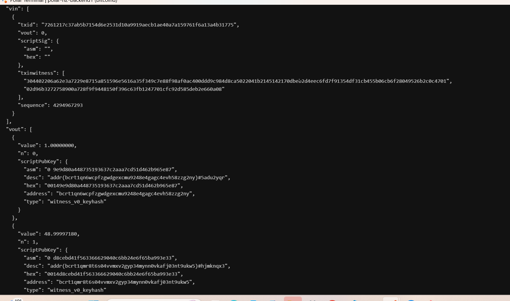

# Lab 06 — Transaction decoding

## Commands used
```bash
# 1. Fetch raw hex transaction data
bitcoin-cli -regtest getrawtransaction "33812f0d3b58d8f6674895ee0636c841edbe565a971259dd4de78d927afc92cf"

# 2. Decode transaction with verbosity level 2 (includes prevout values inside vin)
 bitcoin-cli -regtest getrawtransaction "33812f0d3b58d8f6674895ee0636c841edbe565a971259dd4de78d927afc92cf" 2

```


## Terminal output

* **vins**
```bash
 "vin": [
    {
      "txid": "7261217c37ab5b7154d6e2531d10a9919aecb1ae40a7a159761f6a13a4b31775",
      "vout": 0,
      "scriptSig": {
        "asm": "",
        "hex": ""
      },
      "txinwitness": [
        "304402206a62e3a7229e8715a851596e5616a35f349c7e88f98af0ac400ddd9c984d8ca5022041b2145142170dbeb2d4eec6fd7f91354df31cb455b06cb6f28049526b2c0c4701",
        "02d96b3272758900a728f9f9448150f396c63fb1247701cfc92d585deb2e660a08"
      ],
      "sequence": 4294967293
    }
  ],
```
* **vout**
```bash
 "vout": [
    {
      "value": 1.00000000,
      "n": 0,
      "scriptPubKey": {
        "asm": "0 9e9d80a448735193637c2aaa7cd51d462b965e87",
        "desc": "addr(bcrt1qn6wcpfzgwdgexcmu9248e4gagc4evh58zzg2ny)#5adu2yqr",
        "hex": "00149e9d80a448735193637c2aaa7cd51d462b965e87",
        "address": "bcrt1qn6wcpfzgwdgexcmu9248e4gagc4evh58zzg2ny",
        "type": "witness_v0_keyhash"
      }
    },
    {
      "value": 48.99997180,
      "n": 1,
      "scriptPubKey": {
        "asm": "0 d8cebd41f563366629040c6bb24e6f65ba993e33",
        "desc": "addr(bcrt1qmr8t6s04vvmxv2gyp34mynn0vkafj03nt9ukw5)#hjmknqx3",
        "hex": "0014d8cebd41f563366629040c6bb24e6f65ba993e33",
        "address": "bcrt1qmr8t6s04vvmxv2gyp34mynn0vkafj03nt9ukw5",
        "type": "witness_v0_keyhash"
      }
    }
  ],
```

* **address, values, vsize, fees**
```bash
 "txid": "33812f0d3b58d8f6674895ee0636c841edbe565a971259dd4de78d927afc92cf",
  "hash": "221b270170190fc3f1648135718c83e05af00304519c6b737fd58f6d2f9b0bc6",
  "version": 2,
  "size": 222,
  "vsize": 141,
  "weight": 561,
  "locktime": 102,
```

## Evidence references


* **Figure 1**
- the raw transaction hex and transaction header info


* **Figure 2**
- vin and vout transaction


## Explanation
* **Prove value conservation and explain**
- transaction outputs cannot exceed total input values. For any non-coinbase transaction, the law of value conservation states:

* **why the fee has no dedicated output**
- Creating a fee output would add unnecessary bytes to the blockchain, inflating transaction size and consuming UTXO set space. Instead, fees are implicit.


