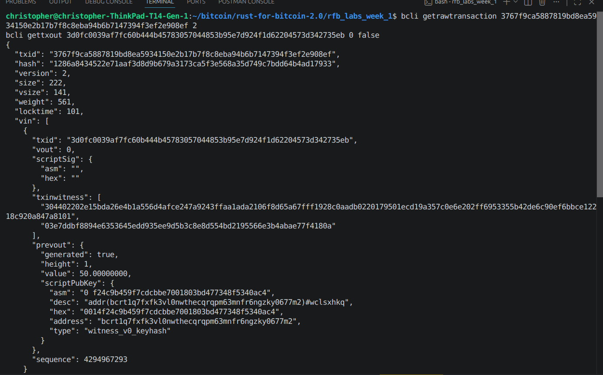

# Lab 06 — Transaction decoding

## Commands used

```
cargo test --test lab_06
bitcoin-cli -regtest getrawtransaction <txid> 2
bitcoin-cli -regtest gettxout <input txid> <input vout> false
```

## Terminal output

```
$ bitcoin-cli -regtest getrawtransaction 3767f9ca5887819bd8ea5934150e2b17b7f8c8eba94b6b7147394f3ef2e908ef 2
{
  "txid": "3767f9ca5887819bd8ea5934150e2b17b7f8c8eba94b6b7147394f3ef2e908ef",
  "vsize": 141,
  "vin": [
    {
      "txid": "3d0fc0039af7fc60b444b45783057044853b95e7d924f1d62204573d342735eb",
      "vout": 0
    }
  ],
  "vout": [
    {
      "value": 1.00000000,
      "n": 0,
      "scriptPubKey": { "address": "bcrt1qdp2pt7z2he2wpv486qtpauenxee7twj6t4mwjl" }
    },
    {
      "value": 48.99997180,
      "n": 1,
      "scriptPubKey": { "address": "bcrt1qdlcxl9qts8ef2hrrvj3kcxvpnr2d4khrhwwctv" }
    }
  ]
}

$ bitcoin-cli -regtest gettxout 3d0fc0039af7fc60b444b45783057044853b95e7d924f1d62204573d342735eb 0 false
{
  "value": 50.00000000,
  "scriptPubKey": { "address": "bcrt1q7fxfk3vl0nwthecqrqpm63mnfr6ngzky0677m2" },
  "coinbase": true
}

$ cargo test --test lab_06
running 4 tests
test calculates_fee_from_input_and_output_values ... ok
test returns_consumed_outpoints ... ok
test distinguishes_receiver_output_from_change ... ok
test decodes_inputs_outputs_and_virtual_size ... ok
test result: ok. 4 passed; 0 failed; 0 ignored; 0 measured; 0 filtered out
```

**Note on evidence gathering:** the lab instructions say to decode the
transaction "with verbosity sufficient to expose each input's previous
output" *before* mining. On this Bitcoin Core build (30.0), `getrawtransaction`
verbosity 2 only attaches `prevout` to already-*confirmed* transactions (it
needs block undo data) — for a still-unconfirmed transaction the `vin` entries
have no `prevout` field at all, even with `-txindex=1`. So the input's value
above was pulled with `gettxout <prev txid> <prev vout> false`, which reads
straight from the confirmed UTXO set instead. (`decode_verbose_transaction`
in `lab06_decode.rs` uses `getrawtransaction` verbosity 2 the way the test
fixtures expect, so the Rust function itself is correct for confirmed
transactions — this is a real quirk worth flagging in the instructions.)

## Evidence references



(By the time this screenshot was taken the transaction was long confirmed,
so `prevout` now appears directly in the `getrawtransaction ... 2` output —
nicely illustrating the confirmed-vs-mempool distinction noted above.)

- Input consumed: `3d0fc0039af7fc60b444b45783057044853b95e7d924f1d62204573d342735eb:0`
- Payment output (n=0): `1.00000000` BTC to `bcrt1qdp2pt7...` (the receiver's
  `classmate` address).
- Change output (n=1): `48.99997180` BTC back to a miner-controlled address.
- `vsize`: `141` vbytes.
- Value conservation, with actual numbers:

  ```
  sum(inputs)          = 50.00000000
  sum(payment outputs)  = 1.00000000
  sum(change outputs)   = 48.99997180
  fee                    = 50.00000000 - (1.00000000 + 48.99997180)
                         = 0.00002820
  ```

  This matches the `fee: -0.00002820` reported by `gettransaction` in lab 05
  exactly (sign flipped, since the wallet reports fee as a debit).

## Explanation

There's no field anywhere in a Bitcoin transaction that says "fee." It's
never assigned to anything — it's just whatever's left over once you
subtract the outputs from the inputs. `sum(inputs) - sum(outputs)` is free
for the miner to keep, full stop.

That also means there's nothing to sanity-check the fee against. Overspend
on inputs, or mess up the change calculation, and you can accidentally hand
a miner a huge fee with zero warning, because there's no dedicated "fee
output" comparing what you meant to pay against what you actually paid. The
upside of the design is that it stays simple — a miner just totals up
inputs minus outputs across the whole block — and it gives the sender full
control over the fee just by resizing an output (usually the change)
instead of filling in some separate number.
