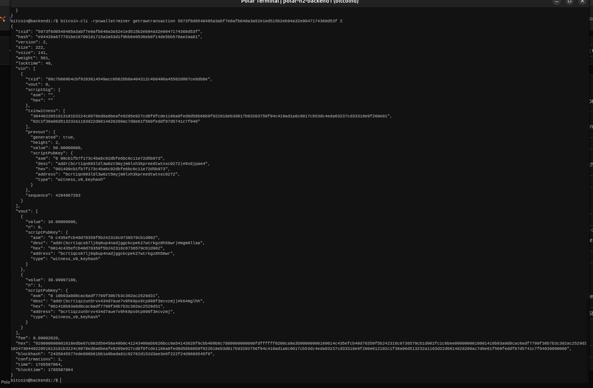
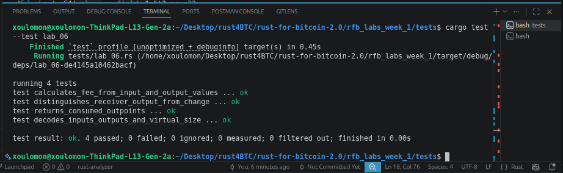

# Lab 06 — Transaction decoding

## Commands used

<!-- TODO: Record the verbose transaction-decoding commands. -->
```bash
bitcoin-cli getrawtransaction <txid> 2  # Decode with verbosity 2 (includes prevout)
```

## Terminal output

<!-- TODO: Include vin, vout, addresses, values, vsize, and calculated fee. -->
```bash
bitcoin@backend1:/$ bitcoin-cli -rpcwallet=miner getrawtransaction 5973f6d0548485a3abf7e0afb640a3a52e1ed515b2eb94a32e9047174368d53f 2   
{
  "txid": "5973f6d0548485a3abf7e0afb640a3a52e1ed515b2eb94a32e9047174368d53f",
  "hash": "e94420a677791be16709181715a3a53d1f9bb6e0536eb8f14de5bb576ae2aa81",
  "version": 2,
  "size": 222,
  "vsize": 141,
  "weight": 561,
  "locktime": 48,
  "vin": [
    {
      "txid": "88c7b609b4cbf9283614549acc6b62bb0a404312c4b0496a45502d087ce6db8e",
      "vout": 0,
      "scriptSig": {
        "asm": "",
        "hex": ""
      },
      "txinwitness": [
        "3044022051613181b3224c8078ed8a6beafe9205e927cd8f0fcde1166a0fed8d58b66b9f022018eb3d017b93203756f94c419ad1a6c0017cb53dc4eda03237cd33318e9f260e01",
        "02c1f38a06d513232a1163d22d0814828209ac7d0e61f569feddf87d5741c7f940"
      ],
      "prevout": {
        "generated": true,
        "height": 2,
        "value": 50.00000000,
        "scriptPubKey": {
          "asm": "0 99cb1fb7f173c4ba6c92dbfe6bc6c11e72d5b973",
          "desc": "addr(bcrt1qn893ldl3w0zt5myjm0lxh3kpreedtwtnsc0272)#9x8jpae4",
          "hex": "001499cb1fb7f173c4ba6c92dbfe6bc6c11e72d5b973",
          "address": "bcrt1qn893ldl3w0zt5myjm0lxh3kpreedtwtnsc0272",
          "type": "witness_v0_keyhash"
        }
      },
      "sequence": 4294967293
    }
  ],
  "vout": [
    {
      "value": 10.00000000,
      "n": 0,
      "scriptPubKey": {
        "asm": "0 c435efcb40d70359f5b242316c0736579cb1d902",
        "desc": "addr(bcrt1qcs67lj6q6up4nadjggckcpek27wtrkgz8h58wr)#mgm0llaa",
        "hex": "0014c435efcb40d70359f5b242316c0736579cb1d902",
        "address": "bcrt1qcs67lj6q6up4nadjggckcpek27wtrkgz8h58wr",
        "type": "witness_v0_keyhash"
      }
    },
    {
      "value": 39.99997180,
      "n": 1,
      "scriptPubKey": {
        "asm": "0 10b93a0d8cac6adf7799f30b7b3c302ac2529d31",
        "desc": "addr(bcrt1qzzun5rvv434d7aue7v9hk0ps9tp998f3ecvzmj)#k64mglhh",
        "hex": "001410b93a0d8cac6adf7799f30b7b3c302ac2529d31",
        "address": "bcrt1qzzun5rvv434d7aue7v9hk0ps9tp998f3ecvzmj",
        "type": "witness_v0_keyhash"
      }
    }
  ],
  "fee": 0.00002820,
  "hex": "020000000001018edbe67c082d50456a49b0c41243400abb626bcc9a54143628f9cbb409b6c7880000000000fdffffff0200ca9a3b00000000160014c435efcb40d70359f5b242316c0736579cb1d902fc1c6bee0000000016001410b93a0d8cac6adf7799f30b7b3c302ac2529d3102473044022051613181b3224c8078ed8a6beafe9205e927cd8f0fcde1166a0fed8d58b66b9f022018eb3d017b93203756f94c419ad1a6c0017cb53dc4eda03237cd33318e9f260e012102c1f38a06d513232a1163d22d0814828209ac7d0e61f569feddf87d5741c7f94030000000",
  "blockhash": "2435845577ede896b61bb1a9bada81c92762d152d3ae3e8f222f24d9689545f9",
  "confirmations": 1,
  "time": 1785587064,
  "blocktime": 1785587064
}
bitcoin@backend1:/$ ^C
bitcoin@backend1:/$ 
```

## Evidence references

<!-- TODO: Link screenshots or describe the attached evidence. -->
screenhsot of polar response when call the getrawtransaction bitcoin-cli methods and its parameters



screenshot of test passing after impllementing lab006



## Explanation

<!-- TODO: Prove value conservation and explain why the fee has no dedicated output. -->

Value conservation rule

sum(inputs) = sum(outputs) + fee

Every satoshi coming in must equal every satoshi going out plus the fee. No coins are created or destroyed in a transaction (except the special coinbase transaction, which mints new coins).

Proof, in short
Bitcoin Core validates this on every transaction:

fee = sum(input values) − sum(output values)

If fee is negative, the transaction is invalid (spending more than available). Fee must be ≥ 0.

Why fee has no dedicated output
Because fee is defined by leftover value, not an explicit line item. You don't say "pay 500 sats to Bob, 200 sats to fee" as two outputs — you just create outputs summing to less than your inputs, and the gap is the fee.

The miner who mines the block claims that leftover gap automatically, added to their coinbase reward. No signature, no address, no output needed for it — it's implicit, calculated by subtraction.
