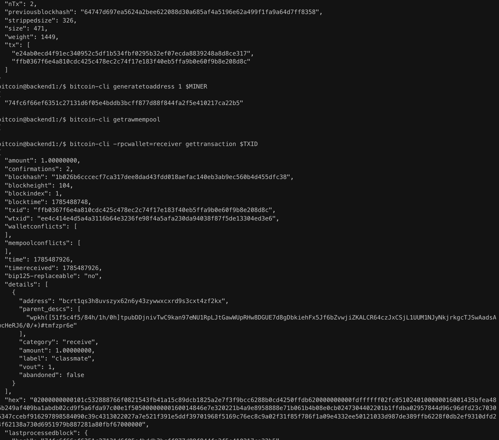

# Lab 07 — Confirmation and block membership

## Commands used

```bash
bitcoin-cli generatetoaddress 1 $MINER

bitcoin-cli getrawmempool

bitcoin-cli -rpcwallet=receiver gettransaction $TXID

bitcoin-cli getblock 1b026b6cccecf7ca317dee8dad43fdd018aefac140eb3ab9ec560b4d455dfc38 1
```

## Terminal output

```text
Block mined:
1b026b6cccecf7ca317dee8dad43fdd018aefac140eb3ab9ec560b4d455dfc38

Mempool:
[]

Transaction:
txid: ffb0367f6e4a810cdc425c478ec2c74f17e183f40eb5ffa9b0e60f9b8e208d8c
confirmations: 1
blockhash: 1b026b6cccecf7ca317dee8dad43fdd018aefac140eb3ab9ec560b4d455dfc38

Block:
Contains transaction:
ffb0367f6e4a810cdc425c478ec2c74f17e183f40eb5ffa9b0e60f9b8e208d8c
```

## Evidence references

The attached terminal screenshots show:
- Mining one block.
- An empty mempool after confirmation.
- The transaction with one confirmation and its block hash.
- The mined block containing the transaction ID in its `tx` array.



## Explanation

When the transaction was first broadcast, it existed only in the mempool and had zero confirmations. After mining one block, the transaction was included in that block, removed from the mempool, and its confirmation count increased to one. The transaction's `blockhash` identifies the block that confirmed it, and inspecting that block shows the transaction ID in the block's `tx` array, proving that it is part of the blockchain.